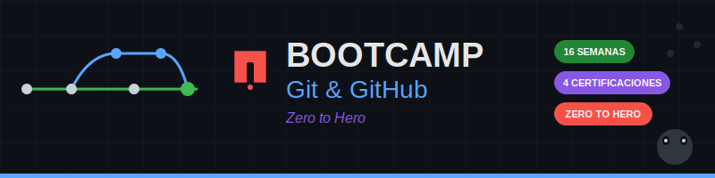

# 🚀 Bootcamp Git & GitHub - 16 Semanas

<p align="center">
  
</p>

<h3 align="center">🎯 Zero to Hero 🦸</h3>
<p align="center"><strong>De cero conocimiento a profesional preparado para certificarte en 16 semanas</strong></p>
<p align="center"><em>⏱️ Dedicación: 6 horas semanales | 📚 Total: 96 horas de formación</em></p>

**Domina Git y GitHub desde fundamentos hasta nivel profesional**  
_Te preparamos para aprobar las 4 Certificaciones Oficiales de GitHub con alta probabilidad de éxito_

[](https://github.com)
[](https://git-scm.com/)
[](https://www.markdownguide.org/)
[](https://creativecommons.org/licenses/by-nc-sa/4.0/)
[](.)

<p align="center">
  <a href="README_EN.md"></a>
  <a href="README.md"></a>
</p>

</div>

---

## 📚 Descripción del Programa

### 🦸 ¿Qué es Zero to Hero?

Este es un bootcamp **Zero to Hero**: no necesitas conocimientos previos de Git o GitHub. Te llevaremos desde **cero absoluto** hasta un nivel **profesional certificado**, capaz de:

- 🌱 **Zero**: Sin experiencia previa en control de versiones
- 🚀 **Hero**: Profesional preparado para certificarte y trabajar en equipos enterprise

| Nivel           | Descripción                      | Semanas |
| --------------- | -------------------------------- | ------- |
| 🌱 Principiante | Sin conocimiento previo de Git   | 1-2     |
| 📚 Fundamentos  | Dominio de comandos básicos      | 3-6     |
| ⚙️ Intermedio   | CI/CD y automatización           | 7-10    |
| 🔒 Avanzado     | Seguridad y administración       | 11-14   |
| 🦸 Hero         | Proyecto final y certificaciones | 15-16   |

Este bootcamp intensivo de **16 semanas** está diseñado para formar desarrolladores con dominio completo de Git y GitHub, desde conceptos básicos hasta administración empresarial. Con una dedicación de **6 horas semanales** (96 horas totales), estarás **preparado para presentarte a los exámenes** de las **4 certificaciones oficiales de GitHub** con alta probabilidad de éxito, y trabajar profesionalmente con equipos de desarrollo.

> ⚠️ **Nota importante**: Este bootcamp **NO otorga las certificaciones**. Te prepara con el conocimiento y práctica necesarios para que puedas **aprobar los exámenes oficiales de GitHub** por tu cuenta. Las certificaciones son emitidas únicamente por GitHub tras aprobar sus exámenes.

## 🎯 Preparación para Certificaciones

Este bootcamp cubre el 100% del temario oficial de las 4 certificaciones de GitHub:

| 🏅 Certificación             | 📅 Semanas | ⏱️ Horas | 💰 Costo Examen\* | 📈 Impacto Salarial |
| ---------------------------- | ---------- | -------- | ----------------- | ------------------- |
| **GitHub Foundations**       | 1-6        | 36h      | $99 USD           | +15%                |
| **GitHub Actions**           | 7-10       | 24h      | $200 USD          | +20%                |
| **GitHub Advanced Security** | 11-13      | 18h      | $200 USD          | +25%                |
| **GitHub Administration**    | 14-15      | 12h      | $200 USD          | +30%                |
| **Proyecto Final**           | 16         | 6h       | -                 | Integración         |

\*Los exámenes de certificación se pagan directamente a GitHub. El bootcamp no incluye el costo de los exámenes.

## 📖 Estructura del Bootcamp

### 🔰 Fase 1: Foundations (Semanas 1-6)

- ✅ Git fundamentals y version control
- ✅ Repository management y collaboration
- ✅ Branching strategies y merge workflows
- ✅ GitHub features (Issues, PRs, Projects)

### ⚙️ Fase 2: Actions (Semanas 7-10)

- ✅ Workflow authoring y CI/CD pipelines
- ✅ Custom actions development
- ✅ Enterprise Actions management
- ✅ Deployment strategies y environments

### 🛡️ Fase 3: Security (Semanas 11-13)

- ✅ Code scanning y vulnerability management
- ✅ Secret scanning y dependency review
- ✅ Security policies y compliance
- ✅ Advanced security features

### 👥 Fase 4: Administration (Semanas 14-15)

- ✅ Enterprise administration y governance
- ✅ Organization management y teams
- ✅ Access controls y audit logging
- ✅ Administrative automation

### 🏆 Fase 5: Proyecto Final (Semana 16)

- ✅ Proyecto integrador completo
- ✅ Simulacros de certificación
- ✅ Presentación y graduación

## 🚀 Inicio Rápido

### Prerrequisitos

- 💻 Conocimientos básicos de programación
- 🖥️ Terminal/línea de comandos básica
- 🌐 Cuenta en GitHub
- ⚡ Git instalado en tu sistema

### Instalación

```bash
# 1. Clonar el repositorio
git clone https://github.com/tu-usuario/bc-git-github.git

# 2. Navegar al directorio
cd bc-git-github

# 3. Comenzar con la Semana 1
cd _docs/week-01
```

### Configuración Inicial

```bash
# Configurar Git con tu información
git config --global user.name "Tu Nombre"
git config --global user.email "tu-email@ejemplo.com"

# Verificar configuración
git config --list
```

## 📁 Estructura del Proyecto

```text
bc-git-github/
├── 📄 README.md                    # Este archivo
├── 🖼️ _assets/                     # Recursos gráficos
│   └── banner-bootcamp.svg
├── ⚙️ .github/                     # Configuraciones GitHub
│   └── copilot-instructions.md
├── 📚 _docs/                       # Documentación del bootcamp
│   ├── 📋 README.md                # Índice principal
│   ├── 📝 week-01/ al week-16/     # Contenido por semanas
│   ├── 💼 recursos/                # Material complementario
│   ├── 🧪 ejercicios/              # Ejercicios generales
│   └── 📊 evaluaciones/            # Exámenes y evaluaciones
└── 🔧 _scripts/                    # Scripts de automatización
    ├── auto-commit.sh              # Commits automáticos
    ├── setup-cron.sh               # Configuración de cron
    └── remove-cron.sh              # Remover cron job
```

## 📅 Cronograma

| Semana | Tema                                          | Horas | Certificación  |
| ------ | --------------------------------------------- | ----- | -------------- |
| 1      | [Git Foundations](/_docs/week-01/)            | 6h    | Foundations    |
| 2      | [Repositories y Commits](/_docs/week-02/)     | 6h    | Foundations    |
| 3      | [Branching Básico](/_docs/week-03/)           | 6h    | Foundations    |
| 4      | [Merge Conflicts](/_docs/week-04/)            | 6h    | Foundations    |
| 5      | [Remote Repositories](/_docs/week-05/)        | 6h    | Foundations    |
| 6      | [GitHub Features](/_docs/week-06/)            | 6h    | Foundations    |
| 7      | [GitHub Actions Fundamentos](/_docs/week-07/) | 6h    | Actions        |
| 8      | [CI/CD Pipelines](/_docs/week-08/)            | 6h    | Actions        |
| 9      | [Actions Avanzadas](/_docs/week-09/)          | 6h    | Actions        |
| 10     | [Deployment Strategies](/_docs/week-10/)      | 6h    | Actions        |
| 11     | [Security Features](/_docs/week-11/)          | 6h    | Security       |
| 12     | [Vulnerability Management](/_docs/week-12/)   | 6h    | Security       |
| 13     | [Security Policies](/_docs/week-13/)          | 6h    | Security       |
| 14     | [Enterprise Administration](/_docs/week-14/)  | 6h    | Administration |
| 15     | [Administration Avanzado](/_docs/week-15/)    | 6h    | Administration |
| 16     | [Proyecto Final](/_docs/week-16/)             | 6h    | Integración    |

**Total: 96 horas de formación intensiva**

## 🎖️ Beneficios del Programa

### 💼 Profesionales

- 🚀 **Aumento salarial:** 15-30% promedio
- 💼 **Nuevas oportunidades:** DevOps, Platform Engineering, Security Engineering
- 🌍 **Reconocimiento global:** Certificaciones válidas internacionalmente
- 🔗 **Networking:** Comunidad de egresados y profesionales

### 🧠 Técnicos

- 🏗️ **Dominio completo** de Git y GitHub
- ⚡ **Automatización** con GitHub Actions
- 🛡️ **Seguridad** en desarrollo de software
- 👥 **Administración** de equipos y organizaciones

## 🛠️ Herramientas y Tecnologías

<div align="center">

| Categoría                | Herramientas                        |
| ------------------------ | ----------------------------------- |
| **Control de Versiones** | Git, GitHub Desktop, GitKraken      |
| **Editores**             | VS Code, Vim, Nano                  |
| **CI/CD**                | GitHub Actions, Workflows, Runners  |
| **Seguridad**            | CodeQL, Dependabot, Secret Scanning |
| **Administración**       | GitHub Enterprise, SAML, LDAP       |

</div>

## 📊 Evaluación y Certificación

### Criterios de Evaluación

- **40%** - Ejercicios semanales y proyectos
- **30%** - Exámenes teórico-prácticos
- **30%** - Proyecto final colaborativo

### Requisitos para Certificación

- ✅ **85%+ en simulacros** durante preparación
- ✅ **Proyectos completados** con calificación mínima 80%
- ✅ **Participación activa** en ejercicios colaborativos
- ✅ **Examen final aprobado** por cada certificación

## 🚦 Cómo Empezar

### Paso 1: Preparación

1. 📋 Revisa los [prerrequisitos](#prerrequisitos)
2. 🔧 [Instala Git](/_docs/ejercicios/ejercicio-01-instalacion.md)
3. 🆔 Crea tu cuenta en GitHub
4. 📖 Lee la [introducción al bootcamp](/_docs/README.md)

### Paso 2: Semana 1

1. 📚 Ve a [Semana 1 - Fundamentos](/_docs/week-01/)
2. 🎯 Revisa los objetivos de aprendizaje
3. 📖 Comienza con la primera lección
4. ✍️ Realiza los ejercicios prácticos

### Paso 3: Comunidad

1. 💬 Únete al Discord del bootcamp
2. 🤝 Forma grupos de estudio
3. ❓ Participa en las sesiones de Q&A
4. 🔗 Conecta con otros estudiantes

## 🤝 Contribuir

¡Las contribuciones son bienvenidas! Este es un proyecto educativo de código abierto.

### Cómo Contribuir

1. Lee la [Guía de Contribución](CONTRIBUTING.md)
2. Revisa el [Código de Conducta](CODE_OF_CONDUCT.md)
3. 🍴 Fork el repositorio
4. 🌿 Crea una branch para tu feature (`git checkout -b feature/mejora`)
5. 💾 Commit tus cambios (`git commit -m 'feat: agregar nueva funcionalidad'`)
6. 📤 Push a la branch (`git push origin feature/mejora`)
7. 🔄 Abre un Pull Request

### 📋 Áreas de Contribución

- ✨ Ejercicios adicionales
- 📚 Mejoras en documentación
- 🐛 Corrección de errores
- 🎨 Recursos visuales (diagramas SVG)
- 🌐 Traducciones
- 📹 Videos tutoriales

## 📞 Soporte

### Durante el Bootcamp

- 💬 **Discord:** Comunidad activa 24/7
- 📧 **Email:** soporte@bootcamp-git.com
- 📅 **Office Hours:** Lunes y Miércoles 18:00-19:00 UTC
- 📖 **FAQ:** [Preguntas frecuentes](/_docs/recursos/faq.md)

### Post-Graduación

- 🔄 **6 meses de acceso** a material actualizado
- 💬 **Alumni network** exclusivo
- 📅 **Sesiones mensuales** de actualización
- 🎯 **Mock exams** actualizados

## 📜 Licencia

Este proyecto está bajo la licencia **CC BY-NC-SA 4.0** (Creative Commons Attribution-NonCommercial-ShareAlike 4.0 International).

- ✅ **Compartir y adaptar** — puedes copiar, redistribuir y transformar el material
- ✅ **Forks educativos** — adaptaciones para enseñanza son bienvenidas
- ❌ **No comercial** — no puedes usar el material con fines comerciales
- 🔄 **ShareAlike** — las adaptaciones deben publicarse bajo la misma licencia

Ver [LICENSE](LICENSE) para el texto completo.

## � Documentación Adicional

- [🤖 Instrucciones para Copilot](.github/copilot-instructions.md)
- [🤝 Guía de Contribución](CONTRIBUTING.md)
- [📜 Código de Conducta](CODE_OF_CONDUCT.md)
- [🔒 Política de Seguridad](SECURITY.md)

## �🙏 Reconocimientos

- 💖 **GitHub Education** por los recursos y soporte
- 👥 **Comunidad Open Source** por las mejores prácticas
- 🧑‍🏫 **Instructores contribuyentes** por el contenido de calidad
- 🎓 **Estudiantes beta** por el feedback invaluable

---

<div align="center">

### 🚀 ¿Listo para transformar tu carrera?

**[📚 Comenzar el Bootcamp](./_docs/week-01/) • [🎓 Ver Certificaciones](./_docs/recursos/certificaciones-github.md) • [❓ FAQ](./_docs/recursos/faq.md)**

_Desarrollado con ❤️ para la comunidad de desarrolladores_

</div>
