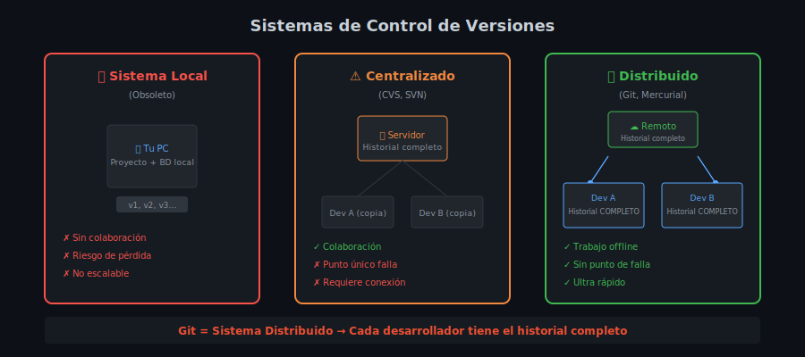
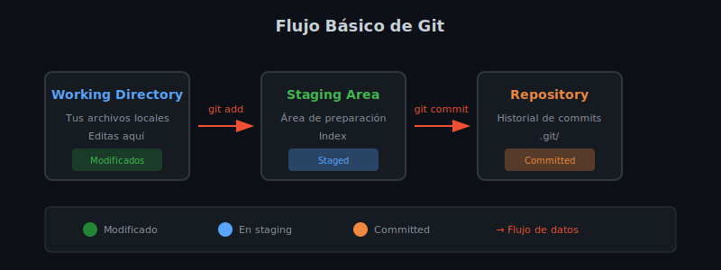

# 📖 Lección 1.1: ¿Qué es el Control de Versiones?

## 🎯 Objetivos de Aprendizaje

Al finalizar esta lección serás capaz de:

- ✅ Definir qué es un sistema de control de versiones
- ✅ Identificar los beneficios del control de versiones
- ✅ Distinguir entre diferentes tipos de sistemas de control de versiones
- ✅ Comprender por qué Git es el estándar de la industria

---

## 🤔 ¿Qué es el Control de Versiones?

El **control de versiones** (también conocido como **version control** o **source control**) es un sistema que registra los cambios realizados en uno o más archivos a lo largo del tiempo, de manera que puedas recuperar versiones específicas más adelante.

### 📝 Analogía del Mundo Real

Imagina que estás escribiendo un ensayo importante:

```
ensayo_v1.docx     (primera versión)
ensayo_v2.docx     (agregaste introducción)
ensayo_final.docx  (correcciones del profesor)
ensayo_final_v2.docx (más correcciones)
ensayo_FINAL.docx   (¿realmente final?)
ensayo_FINAL_definitivo.docx
```

**¿Te resulta familiar?** Este caos de archivos es exactamente lo que el control de versiones resuelve de manera elegante y profesional.

---

## 🎯 ¿Por Qué Usar Control de Versiones?

### 🚫 **Problemas Sin Control de Versiones**

- **Pérdida de trabajo**: ¿Qué pasa si borras algo importante por accidente?
- **Colaboración caótica**: Multiple personas editando el mismo archivo
- **Sin historial**: No sabes qué cambió, cuándo o por qué
- **Pánico por backups**: Copiar carpetas manualmente es propenso a errores
- **Conflictos de versiones**: "¿Cuál es la versión correcta?"

### ✅ **Beneficios del Control de Versiones**

#### 🔄 **Historial Completo**

```bash
# ¿Qué hace?: Muestra todo el historial de cambios del proyecto
# ¿Por qué?: Necesitas ver la evolución del código y quién hizo qué
# ¿Para qué sirve?: Debugging, auditoría y entendimiento del proyecto

git log --oneline
```

#### 🤝 **Colaboración Eficiente**

- Multiple desarrolladores trabajando simultáneamente
- Fusión automática de cambios cuando no hay conflictos
- Resolución estructurada de conflictos cuando los hay

#### 🔙 **Reversibilidad Total**

- Volver a cualquier versión anterior
- Deshacer cambios específicos sin afectar otros
- Crear branches para experimentos seguros

#### 📊 **Trazabilidad**

- ¿Quién cambió qué línea de código?
- ¿Cuándo se introdujo un bug?
- ¿Por qué se hizo un cambio específico?

---

## 🏗️ Tipos de Sistemas de Control de Versiones

### 1️⃣ **Sistemas Locales** (Obsoletos)

```
Tu Computadora
├── Proyecto/
│   ├── archivo.txt
│   └── ...
└── Base de datos local/
    ├── versión 1
    ├── versión 2
    └── versión 3
```

**Problemas**:

- ❌ Sin colaboración
- ❌ Riesgo de pérdida total
- ❌ No escalable

### 2️⃣ **Sistemas Centralizados** (CVS, Subversion)

```
      Servidor Central
      ├── versión 1
      ├── versión 2
      └── versión 3
           ↕️
    ┌──────────────────┐
    ↓                  ↓
Desarrollador A    Desarrollador B
```

**Características**:

- ✅ Colaboración posible
- ✅ Control centralizado
- ❌ Punto único de falla
- ❌ Requiere conexión constante

### 3️⃣ **Sistemas Distribuidos** (Git, Mercurial)

```
    Desarrollador A           Servidor Remoto         Desarrollador B
    ├── Historial completo    ├── Historial completo  ├── Historial completo
    ├── versión 1             ├── versión 1           ├── versión 1
    ├── versión 2             ├── versión 2           ├── versión 2
    └── versión 3             └── versión 3           └── versión 3
            ↕️                        ↕️                        ↕️
         Sincronización          Sincronización          Sincronización
```

**Ventajas de Git**:

- ✅ **Historial completo local**: Trabaja offline
- ✅ **Sin punto único de falla**: Cada copia es un backup completo
- ✅ **Flexibilidad total**: Multiple workflows posibles
- ✅ **Velocidad**: Operaciones locales son instantáneas

### 📊 Comparativa Visual



> **Diagrama**: Evolución de los sistemas de control de versiones, desde locales hasta distribuidos.

---

## 🏆 ¿Por Qué Git es el Estándar?

### 📈 **Adopción Masiva**

- **GitHub**: +100 millones de repositorios
- **GitLab, Bitbucket**: Millones de proyectos
- **Empresas**: Google, Microsoft, Facebook, Netflix, etc.

### ⚡ **Características Técnicas**

#### **Performance**

- Operaciones locales ultra-rápidas
- Compresión eficiente de datos
- Algoritmos optimizados para grandes proyectos

#### **Integridad**

- Checksums SHA-1 para cada cambio
- Imposible corromper datos sin detectarlo
- Historial inmutable y verificable

#### **Flexibilidad**

```bash
# Workflows soportados por Git:
- Centralizado (como SVN)
- Feature Branch Workflow
- Gitflow Workflow
- Forking Workflow
- Y cualquier combinación personalizada
```

---

## 🛠️ Casos de Uso Reales

### 👨‍💻 **Desarrollo de Software**

```bash
# Equipo trabajando en una nueva feature
git branch nueva-feature
git checkout nueva-feature
# ... desarrollo ...
git commit -m "feat: implementar login de usuarios"
git push origin nueva-feature
# ... pull request y review ...
git merge nueva-feature
```

### 📚 **Documentación**

- Manuales técnicos
- Libros (¡incluso este bootcamp!)
- Artículos colaborativos
- Sitios web estáticos

### 🎨 **Proyectos Creativos**

- Diseño gráfico (archivos fuente)
- Configuraciones de sistemas
- Scripts de automatización
- Datos científicos

### 🏢 **Casos Empresariales**

- **Compliance**: Auditoría completa de cambios
- **Disaster Recovery**: Múltiples backups distribuidos
- **Integración Continua**: Automatización de testing y deployment
- **Code Review**: Process estructurado de revisión de código

---

## 🧠 Conceptos Clave para Recordar

### 📝 **Terminología Esencial**

| Término        | Definición                                   |
| -------------- | -------------------------------------------- |
| **Repository** | Carpeta de proyecto con historial de Git     |
| **Commit**     | Snapshot de cambios en un momento específico |
| **Branch**     | Línea de desarrollo independiente            |
| **Merge**      | Fusión de cambios de diferentes branches     |
| **Clone**      | Copia completa de un repository remoto       |

### 🎯 **Flujo Mental Básico**

1. **Modifico** archivos en mi proyecto
2. **Selecciono** cambios que quiero guardar (`git add`)
3. **Confirmo** cambios con mensaje descriptivo (`git commit`)
4. **Comparto** cambios con el equipo (`git push`)
5. **Recibo** cambios de otros (`git pull`)

### 📊 Diagrama del Flujo Básico



> **Diagrama**: El flujo de trabajo básico entre Working Directory, Staging Area y Repository.

---

## ✅ Verificación de Comprensión

### 🤔 **Preguntas de Reflexión**

1. ¿Cuál es la principal diferencia entre un sistema centralizado y distribuido?
2. ¿Por qué Git permite trabajar offline pero SVN no?
3. ¿Qué ventajas tiene tener el historial completo en tu computadora local?

### 🎯 **Ejercicio Mental**

Imagina que trabajas en un equipo de 5 desarrolladores en diferentes países. ¿Cómo te ayudaría Git en estos escenarios?:

- ✍️ Dos personas modifican el mismo archivo
- 🌐 Se cae la conexión a internet por 3 horas
- 🐛 Descubres un bug que se introdujo hace 2 semanas
- 🚀 Necesitas crear una versión experimental sin afectar el código principal

---

## 🔗 Próximos Pasos

En la siguiente lección aprenderemos sobre la **Historia de Git** y cómo Linus Torvalds revolucionó el control de versiones.

### 📖 **Siguiente**: [Lección 1.2: Historia de Git](./leccion-02-historia-git.md)

---

## 📚 Recursos Adicionales

### 🔗 **Enlaces Útiles**

- [Git Official Documentation](https://git-scm.com/doc)
- [Pro Git Book](https://git-scm.com/book) (Gratis y completo)
- [Git Visualization](https://git-school.github.io/visualizing-git/)

### 📹 **Videos Recomendados**

- "Git Explained in 100 Seconds" (Fireship)
- "What is Version Control?" (GitHub)

---

**📝 Nota del Instructor**: Esta es la base conceptual más importante. Asegúrate de entender estos conceptos antes de continuar con comandos específicos.
