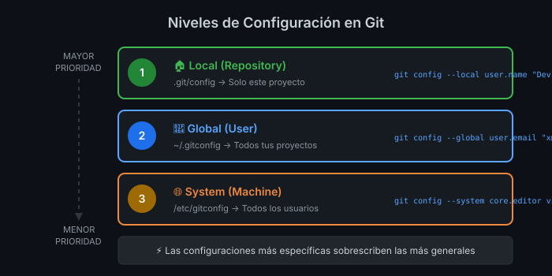

# 📖 Lección 1.3: Configuración de Git

## 🎯 Objetivos de Aprendizaje

Al finalizar esta lección serás capaz de:

- ✅ Configurar tu identidad en Git (nombre y email)
- ✅ Establecer configuraciones globales y locales
- ✅ Personalizar el comportamiento de Git según tus preferencias
- ✅ Verificar y modificar configuraciones existentes
- ✅ Entender los diferentes niveles de configuración

---

## ⚙️ Sistema de Configuración de Git

Git utiliza un sistema de configuración **jerárquico** con tres niveles:

### 📊 **Niveles de Configuración (Prioridad)**

```text
🔺 MAYOR PRIORIDAD
├── 🏠 Local (Repository)     .git/config
├── 👤 Global (User)          ~/.gitconfig
└── 🌐 System (Machine)       /etc/gitconfig
🔻 MENOR PRIORIDAD
```

**Regla**: Las configuraciones más específicas sobrescriben las más generales.



> **Diagrama**: Jerarquía de configuración de Git. Las configuraciones locales tienen mayor prioridad que las globales.

---

## 👤 Configuración de Identidad (ESENCIAL)

### 🆔 **Tu Firma Digital en Git**

**Cada commit** que hagas llevará tu nombre y email. Es **obligatorio** configurarlos:

#### **Configuración Global** (Recomendado para empezar)

```bash
# ¿Qué hace?: Establece tu nombre para todos los repos en esta máquina
# ¿Por qué?: Git necesita saber quién eres para los commits
# ¿Para qué sirve?: Identificación y trazabilidad de cambios

git config --global user.name "Tu Nombre Completo"
```

```bash
# ¿Qué hace?: Establece tu email para todos los repos en esta máquina
# ¿Por qué?: Email es clave para identificación y notificaciones
# ¿Para qué sirve?: Asociar commits con tu cuenta de GitHub/GitLab

git config --global user.email "tu.email@ejemplo.com"
```

#### **Ejemplo Práctico**

```bash
# Configuración de identidad profesional
git config --global user.name "María González"
git config --global user.email "maria.gonzalez@empresa.com"
```

### ✅ **Verificación de Configuración**

```bash
# ¿Qué hace?: Muestra tu configuración actual de nombre
# ¿Por qué?: Verificar que se aplicó correctamente
# ¿Para qué sirve?: Debugging y confirmación de setup

git config user.name
```

```bash
# Ver toda tu configuración global
git config --global --list
```

---

## 🛠️ Configuraciones Esenciales Adicionales

### 📝 **Editor de Texto por Defecto**

Git necesita un editor para escribir mensajes de commit largos:

#### **Opciones Populares**

```bash
# VS Code (Recomendado para principiantes)
git config --global core.editor "code --wait"

# Vim (Por defecto en muchos sistemas)
git config --global core.editor "vim"

# Nano (Más amigable que vim)
git config --global core.editor "nano"

# Sublime Text
git config --global core.editor "subl -n -w"
```

### 🎨 **Colores en Terminal** (Mejor UX)

```bash
# ¿Qué hace?: Activa colores en la salida de Git
# ¿Por qué?: Mejora la legibilidad enormemente
# ¿Para qué sirve?: Identificar rápidamente tipos de cambios

git config --global color.ui auto
```

### 📋 **Configuración de Push**

```bash
# ¿Qué hace?: Configura comportamiento de push por defecto
# ¿Por qué?: Evita confusión sobre qué branch se pushea
# ¿Para qué sirve?: Workflow más predecible y seguro

git config --global push.default simple
```

### 🔄 **Configuración de Pull**

```bash
# ¿Qué hace?: Configura comportamiento de pull por defecto
# ¿Por qué?: Evita merge commits innecesarios
# ¿Para qué sirve?: Mantener historial más limpio

git config --global pull.rebase true
```

---

## 🏠 Configuración Local vs Global

### 🌐 **Global Configuration**

Se aplica a **todos los repositorios** del usuario:

```bash
# Configurar globalmente
git config --global user.name "Tu Nombre"

# Archivo: ~/.gitconfig
```

### 🏠 **Local Configuration**

Se aplica **solo al repositorio actual**:

```bash
# Configurar solo para este repo
git config user.name "Nombre Diferente"

# Archivo: .git/config (dentro del repo)
```

#### **Caso de Uso Real**

```bash
# Configuración global (trabajo)
git config --global user.email "maria@empresa.com"

# En un proyecto personal
cd ~/proyectos/mi-blog
git config user.email "maria.personal@gmail.com"

# Ahora este repo usará el email personal
```

---

## 🖥️ EQUIPOS COMPARTIDOS: Guía Especial

> **⚠️ SECCIÓN CRÍTICA para estudiantes en laboratorios, bootcamps o coworkings**

### 🚨 El Problema de los Equipos Compartidos

Cuando múltiples personas usan el mismo equipo (laboratorio, bootcamp, biblioteca):

```text
┌─────────────────────────────────────────────────────────────────┐
│                    ❌ PROBLEMA COMÚN                            │
├─────────────────────────────────────────────────────────────────┤
│                                                                 │
│   09:00 - Cohorte A: Estudiante configura --global              │
│           "Ana López" <ana@email.com>                           │
│                                                                 │
│   13:00 - Cohorte B: Otro estudiante hace commits...            │
│           ¡Aparecen como "Ana López"! 😱                        │
│                                                                 │
│   17:00 - Cohorte C: Mismo problema, diferentes víctimas        │
│                                                                 │
│   Resultado: Commits mezclados, autoría incorrecta,             │
│              imposible evaluar trabajo individual               │
│                                                                 │
└─────────────────────────────────────────────────────────────────┘
```

### ✅ La Solución: SIEMPRE Usar --local

En equipos compartidos, **NUNCA** uses `--global`. Siempre usa `--local`:

```bash
# ❌ NUNCA en equipos compartidos:
git config --global user.name "Tu Nombre"

# ✅ SIEMPRE en equipos compartidos:
cd mi-proyecto/
git config --local user.name "Tu Nombre"
git config --local user.email "tu.email@ejemplo.com"
```

### 🔐 Protocolo de Seguridad para Equipos Compartidos

#### **Al INICIAR sesión (antes de trabajar):**

```bash
# 1. Verificar quién está configurado actualmente
git config user.name
git config user.email

# 2. Si es otro nombre, NO hagas commits todavía
# 3. Navega a tu proyecto
cd ~/tu-proyecto/

# 4. Configura tu identidad LOCAL
git config --local user.name "Tu Nombre Real"
git config --local user.email "tu.email@real.com"

# 5. Verifica que quedó correctamente
git config user.name   # Debe ser TU nombre
```

#### **Al TERMINAR sesión (antes de irte):**

```bash
# Limpiar credenciales cacheadas (si aplica)
git credential-cache exit

# Verificar que no dejaste sesión de GitHub activa en el browser
# (cerrar sesión manualmente)
```

### 🛡️ Configuraciones de Protección

```bash
# FORZAR que Git pida identidad si no está configurada localmente
git config --global user.useConfigOnly true

# Con esta config, Git dará ERROR si intentas commit sin config local
# Mensaje: "user.name and user.email must be set"
```

### 📋 Script de Verificación Rápida

Crea este alias para verificar tu identidad en 1 segundo:

```bash
git config --global alias.whoami '!echo "══════════════════════════════" && echo "👤 Usuario: $(git config user.name)" && echo "📧 Email: $(git config user.email)" && echo "══════════════════════════════"'
```

Úsalo antes de cada sesión de trabajo:

```bash
git whoami
# ══════════════════════════════
# 👤 Usuario: Tu Nombre
# 📧 Email: tu.email@ejemplo.com
# ══════════════════════════════
```

### 🔧 ¿Hiciste commits con identidad incorrecta?

#### Corregir el ÚLTIMO commit:

```bash
# 1. Configura tu identidad correcta
git config --local user.name "Tu Nombre Real"
git config --local user.email "tu.email@real.com"

# 2. Corrige el último commit
git commit --amend --reset-author --no-edit
```

#### Corregir VARIOS commits (antes de push):

```bash
# Cambiar autor de los últimos N commits
git rebase -i HEAD~3   # últimos 3 commits

# En el editor: cambiar "pick" por "edit" en cada commit
# Luego para cada uno:
git commit --amend --reset-author --no-edit
git rebase --continue
```

### 📊 Tabla de Decisión: ¿Global o Local?

| Situación | Usar | Comando |
|-----------|------|---------|
| **Tu laptop personal** | `--global` | `git config --global user.name "..."` |
| **PC de trabajo (solo tú)** | `--global` | `git config --global user.name "..."` |
| **Laboratorio de universidad** | `--local` | `git config --local user.name "..."` |
| **Bootcamp / Academia** | `--local` | `git config --local user.name "..."` |
| **Coworking compartido** | `--local` | `git config --local user.name "..."` |
| **PC de un amigo** | `--local` | `git config --local user.name "..."` |

---

## 🔍 Comandos de Inspección y Gestión

### 👀 **Ver Configuraciones**

```bash
# Ver TODA la configuración (todos los niveles)
git config --list

# Ver solo configuración global
git config --global --list

# Ver solo configuración local (dentro de un repo)
git config --local --list

# Ver configuración específica
git config user.name
git config user.email
```

### 🗑️ **Eliminar Configuraciones**

```bash
# ¿Qué hace?: Elimina una configuración específica
# ¿Por qué?: Corregir errores o limpiar configuraciones obsoletas
# ¿Para qué sirve?: Mantenimiento de configuraciones

git config --global --unset user.name
git config --local --unset user.email
```

### 📝 **Editar Configuración Directamente**

```bash
# ¿Qué hace?: Abre el archivo de configuración en tu editor
# ¿Por qué?: Editar múltiples configuraciones de una vez
# ¿Para qué sirve?: Configuración avanzada más eficiente

git config --global --edit
```

---

## 🎯 Configuración Completa Recomendada

### 🚀 **Setup Inicial Completo** (Copia y pega)

```bash
# 1. Identidad (OBLIGATORIO - CAMBIA POR TUS DATOS)
git config --global user.name "Tu Nombre Completo"
git config --global user.email "tu.email@ejemplo.com"

# 2. Editor por defecto
git config --global core.editor "code --wait"

# 3. Colores
git config --global color.ui auto

# 4. Comportamiento de Push/Pull
git config --global push.default simple
git config --global pull.rebase true

# 5. Configuraciones de seguridad
git config --global init.defaultBranch main

# 6. Aliases útiles (opcional pero recomendado)
git config --global alias.st status
git config --global alias.co checkout
git config --global alias.br branch
git config --global alias.ci commit
```

### ✅ **Verificación Final**

```bash
# Comprobar que todo está configurado correctamente
git config --list | grep user
git config --list | grep core
git config --list | grep color
```

---

## 🎨 Configuraciones Avanzadas (Opcional)

### 🔧 **Aliases Útiles**

Los aliases te permiten crear shortcuts para comandos frecuentes:

```bash
# Aliases básicos
git config --global alias.st status
git config --global alias.co checkout
git config --global alias.br branch
git config --global alias.ci commit

# Aliases avanzados
git config --global alias.unstage 'reset HEAD --'
git config --global alias.last 'log -1 HEAD'
git config --global alias.visual '!gitk'
```

### 📊 **Configuración de Log**

```bash
# Formato de log más bonito
git config --global alias.lg "log --oneline --decorate --all --graph"

# Ahora puedes usar: git lg
```

### 🛡️ **Configuraciones de Seguridad**

```bash
# Branch por defecto para nuevos repos
git config --global init.defaultBranch main

# Verificación de certificados SSL (normalmente ya está activa)
git config --global http.sslVerify true
```

---

## 🌍 Configuraciones Específicas por Proyecto

### 🏢 **Trabajo vs Personal**

#### **Escenario Real**: Tienes proyectos del trabajo y personales

```bash
# Configuración global (por defecto - trabajo)
git config --global user.name "María González"
git config --global user.email "maria.gonzalez@empresa.com"

# Para proyectos personales
cd ~/proyectos/mi-sitio-web
git config user.email "maria@gmail.com"

# Para proyectos de freelance
cd ~/freelance/cliente-xyz
git config user.name "María González (Freelance)"
git config user.email "maria@freelance.com"
```

#### **Automatización con Directorios**

Puedes configurar Git para que use diferentes configuraciones según la carpeta:

```bash
# Editar configuración global
git config --global --edit

# Agregar al archivo ~/.gitconfig:
```

```ini
[includeIf "gitdir:~/trabajo/"]
    path = ~/.gitconfig-trabajo
[includeIf "gitdir:~/personal/"]
    path = ~/.gitconfig-personal
```

---

## 🚨 Problemas Comunes y Soluciones

### ❌ **Error: "Please tell me who you are"**

```bash
# Error típico:
*** Please tell me who you are.

Run
  git config --global user.email "you@example.com"
  git config --global user.name "Your Name"
```

**Solución:**

```bash
git config --global user.name "Tu Nombre"
git config --global user.email "tu@email.com"
```

### ❌ **Configuración Incorrecta de Email**

```bash
# Verificar configuración actual
git config user.email

# Si está mal, corregir
git config --global user.email "email.correcto@dominio.com"
```

### ❌ **Editor No Funciona**

```bash
# Si VS Code no se abre correctamente
git config --global core.editor "code --wait"

# Si prefieres nano (más simple)
git config --global core.editor "nano"
```

---

## ✅ Verificación de Comprensión

### 🎯 **Ejercicio Práctico**

1. **Configura tu identidad**:

   ```bash
   git config --global user.name "[Tu Nombre]"
   git config --global user.email "[Tu Email]"
   ```

2. **Verifica la configuración**:

   ```bash
   git config user.name
   git config user.email
   ```

3. **Lista toda tu configuración**:
   ```bash
   git config --list
   ```

### 🤔 **Preguntas de Reflexión**

1. ¿Por qué es importante configurar tu identidad antes del primer commit?
2. ¿Cuándo usarías configuración local vs global?
3. ¿Qué pasaría si no configuras tu nombre y email?

---

## 🔐 Conexión Segura con SSH

Una vez configurado Git, el siguiente paso es establecer una **conexión segura** con repositorios remotos usando **SSH** en vez de HTTPS (evita escribir usuario/contraseña o token en cada `push`/`pull`).

1. **Generar un par de llaves** (si no tienes una):
   ```bash
   ssh-keygen -t ed25519 -C "tu-email@ejemplo.com"
   ```
2. **Activar el agente SSH y añadir la llave**:
   ```bash
   eval "$(ssh-agent -s)"
   ssh-add ~/.ssh/id_ed25519
   ```
3. **Copiar la llave pública** y registrarla en GitHub (`Settings → SSH and GPG keys → New SSH key`):
   ```bash
   cat ~/.ssh/id_ed25519.pub
   ```
4. **Verificar la conexión**:
   ```bash
   ssh -T git@github.com
   ```
5. **Usar SSH en vez de HTTPS** al clonar o en un remoto existente:
   ```bash
   git remote set-url origin git@github.com:usuario/repositorio.git
   ```

### 🤔 **Preguntas de Reflexión**

1. ¿Qué ventaja de seguridad tiene SSH frente a HTTPS con usuario/contraseña?
2. ¿Por qué `ssh-add` es necesario incluso después de generar la llave?

---

## 🔗 Próximos Pasos

### 📖 **Siguiente**: [Prácticas de la Semana 1](../2-practicas/README.md)

---

## 📚 Recursos Adicionales

### 🔗 **Enlaces Útiles**

- [Git Configuration Documentation](https://git-scm.com/book/en/v2/Customizing-Git-Git-Configuration)
- [First-Time Git Setup](https://git-scm.com/book/en/v2/Getting-Started-First-Time-Git-Setup)

### 💡 **Tips Pro**

- Usa `git config --edit` para editar configuraciones masivamente
- Crea aliases para comandos que uses frecuentemente
- Configura diferentes identidades para diferentes tipos de proyectos

---

**📝 Nota del Instructor**: La configuración inicial es crucial. Un setup incorrecto puede causar problemas más adelante, especialmente con la identificación en commits y la conexión a repositorios remotos.
