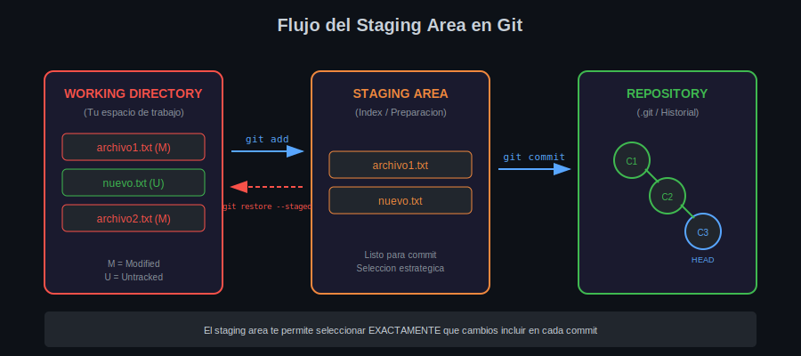

# 📦 Lección 01: El Staging Area

## 🎯 Objetivos de Aprendizaje

Al finalizar esta lección serás capaz de:

- [ ] Comprender el propósito del staging area en Git
- [ ] Diferenciar entre working directory, staging area y repository
- [ ] Usar `git add` de forma estratégica
- [ ] Quitar archivos del staging con `git restore --staged`
- [ ] Verificar el estado de tus archivos con `git status`

---

## 📚 Conceptos Teóricos

### ¿Qué es el Staging Area?

El **staging area** (también llamado **index**) es una zona intermedia entre tu directorio de trabajo y el repository. Es como un **área de preparación** donde seleccionas exactamente qué cambios incluir en tu próximo commit.

> 💡 **Analogía**: Imagina que estás preparando una caja para enviar. El staging area es la mesa donde colocas las cosas que quieres meter en la caja. Puedes agregar cosas, quitar algunas, revisar todo, y cuando estés satisfecho, cierras la caja (commit).

### Las Tres Áreas de Git



| Área | Descripción | Ubicación |
|------|-------------|-----------|
| **Working Directory** | Tu espacio de trabajo actual | Carpeta del proyecto |
| **Staging Area** | Zona de preparación | `.git/index` |
| **Repository** | Historial de commits | `.git/objects` |

### Estados de los Archivos

Un archivo en Git puede estar en uno de estos estados:


| Estado | Color en `git status` | Descripción |
|--------|----------------------|-------------|
| **Untracked** | Rojo | Git no conoce este archivo |
| **Modified** | Rojo | El archivo cambió desde el último commit |
| **Staged** | Verde | Listo para ser incluido en el commit |
| **Unmodified** | No aparece | Sin cambios (igual al último commit) |

---

## ⌨️ Comandos Principales

### 1. `git status` - Ver estado actual

```bash
# ¿Qué hace?: Muestra el estado de todos los archivos
# ¿Por qué?: Para saber qué archivos han cambiado y su estado
# ¿Para qué sirve?: Tomar decisiones informadas sobre qué commitear

git status

# Versión corta (para usuarios avanzados)
git status --short
# o
git status -s
```

**Output de ejemplo:**

```
On branch main
Changes to be committed:
  (use "git restore --staged <file>..." to unstage)
        new file:   README.md           ← Verde: en staging

Changes not staged for commit:
  (use "git add <file>..." to update what will be committed)
        modified:   index.html          ← Rojo: modificado

Untracked files:
  (use "git add <file>..." to include in what will be committed)
        config.js                       ← Rojo: no rastreado
```

### 2. `git add` - Agregar al staging

```bash
# ¿Qué hace?: Mueve archivos al staging area
# ¿Por qué?: Para preparar cambios específicos para el commit
# ¿Para qué sirve?: Control granular sobre qué incluir en cada commit

# Agregar un archivo específico
git add archivo.txt

# Agregar múltiples archivos
git add archivo1.txt archivo2.txt

# Agregar todos los archivos de una carpeta
git add src/

# Agregar todos los archivos modificados y nuevos
git add .

# ⚠️ CUIDADO: git add . agrega TODO
# Mejor práctica: agregar archivos específicos
```

### 3. `git add -p` - Agregar por partes (hunks)

```bash
# ¿Qué hace?: Permite agregar partes específicas de un archivo
# ¿Por qué?: Cuando un archivo tiene cambios que deberían ir en commits separados
# ¿Para qué sirve?: Crear commits más atómicos y lógicos

git add -p archivo.txt
# o
git add --patch archivo.txt
```

**Opciones interactivas:**
- `y` = sí, agregar este cambio
- `n` = no, omitir este cambio
- `s` = dividir en partes más pequeñas
- `q` = salir sin agregar más

### 4. `git restore --staged` - Quitar del staging

```bash
# ¿Qué hace?: Quita archivos del staging area (NO borra cambios)
# ¿Por qué?: Cuando agregaste algo por error o quieres reorganizar
# ¿Para qué sirve?: Flexibilidad para ajustar tu próximo commit

# Quitar un archivo del staging
git restore --staged archivo.txt

# Quitar todos los archivos del staging
git restore --staged .

# Método antiguo (aún funciona pero menos intuitivo)
git reset HEAD archivo.txt
```

### 5. `git diff` - Ver cambios

```bash
# ¿Qué hace?: Muestra las diferencias entre versiones
# ¿Por qué?: Para revisar exactamente qué cambió
# ¿Para qué sirve?: Verificar cambios antes de commitear

# Ver cambios en working directory (no staged)
git diff

# Ver cambios en staging area (listos para commit)
git diff --staged
# o
git diff --cached

# Ver cambios de un archivo específico
git diff archivo.txt
git diff --staged archivo.txt
```

---

## 🎯 Buenas Prácticas

### ✅ Hacer

1. **Usar staging estratégicamente** - Agrupa cambios relacionados
2. **Revisar antes de agregar** - Usa `git diff` para verificar
3. **Commits atómicos** - Un propósito por commit
4. **Agregar archivos específicos** - Evita `git add .` a ciegas

### ❌ Evitar

1. **Agregar todo siempre** - `git add .` sin revisar
2. **Commits gigantes** - Mezclar features, fixes y refactors
3. **Ignorar el staging** - Ir directo de working a commit
4. **No revisar el status** - Commitear sin verificar

---

## 🔨 Ejemplo Práctico

### Escenario: Trabajaste en dos cosas diferentes

Modificaste `login.js` (nueva feature) y `README.md` (documentación). Quieres commits separados.

```bash
# 1. Ver qué archivos cambiaron
git status
# Muestra:
#   modified: login.js
#   modified: README.md

# 2. Ver los cambios específicos
git diff login.js
git diff README.md

# 3. Agregar solo la feature al staging
git add login.js

# 4. Verificar staging
git status
# Muestra:
#   Changes to be committed:
#       modified: login.js     ← Verde
#   Changes not staged:
#       modified: README.md    ← Rojo

# 5. Hacer commit de la feature
git commit -m "feat(auth): implementar validación de login"

# 6. Ahora agregar la documentación
git add README.md
git commit -m "docs: actualizar README con instrucciones de login"
```

**Resultado**: Dos commits limpios y atómicos en lugar de uno mezclado.

---

## ⚠️ Errores Comunes

### Error 1: "Changes not staged for commit"

```bash
# Problema: Intentas commit pero no agregaste al staging
git commit -m "mi mensaje"
# Output: nothing to commit

# Solución: Primero agregar al staging
git add archivo.txt
git commit -m "mi mensaje"
```

### Error 2: Agregué algo que no quería

```bash
# Problema: Agregaste un archivo por error
git add archivo_secreto.txt  # ¡Ups!

# Solución: Quitar del staging
git restore --staged archivo_secreto.txt
# El archivo sigue en tu working directory, solo sale del staging
```

### Error 3: Quiero ver qué hay en staging

```bash
# Problema: No recuerdas qué agregaste al staging

# Solución 1: git status
git status

# Solución 2: git diff --staged (ver contenido)
git diff --staged
```

---

## 📝 Resumen de Comandos

| Comando | Acción |
|---------|--------|
| `git status` | Ver estado de archivos |
| `git status -s` | Estado en formato corto |
| `git add <archivo>` | Agregar archivo al staging |
| `git add .` | Agregar todos los cambios |
| `git add -p` | Agregar por partes |
| `git restore --staged <archivo>` | Quitar del staging |
| `git diff` | Ver cambios no staged |
| `git diff --staged` | Ver cambios en staging |

---

## 🔗 Navegación

| ⬅️ Anterior | 🏠 Semana | Siguiente ➡️ |
|:------------|:---------:|-------------:|
| [Assets](../0-assets/README.md) | [Week 02](../README.md) | [Commits Profesionales](02-commits-profesionales.md) |

---

## 📚 Recursos Adicionales

- [Git Book - Recording Changes](https://git-scm.com/book/en/v2/Git-Basics-Recording-Changes-to-the-Repository)
- [Git Documentation - git-add](https://git-scm.com/docs/git-add)

---

_Lección 01 Week 02 | Bootcamp Git/GitHub | 2025_
