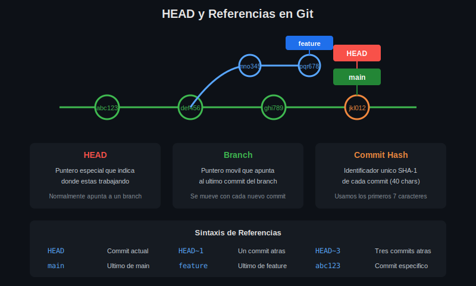

# 🧭 Lección 02: Navegación entre Branches

## 🎯 Objetivos de Aprendizaje

Al finalizar esta lección serás capaz de:

- ✅ Cambiar entre branches con `git switch` y `git checkout`
- ✅ Comprender qué es HEAD y cómo funciona
- ✅ Crear y cambiar a un branch en un solo comando
- ✅ Entender el estado "detached HEAD"

---

## 📖 ¿Qué es HEAD?

**HEAD** es un puntero especial que indica **dónde te encuentras actualmente** en el historial de Git. Normalmente, HEAD apunta a un branch, que a su vez apunta a un commit.



### Cadena de Referencias

```
HEAD → main → commit abc123
```

Cuando haces un nuevo commit:
1. Git crea el nuevo commit
2. El branch (main) se mueve al nuevo commit
3. HEAD sigue apuntando al branch

---

## 🔄 Cambiar de Branch

### Método Moderno: `git switch` (Git 2.23+)

```bash
# ¿Qué hace?: Cambia HEAD al branch especificado
# ¿Por qué?: Para trabajar en un branch diferente
# ¿Para qué sirve?: Cambiar el contexto de trabajo

git switch develop

# Salida:
# Switched to branch 'develop'
```

### Método Tradicional: `git checkout`

```bash
# ¿Qué hace?: Cambia HEAD al branch especificado
# ¿Por qué?: Comando histórico, aún muy usado
# ¿Para qué sirve?: Lo mismo que switch, pero con más opciones

git checkout develop

# Salida:
# Switched to branch 'develop'
```

> 💡 **Recomendación**: Usa `git switch` para cambiar branches. Es más claro e intuitivo.

---

## ✨ Crear y Cambiar en Un Solo Comando

### Con `git switch`

```bash
# ¿Qué hace?: Crea un branch nuevo y cambia a él inmediatamente
# ¿Por qué?: Ahorra escribir dos comandos separados
# ¿Para qué sirve?: Iniciar trabajo en una feature rápidamente

git switch --create feature/login
# Atajo: git switch -c feature/login

# Equivalente a:
# git branch feature/login
# git switch feature/login
```

### Con `git checkout`

```bash
# ¿Qué hace?: Crea un branch nuevo y cambia a él
# ¿Por qué?: Método tradicional, muy común en tutoriales
# ¿Para qué sirve?: Lo mismo que switch -c

git checkout -b feature/login

# Equivalente a:
# git branch feature/login
# git checkout feature/login
```

---

## 📍 Ver el Branch Actual

### Método 1: `git branch`

```bash
# El asterisco (*) indica el branch actual
git branch
#   develop
# * main
#   feature/login
```

### Método 2: `git status`

```bash
git status
# On branch main
# nothing to commit, working tree clean
```

### Método 3: Ver HEAD directamente

```bash
# ¿Qué hace?: Muestra a qué apunta HEAD
# ¿Por qué?: Para entender la referencia actual
# ¿Para qué sirve?: Debugging y comprensión interna

cat .git/HEAD
# ref: refs/heads/main
```

---

## ⚠️ Detached HEAD State

### ¿Qué es?

Un estado **"detached HEAD"** ocurre cuando HEAD apunta directamente a un commit en lugar de a un branch.

```bash
# Esto causa detached HEAD:
git checkout abc1234  # checkout a un commit específico

# Mensaje de Git:
# You are in 'detached HEAD' state. You can look around, make
# experimental changes and commit them...
```

### ¿Cuándo ocurre?

1. Checkout a un commit específico: `git checkout abc1234`
2. Checkout a un tag: `git checkout v1.0.0`
3. Durante un rebase interactivo

### ¿Cómo salir?

```bash
# Opción 1: Volver a un branch existente
git switch main

# Opción 2: Crear un branch desde el estado actual
git switch -c nuevo-branch

# Opción 3 (checkout tradicional)
git checkout main
```

### Diagrama Visual

```
Estado Normal:           Detached HEAD:
HEAD → main → C3        HEAD → C2
                        main → C3

    C1---C2---C3            C1---C2---C3
              ↑                  ↑     ↑
            main              HEAD   main
              ↑
            HEAD
```

---

## 🔢 Referencias Relativas

Git permite referenciar commits de forma relativa a HEAD:

| Referencia | Significado |
|------------|-------------|
| `HEAD` | Commit actual |
| `HEAD~1` | Un commit atrás |
| `HEAD~2` | Dos commits atrás |
| `HEAD~n` | n commits atrás |
| `HEAD^` | Padre del commit actual |
| `HEAD^^` | Abuelo del commit actual |

### Ejemplos Prácticos

```bash
# Ver el commit anterior
git show HEAD~1

# Ver diferencias con 3 commits atrás
git diff HEAD~3

# Volver temporalmente a ver un commit anterior
git checkout HEAD~2  # ¡Cuidado! Esto causa detached HEAD
```

---

## 🔀 Cambiar de Branch con Cambios Pendientes

### Escenario: Tienes cambios sin commit

```bash
# Situación: Estás en main con cambios sin guardar
git status
# On branch main
# Changes not staged for commit:
#   modified:   archivo.txt

# Intentas cambiar de branch:
git switch develop
```

### Caso 1: Git permite el cambio

Si los cambios NO entran en conflicto con el branch destino, Git lleva los cambios contigo.

### Caso 2: Git bloquea el cambio

```bash
# Error:
# error: Your local changes to the following files would be overwritten
# by checkout:
#     archivo.txt
# Please commit your changes or stash them before you switch branches.
```

### Soluciones

```bash
# Opción 1: Hacer commit de los cambios
git add .
git commit -m "wip: trabajo en progreso"
git switch develop

# Opción 2: Guardar temporalmente con stash
git stash
git switch develop
# ... trabajar en develop ...
git switch main
git stash pop

# Opción 3: Descartar los cambios (¡CUIDADO!)
git checkout -- archivo.txt
git switch develop
```

---

## 📋 Comparación: switch vs checkout

| Característica | `git switch` | `git checkout` |
|----------------|--------------|----------------|
| Cambiar branch | ✅ `switch <branch>` | ✅ `checkout <branch>` |
| Crear + cambiar | ✅ `switch -c <new>` | ✅ `checkout -b <new>` |
| Restaurar archivos | ❌ No | ✅ `checkout -- <file>` |
| Claridad | ✅ Más claro | ⚠️ Múltiples usos |
| Versión Git | 2.23+ | Todas |

> 💡 **Mejor práctica**: Usa `git switch` para branches y `git restore` para archivos.

---

## 💡 Tips Avanzados

### Volver al branch anterior

```bash
# ¿Qué hace?: Cambia al branch donde estabas antes
# ¿Por qué?: Útil para alternar entre dos branches
# ¿Para qué sirve?: Agilizar el flujo de trabajo

git switch -
# o
git checkout -

# Ejemplo:
# main → develop → main
git switch develop
git switch -  # Vuelve a main
git switch -  # Vuelve a develop
```

### Crear branch desde otro punto

```bash
# Crear branch desde un commit específico
git switch -c hotfix/urgent abc1234

# Crear branch desde otro branch
git switch -c feature/new develop
```

---

## 📝 Ejercicio Práctico

```bash
# 1. Verificar branch actual
git branch

# 2. Crear y cambiar a nuevo branch
git switch -c feature/test

# 3. Verificar el cambio
git branch

# 4. Hacer un commit en el nuevo branch
echo "Test" > test.txt
git add test.txt
git commit -m "feat: add test file"

# 5. Volver a main
git switch main

# 6. Verificar que test.txt no existe en main
ls test.txt  # No such file

# 7. Volver al feature branch
git switch -
ls test.txt  # El archivo existe
```

---

## 🎯 Resumen

| Comando | Descripción |
|---------|-------------|
| `git switch <branch>` | Cambiar a un branch |
| `git switch -c <new>` | Crear y cambiar a nuevo branch |
| `git switch -` | Volver al branch anterior |
| `git checkout <branch>` | Cambiar a branch (tradicional) |
| `git checkout -b <new>` | Crear y cambiar (tradicional) |
| `cat .git/HEAD` | Ver a qué apunta HEAD |

---

## 🔗 Navegación

| ⬅️ Anterior | 🏠 Índice | Siguiente ➡️ |
|:------------|:---------:|-------------:|
| [01 - Branches](01-branches-git.md) | [Teoría](.) | [03 - Merge](03-merge-basico.md) |

---

<div align="center">

**Lección 02** | Week 03: Branching Básico | Bootcamp Git/GitHub

</div>
