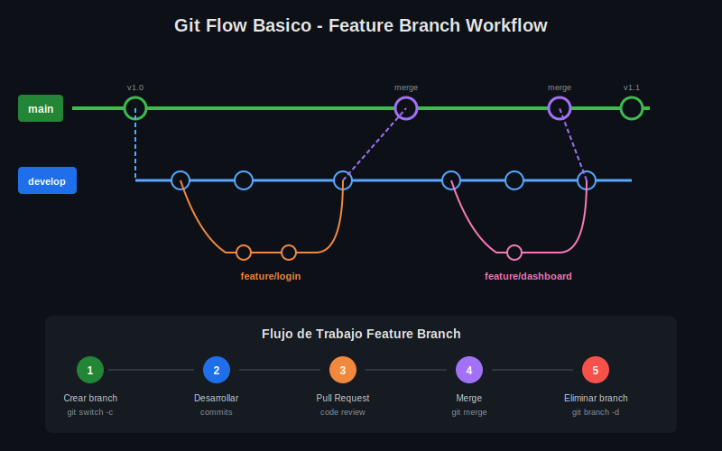

# 🎨 Assets Visuales - Week 03

Diagramas SVG para complementar el material teórico sobre **Branching Básico**.

---

## 📋 Lista de Assets

| Archivo | Descripción | Usado en |
|---------|-------------|----------|
| [01-branches-concepto.svg](01-branches-concepto.svg) | Visualización de branches y commits | [01-branches-git.md](../1-teoria/01-branches-git.md) |
| [02-tipos-merge.svg](02-tipos-merge.svg) | Fast-forward vs Three-way merge | [03-merge-basico.md](../1-teoria/03-merge-basico.md) |
| [03-head-referencias.svg](03-head-referencias.svg) | HEAD, branches y referencias | [02-navegacion-branches.md](../1-teoria/02-navegacion-branches.md) |
| [04-git-flow-basico.svg](04-git-flow-basico.svg) | Feature branch workflow | [04-estrategias-branching.md](../1-teoria/04-estrategias-branching.md) |

---

## 🎨 Estándares de Diseño

| Aspecto | Especificación |
|---------|----------------|
| **Formato** | SVG (Scalable Vector Graphics) |
| **Tema** | Dark mode |
| **Fondo** | `#0d1117` |
| **Texto principal** | `#e6e6e6`, `#c9d1d9` |
| **Colores branches** | main: `#3fb950`, feature: `#58a6ff`, merge: `#a371f7` |
| **Tipografía** | Arial, sans-serif |
| **Sin emojis** | Los emojis no renderizan en SVG puro |

---

## ✅ Checklist de Assets

- [x] Diagrama de concepto de branches
- [x] Comparativa tipos de merge
- [x] HEAD y referencias
- [x] Git Flow básico (feature branch)

---

## 🔗 Vista Previa

### 01 - Concepto de Branches

### 02 - Tipos de Merge

### 03 - HEAD y Referencias

### 04 - Git Flow Básico

---

[⬅️ Volver a Week 03](../README.md)
