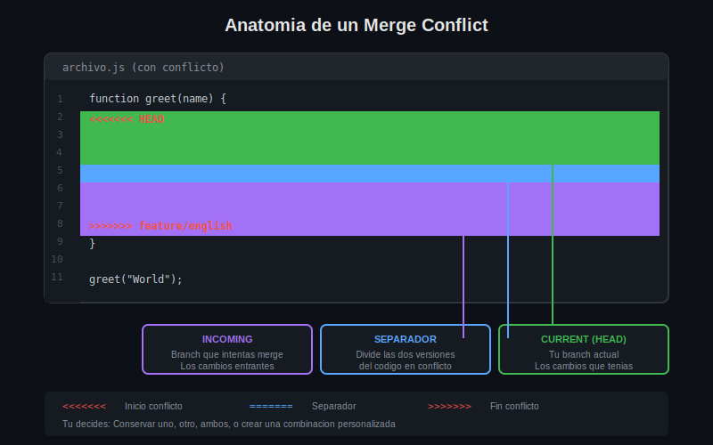

# Leccion 01: Que son los Merge Conflicts

## Objetivos de Aprendizaje

Al finalizar esta leccion seras capaz de:

- Entender por que y cuando ocurren los merge conflicts
- Identificar las situaciones que generan conflictos
- Distinguir entre merges automaticos y conflictos manuales
- Comprender el impacto de los conflictos en el flujo de trabajo

---

## Que es un Merge Conflict

Un **merge conflict** ocurre cuando Git no puede combinar automaticamente los cambios de dos branches porque ambos modificaron la misma parte de un archivo de manera diferente.

```
# Escenario que genera conflicto:

        A---B---C  (main)
             \
              D---E  (feature)

# Si B y D modificaron la MISMA linea del MISMO archivo
# Git no sabe cual version conservar
```

---

## Por que Ocurren los Conflictos

### 1. Misma Linea Modificada

```bash
# En main (commit B):
color: red;

# En feature (commit D):
color: blue;

# Git no puede decidir automaticamente cual es correcto
```

### 2. Modificaciones Cercanas

```bash
# Incluso cambios en lineas adyacentes pueden causar conflictos
# si Git no puede determinar el contexto correcto
```

### 3. Archivos Renombrados Diferente

```bash
# main renombro: utils.js -> helpers.js
# feature renombro: utils.js -> tools.js
```

### 4. Archivo Modificado vs Eliminado

```bash
# main: modifico config.js
# feature: elimino config.js
```

---

## Cuando NO Ocurren Conflictos

Git puede hacer merge automatico cuando:

```bash
# 1. Fast-forward merge (sin divergencia)
        A---B---C  (main)
                 \
                  D---E  (feature)

# 2. Cambios en archivos diferentes
main:    modifico index.html
feature: modifico styles.css

# 3. Cambios en diferentes partes del mismo archivo
main:    modifico lineas 1-10
feature: modifico lineas 50-60
```

---

## Diagrama: Cuando Ocurre un Conflicto



---

## Detectando un Conflicto

Cuando intentas hacer merge y hay conflicto:

```bash
# Intentar merge
git merge feature

# Salida cuando hay conflicto:
Auto-merging archivo.js
CONFLICT (content): Merge conflict in archivo.js
Automatic merge failed; fix conflicts and then commit the result.
```

### Verificar Estado

```bash
# Ver archivos en conflicto
git status

# Salida:
On branch main
You have unmerged paths.
  (fix conflicts and run "git commit")
  (use "git merge --abort" to abort the merge)

Unmerged paths:
  (use "git add <file>..." to mark resolution)
        both modified:   archivo.js
```

---

## Estados del Repositorio Durante Conflicto

```
Estado Normal          Durante Conflicto        Despues de Resolver
--------------         -----------------        -------------------
                       
Working Dir            Working Dir              Working Dir
[limpio]         -->   [archivos con       -->  [archivos limpios]
                        marcadores]
                       
Staging Area           Staging Area             Staging Area
[vacio]          -->   [conflictos         -->  [resueltos listos
                        pendientes]              para commit]
                       
HEAD                   HEAD                     HEAD
[ultimo commit]        [merge en progreso] -->  [merge commit]
```

---

## Impacto en el Flujo de Trabajo

### Sin Conflicto (Ideal)

```bash
git checkout main
git merge feature
# Automatic merge completado
git push
```

### Con Conflicto (Requiere Intervencion)

```bash
git checkout main
git merge feature
# CONFLICT detectado!

# Pausa para resolver manualmente
# (editar archivos, elegir cambios)

git add archivo-resuelto.js
git commit
git push
```

---

## Frecuencia de Conflictos

| Tipo de Equipo | Frecuencia | Causa Principal |
|----------------|------------|-----------------|
| Individual | Rara | Multiples branches propios |
| Equipo pequeno (2-5) | Ocasional | Archivos compartidos |
| Equipo mediano (5-15) | Frecuente | Multiples features paralelas |
| Equipo grande (15+) | Muy frecuente | Alta concurrencia |

---

## Prevencion Basica

```bash
# 1. Sincronizar frecuentemente
git pull origin main

# 2. Branches de corta duracion
# Merge rapido = menos divergencia

# 3. Comunicacion con el equipo
# "Voy a modificar archivo.js"

# 4. Commits pequenos y frecuentes
# Facilita identificar que cambio
```

---

## Resumen

| Concepto | Descripcion |
|----------|-------------|
| **Merge Conflict** | Git no puede combinar cambios automaticamente |
| **Causa principal** | Misma linea modificada en ambos branches |
| **Deteccion** | Mensaje "CONFLICT" al hacer merge |
| **Estado** | `both modified` en git status |
| **Solucion** | Editar manualmente + git add + git commit |

---

## Proximos Pasos

En la siguiente leccion aprenderemos:

- La anatomia de los marcadores de conflicto
- Como leer e interpretar `<<<<<<<`, `=======`, `>>>>>>>`
- Que representa cada seccion del conflicto

---

## Ejercicio de Verificacion

1. ¿Por que ocurre un merge conflict?
2. ¿Que mensaje muestra Git cuando detecta un conflicto?
3. ¿Que comando usas para ver archivos en conflicto?
4. ¿Puede Git resolver automaticamente cambios en archivos diferentes?

---

*Leccion 01 de 04 | Week 04: Merge Conflicts*
