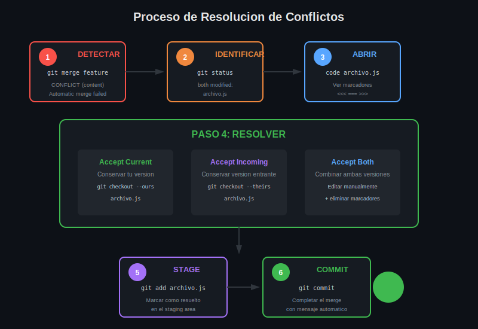

# Leccion 03: Resolucion Manual de Conflictos

## Objetivos de Aprendizaje

Al finalizar esta leccion seras capaz de:

- Resolver conflictos editando archivos manualmente
- Elegir entre diferentes estrategias de resolucion
- Completar el proceso de merge despues de resolver
- Abortar un merge si es necesario

---

## El Proceso de Resolucion



---

## Paso 1: Identificar Archivos en Conflicto

```bash
# Ver estado del repositorio
git status

# Salida:
On branch main
You have unmerged paths.

Unmerged paths:
  (use "git add <file>..." to mark resolution)
        both modified:   archivo.js
        both modified:   styles.css
```

---

## Paso 2: Abrir y Analizar el Archivo

```bash
# Abrir archivo en tu editor
code archivo.js

# O ver contenido en terminal
cat archivo.js
```

### Contenido del Archivo

```javascript
function greet(name) {
<<<<<<< HEAD
  return "Hola, " + name + "!";
  // Saludo en espanol
=======
  return "Hello, " + name + "!";
  // Greeting in English
>>>>>>> feature/english
}
```

---

## Paso 3: Elegir Estrategia de Resolucion

### Opcion A: Conservar Version Actual (Ours)

```javascript
// Resultado: solo tu version
function greet(name) {
  return "Hola, " + name + "!";
  // Saludo en espanol
}
```

### Opcion B: Conservar Version Entrante (Theirs)

```javascript
// Resultado: solo version entrante
function greet(name) {
  return "Hello, " + name + "!";
  // Greeting in English
}
```

### Opcion C: Combinar Ambas Versiones

```javascript
// Resultado: combinacion personalizada
function greet(name, language = 'es') {
  if (language === 'es') {
    return "Hola, " + name + "!";
  }
  return "Hello, " + name + "!";
}
```

### Opcion D: Reescribir Completamente

```javascript
// Resultado: nueva implementacion
function greet(name, language = 'es') {
  const greetings = {
    es: "Hola",
    en: "Hello",
    fr: "Bonjour"
  };
  return `${greetings[language] || greetings.en}, ${name}!`;
}
```

---

## Paso 4: Editar el Archivo

### Reglas al Editar

1. **Eliminar TODOS los marcadores**
   - `<<<<<<<`
   - `=======`
   - `>>>>>>>`

2. **Dejar codigo funcional**
   - Sintaxis correcta
   - Logica coherente

3. **Verificar contexto**
   - El codigo debe tener sentido
   - Probar si es posible

### Ejemplo de Edicion

**Antes (con conflicto):**
```javascript
function greet(name) {
<<<<<<< HEAD
  return "Hola, " + name + "!";
=======
  return "Hello, " + name + "!";
>>>>>>> feature/english
}
```

**Despues (resuelto - eligiendo combinar):**
```javascript
function greet(name, lang = 'es') {
  return lang === 'es' 
    ? "Hola, " + name + "!"
    : "Hello, " + name + "!";
}
```

---

## Paso 5: Marcar como Resuelto

```bash
# Agregar archivo resuelto al staging
git add archivo.js

# Verificar estado
git status

# Salida:
On branch main
All conflicts fixed but you are still merging.
  (use "git commit" to conclude merge)

Changes to be committed:
        modified:   archivo.js
```

---

## Paso 6: Completar el Merge

```bash
# Crear merge commit
git commit

# Git abrira editor con mensaje predeterminado:
Merge branch 'feature/english' into main

# Conflicts:
#       archivo.js
#
# It looks like you may be committing a merge.
# ...
```

### Mensaje de Commit Personalizado

```bash
# O con mensaje directo
git commit -m "Merge feature/english: combinar saludos multiidioma"
```

---

## Resolver Multiples Archivos

```bash
# Ver todos los archivos en conflicto
git status

# Resolver uno por uno
code archivo1.js   # editar y guardar
git add archivo1.js

code archivo2.js   # editar y guardar
git add archivo2.js

# Cuando todos esten resueltos
git commit
```

---

## Comandos de Ayuda Durante Resolucion

### Ver Diferencias

```bash
# Ver cambios en archivo con conflicto
git diff archivo.js

# Ver solo marcadores de conflicto
git diff --check
```

### Elegir Version Completa

```bash
# Usar TU version (current/ours)
git checkout --ours archivo.js
git add archivo.js

# Usar version ENTRANTE (incoming/theirs)
git checkout --theirs archivo.js
git add archivo.js
```

### Ver Versiones Originales

```bash
# Ver tu version
git show :2:archivo.js

# Ver version entrante
git show :3:archivo.js

# Ver version del ancestro comun
git show :1:archivo.js
```

---

## Abortar el Merge

Si decides no continuar con el merge:

```bash
# Cancelar merge y volver al estado anterior
git merge --abort

# Verificar que volviste al estado normal
git status

# Salida:
On branch main
nothing to commit, working tree clean
```

**Cuando abortar:**

- El conflicto es muy complejo
- Necesitas mas informacion del equipo
- Te diste cuenta que no deberias hacer el merge
- Quieres intentar con otra estrategia

---

## Flujo Completo de Resolucion

```bash
# 1. Intentar merge
git merge feature/nueva-funcionalidad
# CONFLICT detectado

# 2. Ver archivos afectados
git status

# 3. Resolver cada archivo
code archivo.js
# ... editar y eliminar marcadores ...

# 4. Marcar como resuelto
git add archivo.js

# 5. Verificar que todo esta resuelto
git status
# "All conflicts fixed"

# 6. Completar merge
git commit -m "Merge feature: resolver conflictos de config"

# 7. Verificar historial
git log --oneline -5
```

---

## Errores Comunes

### Error 1: Commit sin Resolver Todo

```bash
git commit
# error: Committing is not possible because you have unmerged files.
```

**Solucion:** Resolver todos los archivos con `git add`

### Error 2: Marcadores en el Codigo

```bash
# El archivo aun tiene <<<<<<< o similar
git add archivo.js
# Funciona pero el codigo esta roto!
```

**Solucion:** Verificar que eliminaste TODOS los marcadores

### Error 3: Perder Cambios

**Solucion:** Antes de resolver, revisar ambas versiones cuidadosamente

---

## Checklist de Resolucion

- [ ] Identificar todos los archivos en conflicto
- [ ] Abrir y entender cada conflicto
- [ ] Decidir estrategia (ours, theirs, combinar)
- [ ] Eliminar TODOS los marcadores
- [ ] Verificar que el codigo es funcional
- [ ] `git add` cada archivo resuelto
- [ ] Verificar con `git status`
- [ ] `git commit` para completar

---

## Resumen

| Paso | Comando | Descripcion |
|------|---------|-------------|
| Ver conflictos | `git status` | Lista archivos sin resolver |
| Editar | `code archivo.js` | Abrir en editor |
| Usar ours | `git checkout --ours file` | Conservar tu version |
| Usar theirs | `git checkout --theirs file` | Conservar entrante |
| Marcar resuelto | `git add archivo.js` | Agregar al staging |
| Completar | `git commit` | Crear merge commit |
| Cancelar | `git merge --abort` | Abortar merge |

---

## Proximos Pasos

En la siguiente leccion aprenderemos:

- Herramientas visuales para resolver conflictos
- Configurar git mergetool
- Estrategias de prevencion

---

*Leccion 03 de 04 | Week 04: Merge Conflicts*
