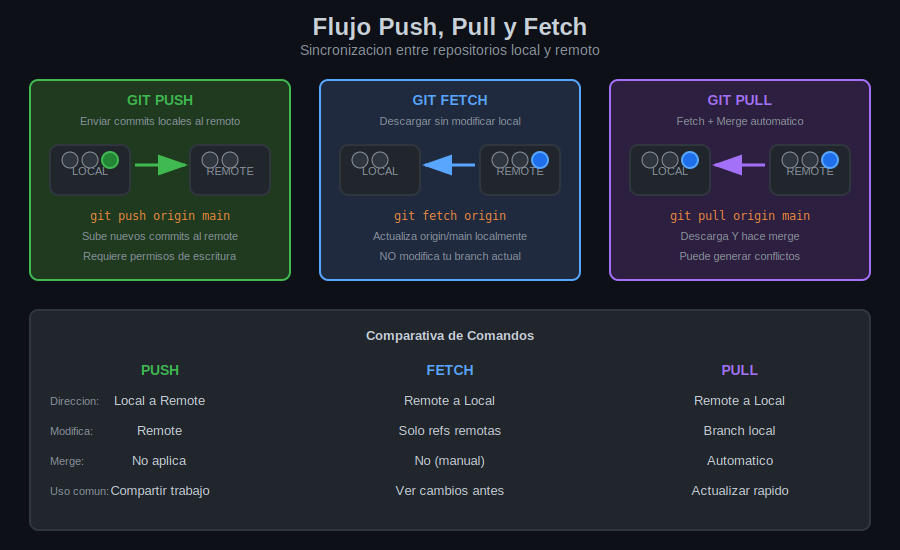

# Leccion 03: Git Push - Enviar Cambios

## Objetivos de Aprendizaje

Al finalizar esta leccion seras capaz de:

- Enviar commits locales al repositorio remoto
- Establecer tracking entre branches locales y remotos
- Manejar errores comunes de push
- Entender push de tags y branches

---

## Concepto de Push

Push envia tus commits locales al repositorio remoto:

```
ANTES del push:
                                    
LOCAL:    A---B---C---D  (main)     
                  ^                  
REMOTE:   A---B---C      (origin/main)


DESPUES del push:

LOCAL:    A---B---C---D  (main)
                      ^
REMOTE:   A---B---C---D  (origin/main)
```

---

## Diagrama: Flujo Push



---

## Push Basico

### Primer push de un branch

```bash
# ¿Que hace?: Envia commits y establece tracking
# ¿Por que?: Es la primera vez que subes este branch
# ¿Para que sirve?: Compartir tu trabajo y configurar seguimiento

git push -u origin main
# o
git push --set-upstream origin main
```

**La bandera `-u` (--set-upstream):**
- Establece relacion entre branch local y remoto
- Despues de esto, solo necesitas `git push`

### Push subsecuentes

```bash
# ¿Que hace?: Envia nuevos commits al remote ya configurado
# ¿Por que?: Ya estableciste upstream con -u
# ¿Para que sirve?: Actualizar el remoto con tu trabajo

git push
# Git sabe que "main" va a "origin/main"
```

### Push a branch especifico

```bash
# ¿Que hace?: Envia a un remote y branch especificos
# ¿Por que?: Quieres ser explicito o tienes multiples remotes
# ¿Para que sirve?: Control preciso de donde van los commits

git push origin main
git push origin feature-login
git push upstream develop
```

---

## Push de Branches Nuevos

### Crear y subir branch

```bash
# Crear branch local
git checkout -b feature/nueva-funcion

# Hacer cambios
git add .
git commit -m "feat: implementar nueva funcion"

# Subir al remoto (primera vez)
git push -u origin feature/nueva-funcion
```

### Ver tracking configurado

```bash
# ¿Que hace?: Muestra branches con su tracking
# ¿Por que?: Ver que branches estan conectados
# ¿Para que sirve?: Verificar configuracion

git branch -vv

# Salida:
# * main          a1b2c3d [origin/main] ultimo commit
#   feature-login e4f5g6h [origin/feature-login] login form
#   experimento   i7j8k9l sin tracking configurado
```

---

## Push de Tags

### Push de un tag especifico

```bash
# Crear tag
git tag v1.0.0

# ¿Que hace?: Envia un tag al remoto
# ¿Por que?: Los tags no se envian automaticamente
# ¿Para que sirve?: Publicar version para el equipo

git push origin v1.0.0
```

### Push de todos los tags

```bash
# ¿Que hace?: Envia todos los tags locales
# ¿Por que?: Tienes varios tags pendientes
# ¿Para que sirve?: Sincronizar todos los tags

git push origin --tags
```

---

## Manejo de Errores

### Error: Rejected (non-fast-forward)

```bash
$ git push origin main
To github.com:usuario/proyecto.git
 ! [rejected]        main -> main (non-fast-forward)
error: failed to push some refs
hint: Updates were rejected because the tip of your current branch is behind
```

**Causa:** El remoto tiene commits que tu no tienes.

**Solucion:**

```bash
# Opcion 1: Traer cambios y hacer merge
git pull origin main
# Resolver conflictos si hay
git push origin main

# Opcion 2: Traer y hacer rebase
git pull --rebase origin main
git push origin main
```

### Error: Permission denied

```bash
$ git push origin main
ERROR: Permission to usuario/repo.git denied to tu-usuario.
fatal: Could not read from remote repository.
```

**Causa:** No tienes permisos de escritura.

**Solucion:**
- Verificar que tienes acceso al repositorio
- Si es fork, debes hacer push a tu fork, no al original
- Verificar SSH keys o credenciales

### Error: Remote origin already exists

```bash
$ git remote add origin url
fatal: remote origin already exists.
```

**Solucion:**

```bash
# Cambiar URL
git remote set-url origin nueva-url

# O eliminar y agregar
git remote remove origin
git remote add origin nueva-url
```

---

## Push Force (Peligroso)

### ¿Cuando se usa?

Solo cuando necesitas sobreescribir historial remoto:
- Despues de rebase interactivo
- Para corregir error grave
- **NUNCA en branches compartidos sin avisar**

### Push force

```bash
# ¡PELIGROSO! Sobreescribe historial remoto
git push --force origin main
git push -f origin main
```

### Push force mas seguro

```bash
# ¿Que hace?: Force push pero verifica que nadie mas haya subido
# ¿Por que?: Evita sobreescribir trabajo de otros
# ¿Para que sirve?: Force push mas seguro

git push --force-with-lease origin main
```

**Diferencia:**
- `--force`: Sobreescribe sin preguntar
- `--force-with-lease`: Falla si hay nuevos commits en remoto

---

## Push a Multiples Remotes

```bash
# Ver remotes
git remote -v
# origin   git@github.com:tu-usuario/proyecto.git
# empresa  git@gitlab.empresa.com:proyecto.git

# Push a GitHub
git push origin main

# Push a GitLab de la empresa
git push empresa main

# Push a todos (manualmente)
git push origin main && git push empresa main
```

---

## Configurar Push por Defecto

### Push solo branch actual

```bash
# ¿Que hace?: Configura push para enviar solo el branch actual
# ¿Por que?: Comportamiento mas seguro y predecible
# ¿Para que sirve?: Evitar subir branches no deseados

git config --global push.default current
```

### Opciones de push.default

| Valor | Comportamiento |
|-------|---------------|
| `current` | Push branch actual al mismo nombre en remote |
| `simple` | Como current pero verifica que upstream coincida (default) |
| `upstream` | Push al branch configurado como upstream |
| `matching` | Push todos los branches con mismo nombre (antiguo) |

---

## Resumen de Comandos

| Comando | Descripcion |
|---------|-------------|
| `git push -u origin main` | Push con tracking |
| `git push` | Push a upstream configurado |
| `git push origin branch` | Push explicito |
| `git push origin --tags` | Push todos los tags |
| `git push --force-with-lease` | Force push seguro |
| `git branch -vv` | Ver tracking |

---

## Checklist Antes de Push

- [ ] Commits con mensajes claros
- [ ] Codigo probado localmente
- [ ] `git pull` para tener ultimos cambios
- [ ] Conflictos resueltos
- [ ] Branch correcto seleccionado

---

## Siguiente Leccion

En la siguiente leccion aprenderemos la diferencia entre `git pull` y `git fetch`.

[Continuar con Leccion 04: Pull vs Fetch](04-pull-vs-fetch.md)

---

*Week 05 - Leccion 03 | Bootcamp Git/GitHub*
