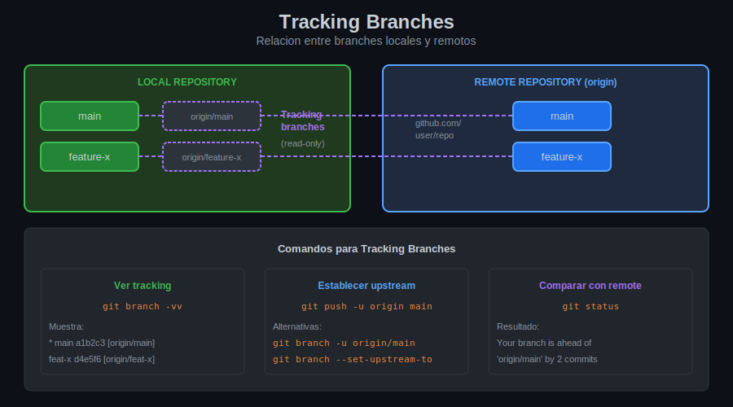

# Leccion 04: Pull vs Fetch - Sincronizacion

## Objetivos de Aprendizaje

Al finalizar esta leccion seras capaz de:

- Entender la diferencia fundamental entre pull y fetch
- Usar fetch para revision segura de cambios
- Aplicar pull en diferentes situaciones
- Usar pull con rebase cuando sea apropiado

---

## La Diferencia Fundamental

| Comando | Accion | Modifica tu branch? |
|---------|--------|---------------------|
| `git fetch` | Descarga cambios | NO |
| `git pull` | Descarga + Merge | SI |

```
git pull = git fetch + git merge
```

---

## Diagrama: Fetch vs Pull


---

## Git Fetch

### Concepto

Fetch descarga cambios del remoto pero NO los aplica a tu branch:

```
ANTES del fetch:

LOCAL:    A---B---C  (main)
                 ^
                 origin/main (desactualizado)

REMOTE:   A---B---C---D---E


DESPUES del fetch:

LOCAL:    A---B---C  (main) <- tu trabajo sigue igual
                     \
                      D---E  (origin/main) <- actualizado

Tu main no cambio, pero origin/main si
```

### Uso basico

```bash
# ¿Que hace?: Descarga todos los cambios de origin
# ¿Por que?: Quieres ver que hay nuevo sin modificar tu codigo
# ¿Para que sirve?: Revision segura antes de merge

git fetch origin
```

### Fetch de branch especifico

```bash
# ¿Que hace?: Descarga solo un branch
# ¿Por que?: Solo te interesa un branch especifico
# ¿Para que sirve?: Descarga mas rapida y enfocada

git fetch origin main
git fetch origin develop
```

### Fetch de todos los remotes

```bash
# ¿Que hace?: Descarga de todos los remotes configurados
# ¿Por que?: Tienes multiples remotes (origin, upstream)
# ¿Para que sirve?: Sincronizar todo de una vez

git fetch --all
```

### Ver que trajo fetch

```bash
# Despues de fetch, comparar
git log main..origin/main --oneline
# Muestra commits en origin/main que no estan en main

git diff main origin/main
# Muestra diferencias de codigo
```

---

## Git Pull

### Concepto

Pull descarga Y aplica cambios automaticamente:

```
ANTES del pull:

LOCAL:    A---B---C  (main)

REMOTE:   A---B---C---D---E


DESPUES del pull (con merge):

LOCAL:    A---B---C-------F  (main)
                   \     /
                    D---E

F es un merge commit
```

### Uso basico

```bash
# ¿Que hace?: Descarga y hace merge automaticamente
# ¿Por que?: Quieres actualizar tu branch rapidamente
# ¿Para que sirve?: Sincronizacion rapida

git pull origin main
```

### Pull al branch actual

```bash
# Si ya tienes upstream configurado
git pull
# Hace pull del tracking branch
```

---

## Pull con Rebase

### Concepto

En vez de crear merge commit, reaplica tus commits sobre los nuevos:

```
ANTES del pull --rebase:

LOCAL:    A---B---C---X  (main, X es tu commit)

REMOTE:   A---B---C---D---E


DESPUES del pull --rebase:

LOCAL:    A---B---C---D---E---X'  (main)

X' es tu commit reaplicado (nuevo hash)
Historial lineal, sin merge commit
```

### Uso

```bash
# ¿Que hace?: Fetch + rebase en vez de merge
# ¿Por que?: Mantiene historial mas limpio
# ¿Para que sirve?: Evitar merge commits innecesarios

git pull --rebase origin main
```

### Configurar rebase por defecto

```bash
# Para un branch especifico
git config branch.main.rebase true

# Para todos los branches
git config --global pull.rebase true
```

---

## Cuando Usar Cada Uno

### Usa Fetch cuando:

- Quieres revisar cambios antes de aplicarlos
- Estas en medio de trabajo y no quieres interrumpir
- Quieres comparar tu trabajo con el remoto
- Tienes cambios locales sin commit

```bash
# Flujo seguro con fetch
git fetch origin
git log main..origin/main    # Ver que hay nuevo
git diff main origin/main    # Ver diferencias
git merge origin/main        # Aplicar cuando estes listo
```

### Usa Pull cuando:

- Confias en los cambios remotos
- Quieres actualizar rapidamente
- Tu branch local esta limpio
- Empiezas el dia de trabajo

```bash
# Flujo rapido con pull
git pull origin main
# Listo para trabajar
```

### Usa Pull --rebase cuando:

- Quieres historial lineal
- Tus commits locales son pequenos
- No has compartido tus commits aun
- El equipo usa esta convencion

```bash
# Flujo con rebase
git pull --rebase origin main
git push origin main
```

---

## Manejo de Conflictos

### Conflictos en Pull

```bash
$ git pull origin main
Auto-merging archivo.js
CONFLICT (content): Merge conflict in archivo.js
Automatic merge failed; fix conflicts and then commit the result.
```

**Solucion:**

```bash
# Editar archivos con conflictos
vim archivo.js

# Marcar como resuelto
git add archivo.js

# Completar merge
git commit -m "Merge origin/main, resolver conflictos"
```

### Conflictos en Pull --rebase

```bash
$ git pull --rebase origin main
CONFLICT (content): Merge conflict in archivo.js
error: could not apply abc1234... tu commit
```

**Solucion:**

```bash
# Editar archivos con conflictos
vim archivo.js

# Marcar como resuelto
git add archivo.js

# Continuar rebase
git rebase --continue

# Si quieres abortar
git rebase --abort
```

---

## Fetch + Merge Manual

Flujo mas controlado que pull:

```bash
# Paso 1: Descargar cambios
git fetch origin

# Paso 2: Ver que hay nuevo
git log HEAD..origin/main --oneline
# a1b2c3d feat: nueva funcion
# d4e5f6g fix: corregir bug

# Paso 3: Revisar cambios
git diff main origin/main

# Paso 4: Decidir y aplicar
git merge origin/main
# o
git rebase origin/main
```

---

## Tracking Branches

Los tracking branches muestran la relacion local-remote:



### Ver estado de tracking

```bash
git status
# On branch main
# Your branch is behind 'origin/main' by 2 commits

git branch -vv
# * main a1b2c3d [origin/main: behind 2] mensaje
```

### Significados

| Estado | Significado |
|--------|-------------|
| `up to date` | Sincronizado |
| `ahead N` | Tienes N commits para push |
| `behind N` | Remoto tiene N commits nuevos |
| `ahead N, behind M` | Ambos tienen commits nuevos |

---

## Resumen de Comandos

| Comando | Descripcion |
|---------|-------------|
| `git fetch origin` | Descargar sin aplicar |
| `git fetch --all` | Descargar de todos los remotes |
| `git pull origin main` | Descargar y merge |
| `git pull --rebase` | Descargar y rebase |
| `git log main..origin/main` | Ver commits nuevos |
| `git diff main origin/main` | Ver diferencias |

---

## Tabla Comparativa Final

| Aspecto | Fetch | Pull | Pull --rebase |
|---------|-------|------|---------------|
| Descarga cambios | Si | Si | Si |
| Modifica tu branch | No | Si | Si |
| Crea merge commit | No | Si* | No |
| Seguro para revisar | Si | No | No |
| Historial lineal | N/A | No | Si |

*Solo si hay cambios que fusionar

---

## Siguiente Leccion

Ahora estas listo para los ejercicios practicos de sincronizacion remota.

[Ir a Practicas](../2-practicas/README.md)

---

*Week 05 - Leccion 04 | Bootcamp Git/GitHub*
