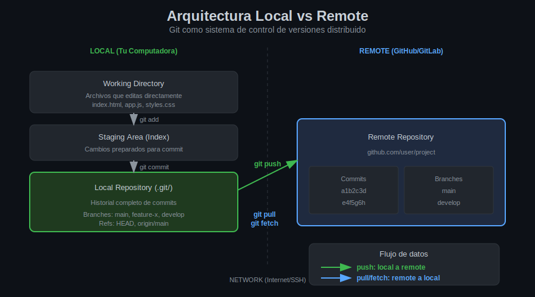

# Leccion 01: Arquitectura Distribuida de Git

## Objetivos de Aprendizaje

Al finalizar esta leccion seras capaz de:

- Comprender la diferencia entre sistemas centralizados y distribuidos
- Entender la relacion entre repositorios locales y remotos
- Identificar las ventajas de la arquitectura distribuida de Git

---

## Sistemas de Control de Versiones

### Sistemas Centralizados (CVCS)

En sistemas como SVN o CVS, existe un unico servidor central:

```
                    [Servidor Central]
                          |
            +-------------+-------------+
            |             |             |
        [Dev A]       [Dev B]       [Dev C]
        (copia)       (copia)       (copia)
```

**Caracteristicas:**
- Un solo punto de verdad
- Requiere conexion para la mayoria de operaciones
- Si el servidor falla, nadie puede trabajar

### Sistemas Distribuidos (DVCS)

Git es un sistema distribuido donde cada desarrollador tiene una copia completa:

```
    [GitHub]              [GitLab]              [Bitbucket]
        |                     |                      |
        +----------+----------+----------+-----------+
                   |                     |
              [Dev A]                [Dev B]
           (repo completo)        (repo completo)
           - historial            - historial
           - branches             - branches
           - commits              - commits
```

**Caracteristicas:**
- Cada clon es un repositorio completo
- Puedes trabajar sin conexion
- Multiples respaldos naturales

---

## Repositorio Local vs Remoto

### Repositorio Local

Es el repositorio en tu computadora. Contiene:

```
tu-proyecto/
├── .git/                    # Repositorio local
│   ├── objects/             # Todos los commits y datos
│   ├── refs/                # Referencias (branches, tags)
│   ├── HEAD                 # Branch actual
│   └── config               # Configuracion local
├── src/                     # Tu codigo
└── README.md
```

**Operaciones locales (sin internet):**
- `git add` - Preparar cambios
- `git commit` - Guardar en historial
- `git branch` - Crear/listar branches
- `git log` - Ver historial
- `git diff` - Ver diferencias
- `git merge` - Fusionar branches

### Repositorio Remoto

Es un repositorio alojado en un servidor (GitHub, GitLab, etc.):

```
github.com/tu-usuario/tu-proyecto
├── Commits                  # Historial compartido
├── Branches                 # Branches del equipo
├── Pull Requests            # Propuestas de cambios
└── Issues                   # Seguimiento de tareas
```

**Operaciones remotas (requieren internet):**
- `git push` - Enviar commits
- `git pull` - Obtener y merge
- `git fetch` - Solo obtener
- `git clone` - Copiar repositorio

---

## Diagrama: Arquitectura Local-Remote



---

## Las Tres Areas Locales

Git mantiene tres areas en tu computadora:

### 1. Working Directory

```
Donde editas archivos normalmente.
Puedes ver y modificar el codigo.
```

### 2. Staging Area (Index)

```
Area de preparacion.
Cambios listos para el proximo commit.
```

### 3. Local Repository (.git/)

```
Historial completo de commits.
Branches y referencias.
```

**Flujo de trabajo:**

```bash
# 1. Editas en Working Directory
vim archivo.js

# 2. Preparas en Staging Area
git add archivo.js

# 3. Guardas en Local Repository
git commit -m "feat: agregar funcion"

# 4. Envias a Remote Repository
git push origin main
```

---

## Ventajas de la Arquitectura Distribuida

### 1. Trabajo Offline

```bash
# Puedes hacer commits sin internet
git add .
git commit -m "avance del dia"

# Y sincronizar cuando tengas conexion
git push origin main
```

### 2. Velocidad

Casi todas las operaciones son locales:

| Operacion | Centralizado | Distribuido |
|-----------|--------------|-------------|
| Ver historial | Requiere red | Instantaneo |
| Crear branch | Requiere red | Instantaneo |
| Hacer commit | Requiere red | Instantaneo |
| Ver diff | Requiere red | Instantaneo |

### 3. Respaldo Automatico

Cada clon es un respaldo completo:

```
Si GitHub cae:
- Tu tienes copia completa
- Tus companeros tienen copias
- Pueden reconstruir desde cualquier clon
```

### 4. Flexibilidad de Flujos

Puedes tener multiples remotes:

```bash
# Tu fork
git remote add origin git@github.com:tu-usuario/proyecto.git

# Proyecto original
git remote add upstream git@github.com:original/proyecto.git

# Servidor de la empresa
git remote add empresa git@empresa.com:proyecto.git
```

---

## Remotes: Conexiones a Repositorios Remotos

### ¿Que es un Remote?

Un remote es un alias para la URL de un repositorio remoto:

```bash
# Ver remotes configurados
git remote -v

# Salida tipica
origin    git@github.com:tu-usuario/proyecto.git (fetch)
origin    git@github.com:tu-usuario/proyecto.git (push)
```

### Nombres Comunes

| Nombre | Uso |
|--------|-----|
| `origin` | Tu repositorio principal (fork o propio) |
| `upstream` | Repositorio original (en fork workflow) |

### Comandos Basicos

```bash
# ¿Que hace?: Ver todos los remotes configurados
# ¿Por que?: Para verificar las conexiones disponibles
# ¿Para que sirve?: Confirmar URLs y nombres de remotes
git remote -v

# ¿Que hace?: Agregar un nuevo remote
# ¿Por que?: Para conectar con otro repositorio
# ¿Para que sirve?: Poder hacer push/pull a ese repo
git remote add <nombre> <url>

# ¿Que hace?: Eliminar un remote
# ¿Por que?: Ya no necesitas esa conexion
# ¿Para que sirve?: Limpiar configuracion
git remote remove <nombre>

# ¿Que hace?: Cambiar URL de un remote
# ¿Por que?: La URL cambio o quieres usar SSH
# ¿Para que sirve?: Actualizar la conexion
git remote set-url <nombre> <nueva-url>
```

---

## Ejercicio Mental

Imagina este escenario:

1. Clonas un proyecto de GitHub
2. Tu companero tambien lo clona
3. Tu haces 5 commits locales sin internet
4. Tu companero hace 3 commits y los sube
5. Recuperas conexion

**Preguntas:**
- ¿Cuantos commits tienes localmente?
- ¿Cuantos commits tiene GitHub?
- ¿Que comando usarias para sincronizar?

---

## Resumen

| Concepto | Descripcion |
|----------|-------------|
| Local Repository | Copia completa en tu maquina |
| Remote Repository | Copia en servidor (GitHub) |
| Remote | Alias para URL de repo remoto |
| Origin | Nombre convencion para tu remote principal |
| Distribuido | Cada clon tiene historial completo |

---

## Siguiente Leccion

En la siguiente leccion aprenderemos sobre `git remote` y `git clone` para configurar y obtener repositorios remotos.

[Continuar con Leccion 02: Git Remote y Clone](02-remote-clone.md)

---

*Week 05 - Leccion 01 | Bootcamp Git/GitHub*
