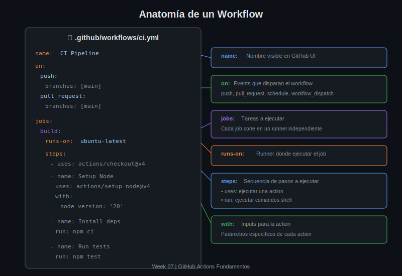

# Lección 02: Sintaxis YAML para Workflows

## 🎯 Objetivos de Aprendizaje

Al finalizar esta lección serás capaz de:

- Comprender la estructura básica de YAML
- Escribir workflows con sintaxis correcta
- Usar variables, expresiones y contextos
- Aplicar mejores prácticas de organización

---

## 📖 Fundamentos de YAML

YAML (YAML Ain't Markup Language) es el formato usado para definir workflows en GitHub Actions.

### Reglas Básicas

```yaml
# Comentarios con #

# Key-value pairs
name: Mi Workflow
version: 1.0

# Listas con guión
items:
  - item1
  - item2
  - item3

# Listas inline
tags: [ci, test, build]

# Objetos anidados (indentación con 2 espacios)
job:
  name: Build
  runs-on: ubuntu-latest
  steps:
    - name: Step 1
      run: echo "Hello"
```

### ⚠️ Errores Comunes

```yaml
# ❌ INCORRECTO: tabs en lugar de espacios
job:
	name: Build    # TAB - causará error

# ✅ CORRECTO: siempre usar espacios
job:
  name: Build      # 2 espacios

# ❌ INCORRECTO: indentación inconsistente
steps:
  - name: Step 1
   run: echo "Hi"  # 1 espacio - error

# ✅ CORRECTO: indentación consistente
steps:
  - name: Step 1
    run: echo "Hi" # 4 espacios desde steps
```

---

## 📋 Anatomía de un Workflow



### Estructura Completa

```yaml
# ========================================
# NIVEL 1: Metadatos del Workflow
# ========================================
name: CI Pipeline                    # Nombre visible en GitHub UI

# ========================================
# NIVEL 2: Triggers (Cuándo ejecutar)
# ========================================
on:
  push:
    branches: [main, develop]
  pull_request:
    branches: [main]

# ========================================
# NIVEL 3: Variables de entorno globales
# ========================================
env:
  NODE_VERSION: '20'
  CI: true

# ========================================
# NIVEL 4: Jobs (Qué ejecutar)
# ========================================
jobs:
  # ------------------------------------
  # Job 1: Build
  # ------------------------------------
  build:
    name: Build Application
    runs-on: ubuntu-latest
    
    # Variables de entorno del job
    env:
      BUILD_ENV: production
    
    # Steps del job
    steps:
      - name: Checkout
        uses: actions/checkout@v4
      
      - name: Build
        run: npm run build

  # ------------------------------------
  # Job 2: Test
  # ------------------------------------
  test:
    name: Run Tests
    needs: build                      # Depende de build
    runs-on: ubuntu-latest
    
    steps:
      - name: Checkout
        uses: actions/checkout@v4
      
      - name: Test
        run: npm test
```

---

## 🔑 Keys Principales

### `name`

```yaml
# Nombre del workflow (aparece en UI)
name: CI/CD Pipeline

jobs:
  build:
    # Nombre del job (aparece en UI)
    name: Build and Compile
    
    steps:
      # Nombre del step (aparece en logs)
      - name: Install dependencies
        run: npm ci
```

### `on` (Triggers)

```yaml
# Trigger simple
on: push

# Múltiples triggers (array)
on: [push, pull_request]

# Triggers con configuración
on:
  push:
    branches:
      - main
      - 'release/**'      # Glob pattern
    paths:
      - 'src/**'          # Solo si cambia src/
      - '!src/**/*.md'    # Excepto markdown
  
  pull_request:
    types: [opened, synchronize, reopened]
  
  schedule:
    - cron: '0 2 * * *'   # Diario a las 2 AM
  
  workflow_dispatch:       # Manual trigger
    inputs:
      environment:
        description: 'Deploy environment'
        required: true
        default: 'staging'
        type: choice
        options:
          - staging
          - production
```

### `jobs`

```yaml
jobs:
  # Identificador único del job (sin espacios)
  build-and-test:
    name: Build and Test           # Nombre legible
    runs-on: ubuntu-latest         # Runner
    
    # Timeout (default: 360 minutos)
    timeout-minutes: 30
    
    # Continuar aunque falle
    continue-on-error: false
    
    # Dependencias
    needs: [lint, security-scan]
    
    # Condicional
    if: github.event_name == 'push'
    
    steps:
      - run: echo "Building..."
```

### `runs-on`

```yaml
jobs:
  # GitHub-hosted runners
  linux:
    runs-on: ubuntu-latest      # Ubuntu 22.04
  
  windows:
    runs-on: windows-latest     # Windows Server 2022
  
  mac:
    runs-on: macos-latest       # macOS 14
  
  # Versiones específicas
  specific:
    runs-on: ubuntu-22.04
  
  # Self-hosted con labels
  custom:
    runs-on: [self-hosted, linux, x64, gpu]
```

### `steps`

```yaml
steps:
  # Usar una action
  - uses: actions/checkout@v4
  
  # Usar action con parámetros
  - uses: actions/setup-node@v4
    with:
      node-version: '20'
      cache: 'npm'
  
  # Ejecutar comando
  - run: npm ci
  
  # Comando con nombre
  - name: Run tests
    run: npm test
  
  # Múltiples comandos
  - name: Build and deploy
    run: |
      npm run build
      npm run deploy
  
  # Con variables de entorno
  - name: Deploy
    run: ./deploy.sh
    env:
      API_KEY: ${{ secrets.API_KEY }}
  
  # Con directorio de trabajo
  - name: Build frontend
    run: npm run build
    working-directory: ./frontend
  
  # Con shell específico
  - name: PowerShell script
    run: Get-Process
    shell: pwsh
```

---

## 🔧 Variables y Expresiones

### Contextos Disponibles

```yaml
# Contexto github
${{ github.repository }}        # owner/repo
${{ github.ref }}               # refs/heads/main
${{ github.ref_name }}          # main
${{ github.sha }}               # commit SHA
${{ github.actor }}             # usuario que disparó
${{ github.event_name }}        # push, pull_request, etc.
${{ github.workspace }}         # /home/runner/work/repo/repo
${{ github.run_id }}            # ID único de la ejecución

# Contexto env
${{ env.MY_VAR }}               # Variable de entorno

# Contexto secrets
${{ secrets.API_KEY }}          # Secret del repositorio

# Contexto job
${{ job.status }}               # success, failure, cancelled

# Contexto steps
${{ steps.step_id.outputs.result }}  # Output de un step

# Contexto matrix
${{ matrix.node-version }}      # Valor de la matrix
```

### Variables de Entorno

```yaml
# Globales (todo el workflow)
env:
  CI: true
  NODE_ENV: production

jobs:
  build:
    # Nivel job
    env:
      BUILD_TARGET: dist
    
    steps:
      - name: Build
        # Nivel step
        env:
          API_URL: https://api.example.com
        run: |
          echo "CI: $CI"
          echo "Target: $BUILD_TARGET"
          echo "API: $API_URL"
```

### Expresiones

```yaml
# Condicionales
if: ${{ github.ref == 'refs/heads/main' }}
if: ${{ github.event_name == 'pull_request' }}
if: ${{ contains(github.event.head_commit.message, '[skip ci]') }}
if: ${{ always() }}                    # Siempre ejecutar
if: ${{ success() }}                   # Solo si previo exitoso
if: ${{ failure() }}                   # Solo si previo falló
if: ${{ cancelled() }}                 # Solo si cancelado

# Operadores
if: ${{ github.ref == 'refs/heads/main' && github.event_name == 'push' }}
if: ${{ github.actor == 'dependabot[bot]' || github.actor == 'renovate[bot]' }}
if: ${{ !contains(github.event.head_commit.message, '[skip ci]') }}

# Funciones
${{ format('Hello {0}', github.actor) }}
${{ join(matrix.os, ', ') }}
${{ toJSON(github.event) }}
${{ fromJSON(needs.setup.outputs.config) }}
```

---

## 📤 Outputs entre Steps y Jobs

### Outputs de Steps

```yaml
jobs:
  build:
    runs-on: ubuntu-latest
    steps:
      - name: Set output
        id: step1
        run: echo "version=1.2.3" >> $GITHUB_OUTPUT
      
      - name: Use output
        run: echo "Version is ${{ steps.step1.outputs.version }}"
```

### Outputs de Jobs

```yaml
jobs:
  setup:
    runs-on: ubuntu-latest
    # Declarar outputs del job
    outputs:
      version: ${{ steps.get-version.outputs.version }}
    
    steps:
      - name: Get version
        id: get-version
        run: echo "version=1.2.3" >> $GITHUB_OUTPUT
  
  build:
    needs: setup
    runs-on: ubuntu-latest
    steps:
      - name: Use version
        run: echo "Building version ${{ needs.setup.outputs.version }}"
```

---

## 🧩 Patrones Comunes

### Checkout del Código

```yaml
steps:
  # Checkout básico
  - uses: actions/checkout@v4
  
  # Con historial completo
  - uses: actions/checkout@v4
    with:
      fetch-depth: 0
  
  # Checkout de PR
  - uses: actions/checkout@v4
    with:
      ref: ${{ github.event.pull_request.head.sha }}
```

### Setup de Node.js

```yaml
steps:
  - uses: actions/checkout@v4
  
  - name: Setup Node.js
    uses: actions/setup-node@v4
    with:
      node-version: '20'
      cache: 'npm'
  
  - run: npm ci
  - run: npm test
```

### Caché de Dependencias

```yaml
steps:
  - uses: actions/checkout@v4
  
  - name: Cache node modules
    uses: actions/cache@v4
    with:
      path: ~/.npm
      key: ${{ runner.os }}-node-${{ hashFiles('**/package-lock.json') }}
      restore-keys: |
        ${{ runner.os }}-node-
  
  - run: npm ci
```

### Upload/Download Artifacts

```yaml
jobs:
  build:
    runs-on: ubuntu-latest
    steps:
      - run: npm run build
      
      - name: Upload build
        uses: actions/upload-artifact@v4
        with:
          name: build
          path: dist/
  
  deploy:
    needs: build
    runs-on: ubuntu-latest
    steps:
      - name: Download build
        uses: actions/download-artifact@v4
        with:
          name: build
          path: dist/
      
      - run: ./deploy.sh
```

---

## ✅ Mejores Prácticas

### 1. Versiones Fijadas

```yaml
# ✅ CORRECTO: versión específica
- uses: actions/checkout@v4

# ⚠️ ACEPTABLE: major version
- uses: actions/checkout@v4

# ❌ EVITAR: sin versión o branch
- uses: actions/checkout@main
- uses: actions/checkout
```

### 2. Nombres Descriptivos

```yaml
# ✅ CORRECTO
name: CI - Build and Test
jobs:
  build:
    name: Build Application
    steps:
      - name: Install production dependencies
        run: npm ci --production

# ❌ EVITAR
name: ci
jobs:
  job1:
    steps:
      - run: npm ci --production
```

### 3. Secrets Seguros

```yaml
# ✅ CORRECTO: usar secrets
env:
  API_KEY: ${{ secrets.API_KEY }}

# ❌ NUNCA: hardcodear secrets
env:
  API_KEY: sk-1234567890abcdef
```

---

## 📚 Recursos

- [Workflow Syntax Reference](https://docs.github.com/en/actions/reference/workflow-syntax-for-github-actions)
- [Contexts Reference](https://docs.github.com/en/actions/learn-github-actions/contexts)
- [Expressions Reference](https://docs.github.com/en/actions/learn-github-actions/expressions)

---

[⬅️ Anterior: Introducción](01-introduccion-actions.md) | [➡️ Siguiente: Events y Triggers](03-events-triggers.md)

---

_Lección 02 | Week 07 | GitHub Actions Fundamentos_
