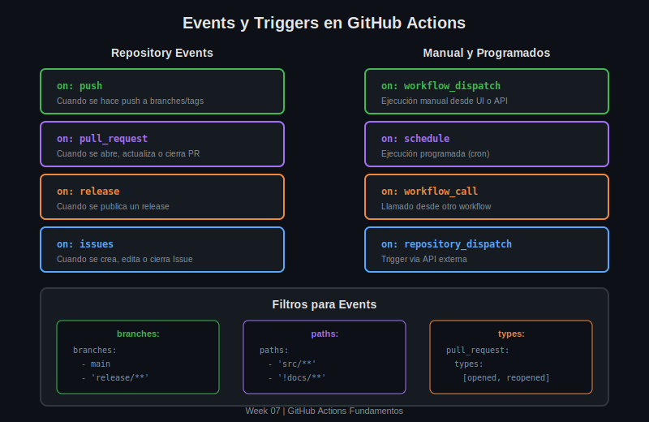

# Lección 03: Events y Triggers

## 🎯 Objetivos de Aprendizaje

Al finalizar esta lección serás capaz de:

- Configurar diferentes tipos de events para workflows
- Aplicar filtros de branches y paths
- Usar triggers manuales y programados
- Combinar múltiples events efectivamente

---

## 📖 ¿Qué son los Events?

Los **events** son actividades que disparan la ejecución de un workflow. GitHub Actions soporta más de 30 tipos de eventos diferentes.



---

## 🔥 Events de Código

### `push`

Se dispara cuando se hace push de commits o tags.

```yaml
# Básico: cualquier push
on: push

# Con filtros de branches
on:
  push:
    branches:
      - main
      - develop
      - 'release/**'        # Glob: release/1.0, release/2.0
      - '!release/**-beta'  # Excluir betas

# Con filtros de tags
on:
  push:
    tags:
      - 'v*'                # v1.0, v2.0.0
      - '!v*-rc*'           # Excluir release candidates

# Con filtros de paths
on:
  push:
    paths:
      - 'src/**'            # Solo cambios en src/
      - 'package.json'
      - '!src/**/*.md'      # Excepto markdown
    paths-ignore:
      - 'docs/**'
      - '*.md'
```

### `pull_request`

Se dispara con actividad en Pull Requests.

```yaml
# Básico
on: pull_request

# Con tipos específicos
on:
  pull_request:
    types:
      - opened              # PR abierto
      - synchronize         # Nuevos commits
      - reopened            # PR reabierto
      - closed              # PR cerrado
      - ready_for_review    # Salió de draft
      - labeled             # Se añadió label
      - unlabeled           # Se quitó label

# Con filtros de branches
on:
  pull_request:
    branches:
      - main                # PR hacia main
      - 'release/**'        # PR hacia release/*

# Ejemplo completo
on:
  pull_request:
    types: [opened, synchronize, reopened]
    branches: [main, develop]
    paths:
      - 'src/**'
      - 'tests/**'
```

### `pull_request_target`

Similar a `pull_request` pero corre en el contexto del base branch (más privilegios, usar con cuidado).

```yaml
on:
  pull_request_target:
    types: [opened, labeled]
```

---

## 🔄 Events de Releases

### `release`

Se dispara con actividad en releases.

```yaml
on:
  release:
    types:
      - published           # Release publicado
      - created             # Release creado
      - edited              # Release editado
      - deleted             # Release eliminado
      - prereleased         # Pre-release publicado
      - released            # Release (no pre-release)

# Ejemplo: deploy en release
on:
  release:
    types: [published]

jobs:
  deploy:
    runs-on: ubuntu-latest
    steps:
      - uses: actions/checkout@v4
      - run: |
          echo "Deploying ${{ github.event.release.tag_name }}"
          ./deploy.sh
```

---

## 📋 Events de Issues y PRs

### `issues`

```yaml
on:
  issues:
    types:
      - opened
      - edited
      - deleted
      - closed
      - reopened
      - labeled
      - unlabeled
      - assigned
      - unassigned

# Ejemplo: auto-label
on:
  issues:
    types: [opened]

jobs:
  label:
    runs-on: ubuntu-latest
    steps:
      - name: Add triage label
        # ⚠️ PRODUCCIÓN: pinar a commit SHA completo, nunca a @v1
        # Ejemplo seguro: actions-ecosystem/action-add-labels@01da6e2
        uses: actions-ecosystem/action-add-labels@v1
        with:
          labels: needs-triage
```

### `issue_comment`

```yaml
on:
  issue_comment:
    types: [created, edited, deleted]

jobs:
  respond:
    if: github.event.comment.body == '/deploy'
    runs-on: ubuntu-latest
    steps:
      - run: echo "Deploy triggered by comment"
```

---

## ⏰ Events Programados

### `schedule`

Ejecuta workflows en horarios específicos usando sintaxis cron.

```yaml
on:
  schedule:
    # ┌───────────── minute (0 - 59)
    # │ ┌───────────── hour (0 - 23)
    # │ │ ┌───────────── day of month (1 - 31)
    # │ │ │ ┌───────────── month (1 - 12)
    # │ │ │ │ ┌───────────── day of week (0 - 6)
    # │ │ │ │ │
    # │ │ │ │ │
    # * * * * *

    - cron: '0 2 * * *'     # Cada día a las 2:00 AM UTC
    - cron: '30 5 * * 1-5'  # Lun-Vie a las 5:30 AM UTC
    - cron: '0 0 1 * *'     # Primer día de cada mes

# Múltiples schedules
on:
  schedule:
    - cron: '0 0 * * *'     # Medianoche
    - cron: '0 12 * * *'    # Mediodía
```

**Ejemplos comunes:**

| Cron             | Descripción                |
| ---------------- | -------------------------- |
| `0 * * * *`      | Cada hora                  |
| `0 0 * * *`      | Cada día a medianoche      |
| `0 0 * * 0`      | Cada domingo               |
| `0 0 1 * *`      | Primer día del mes         |
| `*/15 * * * *`   | Cada 15 minutos            |
| `0 9-17 * * 1-5` | Cada hora de 9-17, Lun-Vie |

⚠️ **Nota:** Los schedules usan UTC y pueden tener hasta 15 minutos de delay.

---

## 🖱️ Events Manuales

### `workflow_dispatch`

Permite ejecutar workflows manualmente desde la UI o API.

```yaml
on:
  workflow_dispatch:
    # Sin inputs

# Con inputs
on:
  workflow_dispatch:
    inputs:
      environment:
        description: 'Target environment'
        required: true
        default: 'staging'
        type: choice
        options:
          - development
          - staging
          - production

      version:
        description: 'Version to deploy'
        required: true
        type: string

      debug:
        description: 'Enable debug mode'
        required: false
        type: boolean
        default: false

jobs:
  deploy:
    runs-on: ubuntu-latest
    steps:
      - name: Deploy
        run: |
          echo "Environment: ${{ inputs.environment }}"
          echo "Version: ${{ inputs.version }}"
          echo "Debug: ${{ inputs.debug }}"
```

**Tipos de inputs:**

- `string` - Texto libre
- `boolean` - Checkbox
- `choice` - Dropdown con opciones
- `environment` - Selector de environment

### Ejecutar desde CLI

```bash
# Con GitHub CLI
gh workflow run deploy.yml \
  -f environment=production \
  -f version=1.2.3 \
  -f debug=false
```

### `repository_dispatch`

Trigger via API externa para integraciones.

```yaml
on:
  repository_dispatch:
    types: [deploy-event, build-event]

jobs:
  handle:
    runs-on: ubuntu-latest
    steps:
      - name: Handle event
        run: |
          echo "Event type: ${{ github.event.action }}"
          echo "Payload: ${{ toJSON(github.event.client_payload) }}"
```

**Disparar via API:**

```bash
curl -X POST \
  -H "Accept: application/vnd.github.v3+json" \
  -H "Authorization: token $GITHUB_TOKEN" \
  https://api.github.com/repos/OWNER/REPO/dispatches \
  -d '{"event_type":"deploy-event","client_payload":{"version":"1.2.3"}}'
```

---

## 🔗 Events entre Workflows

### `workflow_call`

Permite crear workflows reutilizables.

```yaml
# .github/workflows/reusable-build.yml
name: Reusable Build

on:
  workflow_call:
    inputs:
      node-version:
        required: true
        type: string
    secrets:
      npm-token:
        required: true

jobs:
  build:
    runs-on: ubuntu-latest
    steps:
      - uses: actions/checkout@v4
      - uses: actions/setup-node@v4
        with:
          node-version: ${{ inputs.node-version }}
      - run: npm ci
        env:
          NPM_TOKEN: ${{ secrets.npm-token }}
```

```yaml
# .github/workflows/ci.yml - Workflow que llama
name: CI

on: push

jobs:
  call-build:
    uses: ./.github/workflows/reusable-build.yml
    with:
      node-version: "20"
    secrets:
      npm-token: ${{ secrets.NPM_TOKEN }}
```

### `workflow_run`

Se dispara cuando otro workflow se completa.

```yaml
on:
  workflow_run:
    workflows: ["Build"] # Nombre del workflow
    types:
      - completed # Cuando termina
      - requested # Cuando inicia

jobs:
  deploy:
    # Solo si el workflow anterior fue exitoso
    if: ${{ github.event.workflow_run.conclusion == 'success' }}
    runs-on: ubuntu-latest
    steps:
      - run: echo "Build succeeded, deploying..."
```

---

## 🎯 Combinando Events

### Múltiples Triggers

```yaml
# Sintaxis array
on: [push, pull_request]

# Sintaxis detallada
on:
  push:
    branches: [main]
  pull_request:
    branches: [main]
  schedule:
    - cron: '0 0 * * *'
  workflow_dispatch:
```

### Ejemplo Real: CI/CD Completo

```yaml
name: CI/CD Pipeline

on:
  # CI en push y PR
  push:
    branches: [main, develop]
    paths-ignore:
      - "docs/**"
      - "*.md"

  pull_request:
    branches: [main]
    types: [opened, synchronize, reopened]

  # Deploy manual
  workflow_dispatch:
    inputs:
      environment:
        type: choice
        options: [staging, production]

  # Deploy automático en release
  release:
    types: [published]

jobs:
  test:
    runs-on: ubuntu-latest
    steps:
      - uses: actions/checkout@v4
      - run: npm test

  deploy:
    needs: test
    if: |
      github.event_name == 'release' ||
      github.event_name == 'workflow_dispatch'
    runs-on: ubuntu-latest
    steps:
      - run: ./deploy.sh
```

---

## ⚙️ Condicionales con Events

```yaml
jobs:
  build:
    runs-on: ubuntu-latest
    steps:
      - name: Only on push
        if: github.event_name == 'push'
        run: echo "This is a push"

      - name: Only on PR
        if: github.event_name == 'pull_request'
        run: echo "This is a PR"

      - name: Only on main
        if: github.ref == 'refs/heads/main'
        run: echo "This is main branch"

      - name: Not on forks
        if: github.event.pull_request.head.repo.full_name == github.repository
        run: echo "Not a fork"
```

---

## ✅ Mejores Prácticas

1. **Usa filtros de paths** para evitar ejecuciones innecesarias
2. **Combina triggers** apropiadamente para tu flujo
3. **Usa `workflow_dispatch`** para deploys manuales
4. **Aprovecha `workflow_call`** para reutilizar workflows
5. **Cuidado con `schedule`** - puede acumular ejecuciones

---

## 📚 Recursos

- [Events that trigger workflows](https://docs.github.com/en/actions/reference/events-that-trigger-workflows)
- [Workflow syntax for GitHub Actions](https://docs.github.com/en/actions/reference/workflow-syntax-for-github-actions)

---

[⬅️ Anterior: Sintaxis YAML](02-sintaxis-yaml.md) | [➡️ Siguiente: Jobs y Runners](04-jobs-runners.md)

---

_Lección 03 | Week 07 | GitHub Actions Fundamentos_
