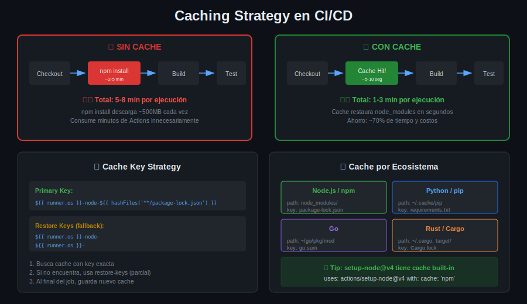

# 📚 Lección 03: Artifacts y Caching

## 🎯 Objetivos de Aprendizaje

Al finalizar esta lección serás capaz de:

- [ ] Usar artifacts para compartir datos entre jobs
- [ ] Implementar estrategias de caching efectivas
- [ ] Optimizar tiempos de ejecución de pipelines
- [ ] Configurar cache keys dinámicas
- [ ] Gestionar retención de artifacts

---

## 📋 Contenido

1. [Artifacts en GitHub Actions](#1-artifacts-en-github-actions)
2. [Upload y Download Artifacts](#2-upload-y-download-artifacts)
3. [Caching en CI/CD](#3-caching-en-cicd)
4. [Estrategias de Cache](#4-estrategias-de-cache)
5. [Cache por Ecosistema](#5-cache-por-ecosistema)
6. [Comparación Artifacts vs Cache](#6-comparación-artifacts-vs-cache)
7. [Optimización de Pipelines](#7-optimización-de-pipelines)

---

## 1. Artifacts en GitHub Actions

### ¿Qué son los Artifacts?

Los **artifacts** son archivos o directorios producidos durante un workflow que pueden ser:
- Compartidos entre jobs
- Descargados después del workflow
- Usados para debugging o auditoría

```
Job 1 (build)              Job 2 (deploy)
     │                          │
     ├── npm run build          │
     │        │                 │
     │        ▼                 │
     │   ┌────────┐             │
     │   │ dist/  │─────upload──┼──────download───▶ Deploy
     │   └────────┘             │
     │    artifact              │
```

### Casos de Uso

| Caso | Descripción |
|------|-------------|
| **Build output** | Compartir compilación entre jobs |
| **Test reports** | Guardar resultados para análisis |
| **Coverage** | Reports de cobertura de código |
| **Logs** | Debugging de pipelines |
| **Screenshots** | E2E test failures |
| **Binaries** | Ejecutables para release |

### Límites y Retención

| Aspecto | GitHub Free | GitHub Pro/Teams | Enterprise |
|---------|-------------|------------------|------------|
| **Storage** | 500 MB | 2 GB | 50 GB |
| **Retention default** | 90 días | 90 días | 400 días |
| **Max retention** | 90 días | 90 días | 400 días |
| **Single artifact max** | 500 MB | 2 GB | 50 GB |

---

## 2. Upload y Download Artifacts

### Upload Artifact

```yaml
# Subir un directorio completo
- name: Upload build artifact
  uses: actions/upload-artifact@v4
  with:
    name: build-output
    path: dist/
    retention-days: 7
```

#### Opciones de Upload

```yaml
- uses: actions/upload-artifact@v4
  with:
    # Nombre del artifact (requerido)
    name: my-artifact
    
    # Ruta(s) a subir (requerido)
    path: |
      dist/
      coverage/
      !dist/**/*.map
    
    # Días de retención (opcional, default: 90)
    retention-days: 30
    
    # Qué hacer si no hay archivos
    if-no-files-found: error  # 'warn' | 'ignore'
    
    # Nivel de compresión (0-9)
    compression-level: 6
    
    # Sobrescribir si existe
    overwrite: true
```

### Download Artifact

```yaml
# Descargar en otro job
- name: Download build artifact
  uses: actions/download-artifact@v4
  with:
    name: build-output
    path: ./dist
```

#### Opciones de Download

```yaml
- uses: actions/download-artifact@v4
  with:
    # Nombre específico (omitir para todos)
    name: build-output
    
    # Directorio destino (default: workspace)
    path: ./my-artifacts
    
    # Descargar de otro workflow run
    run-id: 1234567890
    
    # Pattern matching para múltiples
    pattern: coverage-*
    
    # Merge múltiples artifacts
    merge-multiple: true
```

### Ejemplo Completo: Build → Deploy

```yaml
name: Build and Deploy

on:
  push:
    branches: [main]

jobs:
  build:
    runs-on: ubuntu-latest
    steps:
      - uses: actions/checkout@v4
      
      - uses: actions/setup-node@v4
        with:
          node-version: '20'
          cache: 'npm'
      
      - run: npm ci
      - run: npm run build
      
      - name: Upload build
        uses: actions/upload-artifact@v4
        with:
          name: production-build
          path: dist/
          retention-days: 7

  test:
    needs: build
    runs-on: ubuntu-latest
    steps:
      - uses: actions/checkout@v4
      
      - name: Download build
        uses: actions/download-artifact@v4
        with:
          name: production-build
          path: dist/
      
      - name: Run smoke tests
        run: |
          ls -la dist/
          # Run tests against built files

  deploy:
    needs: [build, test]
    runs-on: ubuntu-latest
    environment: production
    steps:
      - name: Download build
        uses: actions/download-artifact@v4
        with:
          name: production-build
          path: dist/
      
      - name: Deploy to server
        run: |
          echo "Deploying dist/ to production..."
          # rsync, scp, or deployment command
```

### Artifacts con Matrix

```yaml
jobs:
  build:
    runs-on: ubuntu-latest
    strategy:
      matrix:
        os: [linux, windows, macos]
    
    steps:
      - uses: actions/checkout@v4
      
      - name: Build for ${{ matrix.os }}
        run: npm run build:${{ matrix.os }}
      
      - name: Upload artifact
        uses: actions/upload-artifact@v4
        with:
          name: build-${{ matrix.os }}  # Nombre único por OS
          path: dist/
  
  release:
    needs: build
    runs-on: ubuntu-latest
    steps:
      - name: Download all artifacts
        uses: actions/download-artifact@v4
        with:
          pattern: build-*
          merge-multiple: true
          path: all-builds/
```

---

## 3. Caching en CI/CD

### ¿Qué es el Cache?

El **cache** almacena archivos entre ejecuciones de workflows para evitar regenerarlos cada vez.



### ¿Por qué Cachear?

**Sin cache:**
```
Run 1: npm install → 3 min (download 500MB)
Run 2: npm install → 3 min (download 500MB)
Run 3: npm install → 3 min (download 500MB)
Total: 9 min
```

**Con cache:**
```
Run 1: npm install → 3 min (download + save cache)
Run 2: cache hit → 10 seg (restore from cache)
Run 3: cache hit → 10 seg (restore from cache)
Total: 3 min 20 seg (63% ahorro)
```

### Cache en GitHub Actions

```yaml
- name: Cache node modules
  uses: actions/cache@v4
  with:
    path: node_modules
    key: ${{ runner.os }}-node-${{ hashFiles('**/package-lock.json') }}
    restore-keys: |
      ${{ runner.os }}-node-
```

---

## 4. Estrategias de Cache

### Cache Key Anatomy

```yaml
key: ${{ runner.os }}-node-${{ hashFiles('**/package-lock.json') }}
      │              │            │
      │              │            └── Hash del lockfile (cambia con deps)
      │              └── Identificador del ecosistema
      └── Sistema operativo del runner
```

### Restore Keys (Fallback)

```yaml
- uses: actions/cache@v4
  with:
    path: node_modules
    key: ${{ runner.os }}-node-${{ hashFiles('**/package-lock.json') }}
    restore-keys: |
      ${{ runner.os }}-node-
      ${{ runner.os }}-
```

**Flujo de búsqueda:**
1. Busca key exacta: `Linux-node-abc123`
2. Si no encuentra, busca prefix: `Linux-node-*`
3. Si no encuentra, busca prefix: `Linux-*`
4. Si no encuentra ninguna, cache miss

### Tipos de Cache Keys

#### Static Key (No recomendado)
```yaml
key: my-cache-key
# Problema: Nunca se invalida
```

#### Hash-based Key (Recomendado)
```yaml
key: deps-${{ hashFiles('**/package-lock.json') }}
# Se invalida cuando cambian dependencias
```

#### Time-based Key
```yaml
key: cache-${{ github.run_number }}
# Nueva cache en cada run (útil para builds)
```

#### Composite Key
```yaml
key: ${{ runner.os }}-${{ matrix.node }}-${{ hashFiles('**/package-lock.json') }}
# Específico por OS y versión de Node
```

### Cache Hit vs Miss

```yaml
- name: Cache dependencies
  id: cache
  uses: actions/cache@v4
  with:
    path: node_modules
    key: ${{ runner.os }}-node-${{ hashFiles('**/package-lock.json') }}

- name: Install dependencies
  if: steps.cache.outputs.cache-hit != 'true'
  run: npm ci
```

---

## 5. Cache por Ecosistema

### Node.js / npm

```yaml
# Opción 1: Cache manual
- uses: actions/cache@v4
  with:
    path: |
      node_modules
      ~/.npm
    key: ${{ runner.os }}-node-${{ hashFiles('**/package-lock.json') }}

# Opción 2: Built-in en setup-node (recomendado)
- uses: actions/setup-node@v4
  with:
    node-version: '20'
    cache: 'npm'
```

### Python / pip

```yaml
# Opción 1: Cache manual
- uses: actions/cache@v4
  with:
    path: ~/.cache/pip
    key: ${{ runner.os }}-pip-${{ hashFiles('**/requirements.txt') }}

# Opción 2: Built-in en setup-python
- uses: actions/setup-python@v5
  with:
    python-version: '3.12'
    cache: 'pip'
```

### Go

```yaml
- uses: actions/cache@v4
  with:
    path: |
      ~/go/pkg/mod
      ~/.cache/go-build
    key: ${{ runner.os }}-go-${{ hashFiles('**/go.sum') }}
```

### Rust / Cargo

```yaml
- uses: actions/cache@v4
  with:
    path: |
      ~/.cargo/bin/
      ~/.cargo/registry/index/
      ~/.cargo/registry/cache/
      ~/.cargo/git/db/
      target/
    key: ${{ runner.os }}-cargo-${{ hashFiles('**/Cargo.lock') }}
```

### Java / Maven

```yaml
- uses: actions/cache@v4
  with:
    path: ~/.m2/repository
    key: ${{ runner.os }}-maven-${{ hashFiles('**/pom.xml') }}
```

### Java / Gradle

```yaml
- uses: actions/cache@v4
  with:
    path: |
      ~/.gradle/caches
      ~/.gradle/wrapper
    key: ${{ runner.os }}-gradle-${{ hashFiles('**/*.gradle*', '**/gradle-wrapper.properties') }}
```

### Docker Layers

```yaml
- uses: actions/cache@v4
  with:
    path: /tmp/.buildx-cache
    key: ${{ runner.os }}-buildx-${{ github.sha }}
    restore-keys: |
      ${{ runner.os }}-buildx-

- name: Build Docker image
  uses: docker/build-push-action@v5
  with:
    cache-from: type=local,src=/tmp/.buildx-cache
    cache-to: type=local,dest=/tmp/.buildx-cache-new,mode=max

# Move cache (evita crecimiento infinito)
- run: |
    rm -rf /tmp/.buildx-cache
    mv /tmp/.buildx-cache-new /tmp/.buildx-cache
```

---

## 6. Comparación Artifacts vs Cache

| Aspecto | Artifacts | Cache |
|---------|-----------|-------|
| **Propósito** | Compartir outputs | Reutilizar dependencias |
| **Persistencia** | Entre jobs/runs | Entre runs |
| **Vida útil** | Configurable (1-90 días) | 7 días sin acceso |
| **Scope** | Workflow run | Repository branch |
| **Descarga** | UI de GitHub | Solo en workflows |
| **Contenido típico** | Builds, reports, logs | node_modules, pip cache |
| **Action** | upload/download-artifact | cache |

### Cuándo Usar Cada Uno

```
┌────────────────────────────────────────────────────────────┐
│                                                            │
│   ¿Necesitas los archivos después del workflow?           │
│                     │                                      │
│           ┌────────┴────────┐                             │
│           ▼                 ▼                             │
│          Sí                No                             │
│           │                 │                             │
│           ▼                 │                             │
│     ARTIFACTS              │                              │
│                            │                              │
│                     ¿Son dependencias que                 │
│                     no cambian frecuentemente?            │
│                            │                              │
│                  ┌────────┴────────┐                      │
│                  ▼                 ▼                      │
│                 Sí                No                      │
│                  │                 │                      │
│                  ▼                 ▼                      │
│              CACHE            ARTIFACTS                   │
│                            (entre jobs)                   │
│                                                            │
└────────────────────────────────────────────────────────────┘
```

---

## 7. Optimización de Pipelines

### Métricas de Pipeline

```yaml
# Agregar timestamps para medir
- name: Start timer
  run: echo "START_TIME=$(date +%s)" >> $GITHUB_ENV

- name: Build
  run: npm run build

- name: Report time
  run: |
    END_TIME=$(date +%s)
    DURATION=$((END_TIME - START_TIME))
    echo "Build took $DURATION seconds" >> $GITHUB_STEP_SUMMARY
```

### Técnicas de Optimización

#### 1. Paralelizar Jobs Independientes

```yaml
jobs:
  lint:
    runs-on: ubuntu-latest
    # ...
  
  test:
    runs-on: ubuntu-latest
    # Ejecuta en paralelo con lint
    # ...
  
  build:
    needs: [lint, test]  # Espera a ambos
```

#### 2. Matrix para Paralelismo

```yaml
jobs:
  test:
    strategy:
      matrix:
        shard: [1, 2, 3, 4]
    steps:
      - run: npm test -- --shard=${{ matrix.shard }}/4
```

#### 3. Cancelar Workflows Redundantes

```yaml
concurrency:
  group: ${{ github.workflow }}-${{ github.ref }}
  cancel-in-progress: true
```

#### 4. Ejecutar Solo lo Necesario

```yaml
on:
  push:
    paths:
      - 'src/**'
      - 'tests/**'
      - 'package*.json'
    paths-ignore:
      - '**.md'
      - 'docs/**'
```

#### 5. Cache Inteligente

```yaml
- uses: actions/setup-node@v4
  with:
    node-version: '20'
    cache: 'npm'  # Built-in cache

- name: Install deps (only if needed)
  run: npm ci
  # Solo ejecuta si cache miss
```

### Pipeline Optimizado Completo

```yaml
name: Optimized CI

on:
  push:
    branches: [main]
    paths-ignore: ['**.md', 'docs/**']
  pull_request:
    branches: [main]

concurrency:
  group: ${{ github.workflow }}-${{ github.ref }}
  cancel-in-progress: true

jobs:
  changes:
    runs-on: ubuntu-latest
    outputs:
      src: ${{ steps.filter.outputs.src }}
      tests: ${{ steps.filter.outputs.tests }}
    steps:
      - uses: actions/checkout@v4
      - uses: dorny/paths-filter@v3
        id: filter
        with:
          filters: |
            src:
              - 'src/**'
            tests:
              - 'tests/**'

  lint:
    needs: changes
    if: needs.changes.outputs.src == 'true'
    runs-on: ubuntu-latest
    steps:
      - uses: actions/checkout@v4
      - uses: actions/setup-node@v4
        with:
          node-version: '20'
          cache: 'npm'
      - run: npm ci
      - run: npm run lint

  test:
    needs: changes
    if: needs.changes.outputs.tests == 'true' || needs.changes.outputs.src == 'true'
    runs-on: ubuntu-latest
    strategy:
      matrix:
        shard: [1, 2]
    steps:
      - uses: actions/checkout@v4
      - uses: actions/setup-node@v4
        with:
          node-version: '20'
          cache: 'npm'
      - run: npm ci
      - run: npm test -- --shard=${{ matrix.shard }}/2
```

---

## 📝 Resumen

| Concepto | Uso Principal | Action |
|----------|---------------|--------|
| **Artifacts** | Compartir builds/reports | upload/download-artifact |
| **Cache** | Reutilizar dependencias | cache o built-in |
| **Cache Key** | Identificar cache | hash de lockfile |
| **Restore Keys** | Fallback de cache | prefixes |

### Best Practices

1. ✅ Usar cache built-in cuando esté disponible
2. ✅ Cache keys con hash de lockfiles
3. ✅ Artifacts para outputs importantes
4. ✅ Retention days apropiados
5. ✅ Paralelizar jobs independientes
6. ✅ Path filters para evitar runs innecesarios

---

## 🔗 Navegación

| ⬅️ Anterior | 🏠 Semana | ➡️ Siguiente |
|:-----------:|:---------:|:------------:|
| [Build y Testing](02-build-testing.md) | [Semana 08](../README.md) | [Secrets y Variables](04-secrets-variables.md) |
