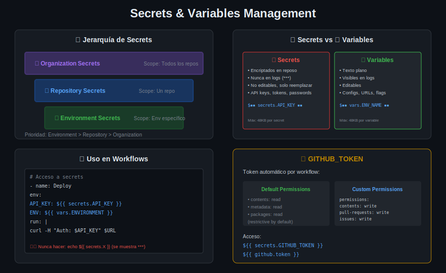

# 📚 Lección 04: Secrets y Variables

## 🎯 Objetivos de Aprendizaje

Al finalizar esta lección serás capaz de:

- [ ] Configurar y usar secrets de forma segura
- [ ] Diferenciar entre secrets y variables
- [ ] Implementar environments con protecciones
- [ ] Usar GITHUB_TOKEN correctamente
- [ ] Aplicar best practices de seguridad

---

## 📋 Contenido

1. [Secrets en GitHub Actions](#1-secrets-en-github-actions)
2. [Variables de Configuración](#2-variables-de-configuración)
3. [Jerarquía y Scope](#3-jerarquía-y-scope)
4. [Environments](#4-environments)
5. [GITHUB_TOKEN](#5-github_token)
6. [Best Practices de Seguridad](#6-best-practices-de-seguridad)
7. [OIDC y Secretless Authentication](#7-oidc-y-secretless-authentication)

---

## 1. Secrets en GitHub Actions

### ¿Qué son los Secrets?

Los **secrets** son valores sensibles encriptados que se usan en workflows sin exponerlos en logs o código.



### Características de Secrets

| Característica | Descripción |
|----------------|-------------|
| **Encriptación** | Encriptados en reposo con libsodium |
| **Masking** | Automáticamente reemplazados por `***` en logs |
| **Immutabilidad** | No se pueden ver, solo sobrescribir |
| **Scope** | Organization, Repository, o Environment |

### Crear Secrets

#### Via UI de GitHub

1. Repository → Settings → Secrets and variables → Actions
2. Click "New repository secret"
3. Nombre: `API_KEY`
4. Valor: `your-secret-value`

#### Via GitHub CLI

```bash
# Crear secret de repositorio
gh secret set API_KEY --body "your-secret-value"

# Crear secret de environment
gh secret set API_KEY --env production --body "your-secret-value"

# Crear desde archivo
gh secret set PRIVATE_KEY < private-key.pem

# Listar secrets
gh secret list
```

### Usar Secrets en Workflows

```yaml
jobs:
  deploy:
    runs-on: ubuntu-latest
    steps:
      - name: Deploy to server
        env:
          API_KEY: ${{ secrets.API_KEY }}
          DB_PASSWORD: ${{ secrets.DB_PASSWORD }}
        run: |
          curl -H "Authorization: Bearer $API_KEY" https://api.example.com
          
      # También en 'with' de actions
      - uses: some/action@v1
        with:
          token: ${{ secrets.API_TOKEN }}
```

### Secrets en Outputs (Cuidado!)

```yaml
# ❌ MALO - Expone el secret
- run: echo "The secret is ${{ secrets.MY_SECRET }}"

# ❌ MALO - Puede exponer en JSON
- run: echo '${{ toJSON(secrets) }}'

# ✅ BIEN - Usar como variable de entorno
- run: curl -H "Auth: $MY_SECRET" https://api.example.com
  env:
    MY_SECRET: ${{ secrets.MY_SECRET }}
```

---

## 2. Variables de Configuración

### ¿Qué son las Variables?

Las **variables** (vars) son valores de configuración no sensibles, visibles en logs.

### Secrets vs Variables

| Aspecto | Secrets | Variables |
|---------|---------|-----------|
| **Visibilidad** | Ocultos (***) | Visibles en logs |
| **Uso** | API keys, tokens, passwords | URLs, flags, configuración |
| **Editables** | Solo sobrescribir | Editables |
| **Acceso** | `secrets.NAME` | `vars.NAME` |

### Crear Variables

#### Via UI
Settings → Secrets and variables → Actions → Variables → New variable

#### Via CLI
```bash
gh variable set ENV_NAME --body "production"
gh variable list
```

### Usar Variables

```yaml
jobs:
  build:
    runs-on: ubuntu-latest
    steps:
      - name: Build with config
        run: |
          echo "Building for environment: ${{ vars.ENVIRONMENT }}"
          echo "API URL: ${{ vars.API_URL }}"
          npm run build
        env:
          NODE_ENV: ${{ vars.ENVIRONMENT }}
          NEXT_PUBLIC_API_URL: ${{ vars.API_URL }}
```

### Variables vs env

```yaml
# Variables de repositorio (vars)
# - Configurables en UI
# - Compartidas entre workflows

# Variables de workflow (env)
env:
  NODE_VERSION: '20'

jobs:
  build:
    runs-on: ubuntu-latest
    # Variables de job
    env:
      CI: true
    steps:
      - name: Step with vars
        # Variables de step
        env:
          STEP_VAR: value
        run: |
          echo "Node: $NODE_VERSION"      # workflow env
          echo "CI: $CI"                   # job env
          echo "Step: $STEP_VAR"           # step env
          echo "Repo: ${{ vars.MY_VAR }}"  # repository variable
```

---

## 3. Jerarquía y Scope

### Niveles de Secrets/Variables

```
┌─────────────────────────────────────────────────────────────┐
│                   Organization Level                         │
│   • Compartidos entre múltiples repositorios                │
│   • Administrados por org admins                            │
│   secrets.ORG_SECRET / vars.ORG_VAR                         │
├─────────────────────────────────────────────────────────────┤
│              Repository Level                                │
│   • Específicos de un repositorio                           │
│   • Administrados por repo admins                           │
│   secrets.REPO_SECRET / vars.REPO_VAR                       │
├─────────────────────────────────────────────────────────────┤
│              Environment Level                               │
│   • Específicos de un environment (staging, prod)           │
│   • Pueden tener protecciones adicionales                   │
│   secrets.ENV_SECRET / vars.ENV_VAR                         │
└─────────────────────────────────────────────────────────────┘
```

### Precedencia (Override)

Si el mismo nombre existe en múltiples niveles:

```
Environment > Repository > Organization
```

### Organization Secrets

```yaml
# Solo disponibles si el repositorio tiene acceso
# Configurar en: Organization → Settings → Secrets → Actions

# Puede limitarse a:
# - All repositories
# - Private repositories
# - Selected repositories
```

---

## 4. Environments

### ¿Qué son los Environments?

Los **environments** son contextos de deploy con configuraciones específicas de secrets, variables y protecciones.

### Crear Environment

1. Repository → Settings → Environments
2. New environment: `production`
3. Configurar protecciones y secrets

### Protecciones de Environment

| Protección | Descripción |
|------------|-------------|
| **Required reviewers** | Aprobación manual antes de deploy |
| **Wait timer** | Delay antes de ejecutar |
| **Deployment branches** | Solo branches específicas |
| **Custom rules** | Reglas personalizadas |

### Usar Environments

```yaml
jobs:
  deploy-staging:
    runs-on: ubuntu-latest
    environment: staging  # Usa secrets/vars de staging
    steps:
      - name: Deploy
        run: ./deploy.sh
        env:
          API_KEY: ${{ secrets.API_KEY }}  # Secret de staging

  deploy-production:
    runs-on: ubuntu-latest
    needs: deploy-staging
    environment: 
      name: production
      url: https://myapp.com  # URL del deployment
    steps:
      - name: Deploy
        run: ./deploy.sh
        env:
          API_KEY: ${{ secrets.API_KEY }}  # Secret de production
```

### Environment con Approval

```yaml
jobs:
  deploy-production:
    runs-on: ubuntu-latest
    environment: production  # Si tiene required reviewers, pausará aquí
    steps:
      - name: Deploy to production
        run: |
          echo "Deploying to production..."
          # Este paso solo ejecuta después de aprobación
```

### Environment Protection Rules

```yaml
# El workflow se pausa esperando aprobación

Workflow Log:
┌────────────────────────────────────────────────────┐
│ deploy-production                                  │
│                                                    │
│ ⏳ Waiting for approval                            │
│                                                    │
│ Environment: production                            │
│ Required reviewers: @lead-dev, @devops-team        │
│                                                    │
│ [Review pending deployments]                       │
└────────────────────────────────────────────────────┘
```

---

## 5. GITHUB_TOKEN

### ¿Qué es GITHUB_TOKEN?

Token de autenticación generado automáticamente para cada workflow run que permite interactuar con la API de GitHub.

### Acceso al Token

```yaml
# Forma 1: secrets.GITHUB_TOKEN
- run: gh pr list
  env:
    GITHUB_TOKEN: ${{ secrets.GITHUB_TOKEN }}

# Forma 2: github.token (equivalente)
- run: gh pr list
  env:
    GITHUB_TOKEN: ${{ github.token }}
```

### Permisos por Defecto

Depende de la configuración del repositorio (Settings → Actions → General):

| Modo | Permisos |
|------|----------|
| **Restrictive (default)** | `contents: read`, `metadata: read` |
| **Permissive** | Read/write para la mayoría |

### Personalizar Permisos

```yaml
# A nivel de workflow
permissions:
  contents: read
  pull-requests: write
  issues: write

jobs:
  update-pr:
    runs-on: ubuntu-latest
    # O a nivel de job
    permissions:
      pull-requests: write
    steps:
      - uses: actions/checkout@v4
      
      - name: Comment on PR
        run: gh pr comment ${{ github.event.number }} --body "Build passed! ✅"
        env:
          GITHUB_TOKEN: ${{ secrets.GITHUB_TOKEN }}
```

### Permisos Disponibles

| Permiso | Read | Write | Descripción |
|---------|------|-------|-------------|
| `actions` | ✓ | ✓ | Workflow runs |
| `contents` | ✓ | ✓ | Repository contents |
| `issues` | ✓ | ✓ | Issues |
| `pull-requests` | ✓ | ✓ | PRs |
| `packages` | ✓ | ✓ | GitHub Packages |
| `deployments` | ✓ | ✓ | Deployments |
| `id-token` | ✓ | - | OIDC token |

### Limitaciones del GITHUB_TOKEN

```yaml
# ❌ No puede triggear otros workflows
- run: |
    git commit -m "Auto-update"
    git push
    # Este push NO triggerea workflows

# ✅ Para triggear, usar PAT
- run: |
    git remote set-url origin https://x-access-token:${{ secrets.PAT }}@github.com/${{ github.repository }}
    git push
```

---

## 6. Best Practices de Seguridad

### Do's ✅

```yaml
# ✅ Usar secrets para valores sensibles
env:
  API_KEY: ${{ secrets.API_KEY }}

# ✅ Principio de menor privilegio
permissions:
  contents: read  # Solo lo necesario

# ✅ Environments para producción
environment: production  # Con required reviewers

# ✅ Validar inputs de workflow_dispatch
on:
  workflow_dispatch:
    inputs:
      version:
        required: true
        type: string
        # Validar formato
        
# ✅ Pin actions a SHA
uses: actions/checkout@b4ffde65f46336ab88eb53be808477a3936bae11
```

### Don'ts ❌

```yaml
# ❌ Nunca loggear secrets
- run: echo "${{ secrets.API_KEY }}"

# ❌ No usar secrets en URLs (pueden loggearse)
- run: curl "https://api.example.com?key=${{ secrets.API_KEY }}"

# ❌ No exponer toJSON(secrets)
- run: echo '${{ toJSON(secrets) }}'

# ❌ No hardcodear secrets
- run: curl -H "Authorization: Bearer sk-abc123..."

# ❌ No dar permisos excesivos
permissions: write-all  # Evitar
```

### Auditoría y Rotación

```yaml
# Rotar secrets regularmente
# 1. Crear nuevo secret con sufijo _NEW
# 2. Actualizar workflows para usar ambos
# 3. Verificar que funciona
# 4. Eliminar secret antiguo

# Auditar uso de secrets
# Settings → Security → Code security → Secret scanning
```

---

## 7. OIDC y Secretless Authentication

### ¿Qué es OIDC?

**OpenID Connect (OIDC)** permite autenticación sin secrets estáticos. GitHub Actions actúa como Identity Provider.

### Beneficios de OIDC

| Aspecto | Con Secrets | Con OIDC |
|---------|-------------|----------|
| **Rotación** | Manual | Automática |
| **Exposición** | Riesgo si se filtra | Sin secrets que filtrar |
| **Scope** | Amplio | Por workflow/job |
| **Auditoría** | Limitada | Completa |

### OIDC con AWS

```yaml
permissions:
  id-token: write   # Requerido para OIDC
  contents: read

jobs:
  deploy:
    runs-on: ubuntu-latest
    steps:
      - name: Configure AWS credentials
        uses: aws-actions/configure-aws-credentials@v4
        with:
          role-to-assume: arn:aws:iam::123456789:role/GitHubActionsRole
          aws-region: us-east-1
          # No secrets! AWS valida el token OIDC
      
      - name: Deploy to S3
        run: aws s3 sync ./dist s3://my-bucket
```

### OIDC con Azure

```yaml
permissions:
  id-token: write
  contents: read

jobs:
  deploy:
    runs-on: ubuntu-latest
    steps:
      - name: Azure login
        uses: azure/login@v2
        with:
          client-id: ${{ vars.AZURE_CLIENT_ID }}
          tenant-id: ${{ vars.AZURE_TENANT_ID }}
          subscription-id: ${{ vars.AZURE_SUBSCRIPTION_ID }}
          # Usa OIDC, no client secret
```

### OIDC con GCP

```yaml
permissions:
  id-token: write
  contents: read

jobs:
  deploy:
    runs-on: ubuntu-latest
    steps:
      - name: Authenticate to GCP
        uses: google-github-actions/auth@v2
        with:
          workload_identity_provider: projects/123/locations/global/workloadIdentityPools/github/providers/github
          service_account: deploy@my-project.iam.gserviceaccount.com
```

---

## 📝 Resumen

| Concepto | Uso | Acceso |
|----------|-----|--------|
| **Secrets** | Valores sensibles | `secrets.NAME` |
| **Variables** | Configuración no sensible | `vars.NAME` |
| **GITHUB_TOKEN** | API de GitHub | `secrets.GITHUB_TOKEN` |
| **Environments** | Contextos de deploy | `environment: name` |
| **OIDC** | Auth sin secrets | `id-token: write` |

### Checklist de Seguridad

- [ ] Secrets para API keys, tokens, passwords
- [ ] Variables para URLs, flags, configuración
- [ ] Permisos mínimos necesarios
- [ ] Environments con protecciones para producción
- [ ] OIDC cuando sea posible
- [ ] Rotación periódica de secrets
- [ ] Pin actions a SHA específicos

---

## 🔗 Navegación

| ⬅️ Anterior | 🏠 Semana | ➡️ Siguiente |
|:-----------:|:---------:|:------------:|
| [Artifacts y Caching](03-artifacts-caching.md) | [Semana 08](../README.md) | [Ejercicio 01](../2-practicas/ejercicio-01-pipeline-completo/README.md) |
