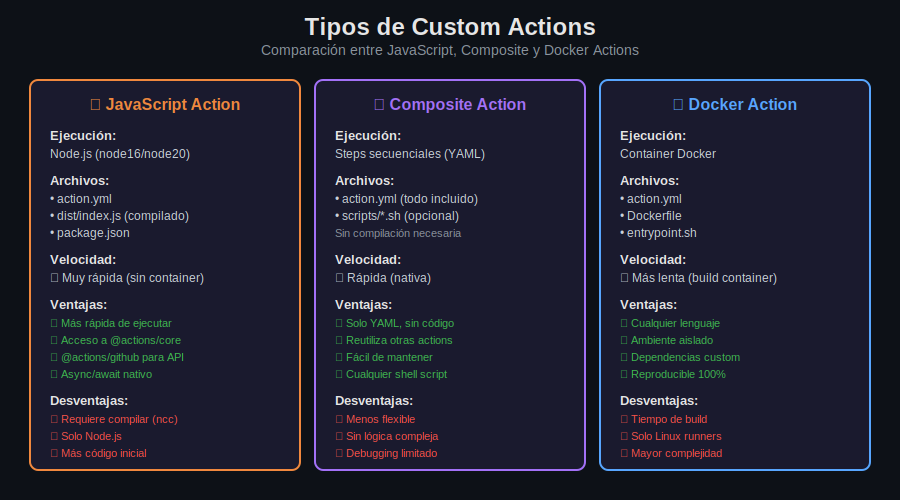

# 📚 Lección 01: Introducción a Custom Actions

> **Duración estimada**: 20 minutos  
> **Nivel**: Intermedio  
> **Prerequisitos**: Conocimiento de GitHub Actions workflows (Semanas 07-08)

---

## 🎯 Objetivos de Aprendizaje

Al finalizar esta lección, serás capaz de:

- [ ] Comprender qué son las Custom Actions y cuándo usarlas
- [ ] Identificar los tres tipos de actions: JavaScript, Composite y Docker
- [ ] Entender la estructura básica de `action.yml`
- [ ] Decidir qué tipo de action usar según el caso de uso

---

## 📖 Contenido Teórico

### 1. ¿Qué son las Custom Actions?

Las **Custom Actions** son unidades de código reutilizables que encapsulan tareas específicas dentro de GitHub Actions. Permiten:

- **Reutilización**: Usar la misma lógica en múltiples workflows
- **Abstracción**: Ocultar complejidad detrás de una interfaz simple
- **Compartir**: Publicar en GitHub Marketplace o repositorios privados
- **Mantenimiento**: Actualizar lógica en un solo lugar

> **💡 Analogía**: Las Custom Actions son como funciones en programación - encapsulan lógica que puedes llamar desde cualquier parte con diferentes parámetros.

---

### 2. Tipos de Custom Actions

GitHub soporta **tres tipos** de Custom Actions, cada uno con sus propias características:



#### 2.1 JavaScript Actions ⚡

```yaml
runs:
  using: 'node20'    # o 'node16'
  main: 'dist/index.js'
```

**Características**:
- Ejecutan directamente en el runner (sin container)
- Usan Node.js como runtime
- Requieren compilación con `@vercel/ncc`
- Acceso a librerías oficiales: `@actions/core`, `@actions/github`

**Cuándo usar**:
- Tareas que requieren lógica compleja
- Interacción con la API de GitHub
- Necesitas máxima velocidad de ejecución
- Quieres publicar en GitHub Marketplace

---

#### 2.2 Composite Actions 🔗

```yaml
runs:
  using: 'composite'
  steps:
    - run: echo "Step 1"
      shell: bash
    - uses: actions/checkout@v4
```

**Características**:
- Definen múltiples steps en YAML
- No requieren código ni compilación
- Pueden reutilizar otras actions
- Soportan múltiples shells

**Cuándo usar**:
- Agrupar steps repetitivos
- No necesitas lógica programática compleja
- Quieres evitar escribir código JavaScript
- Configuraciones de setup comunes

---

#### 2.3 Docker Actions 🐳

```yaml
runs:
  using: 'docker'
  image: 'Dockerfile'   # o 'docker://image:tag'
```

**Características**:
- Ejecutan en un container Docker
- Soportan cualquier lenguaje
- Ambiente completamente aislado
- Requieren más tiempo de inicialización

**Cuándo usar**:
- Necesitas un lenguaje específico (Python, Go, etc.)
- Dependencias del sistema operativo
- Ambiente 100% reproducible
- **Solo funciona en runners Linux**

---

### 3. Estructura de `action.yml`

Todas las Custom Actions **requieren** un archivo `action.yml` (o `action.yaml`) en la raíz:


```yaml
# Metadatos obligatorios
name: 'Nombre de la Action'
description: 'Descripción breve de qué hace'
author: 'tu-usuario'

# Parámetros de entrada (opcionales)
inputs:
  nombre-input:
    description: 'Descripción del input'
    required: true
    default: 'valor-por-defecto'

# Valores de salida (opcionales)
outputs:
  nombre-output:
    description: 'Descripción del output'
    value: ${{ steps.step-id.outputs.valor }}

# Configuración de ejecución (obligatorio)
runs:
  using: 'node20'           # o 'composite' o 'docker'
  main: 'dist/index.js'     # punto de entrada

# Branding para Marketplace (opcional)
branding:
  icon: 'check-circle'
  color: 'green'
```

---

### 4. Comparativa de Tipos

| Aspecto | JavaScript | Composite | Docker |
|---------|------------|-----------|--------|
| **Velocidad** | ⚡ Muy rápida | ⚡ Rápida | 🐢 Lenta |
| **Complejidad** | Media-Alta | Baja | Media |
| **Lenguaje** | Node.js | YAML + shell | Cualquiera |
| **Compilación** | Sí (ncc) | No | Sí (build) |
| **Runners** | Todos | Todos | Solo Linux |
| **Marketplace** | ✅ Sí | ✅ Sí | ✅ Sí |
| **Debugging** | Bueno | Limitado | Variable |

---

### 5. Dónde Alojar Custom Actions

Las actions pueden estar en:

#### 5.1 Mismo Repositorio (Local)

```yaml
# Uso local
- uses: ./.github/actions/mi-action
```

**Ventaja**: Fácil desarrollo y testing  
**Desventaja**: No reutilizable entre repos

#### 5.2 Repositorio Público

```yaml
# Uso desde repo público
- uses: owner/action-repo@v1
```

**Ventaja**: Compartible, versionado  
**Desventaja**: Código visible para todos

#### 5.3 Repositorio Privado

```yaml
# Requiere token con permisos
- uses: owner/private-action@v1
```

**Ventaja**: Código protegido  
**Desventaja**: Configuración adicional de permisos

#### 5.4 GitHub Marketplace

```yaml
# Uso desde Marketplace
- uses: actions/checkout@v4
```

**Ventaja**: Descubribilidad, confianza  
**Desventaja**: Proceso de publicación

---

## 📝 Resumen

| Concepto | Descripción |
|----------|-------------|
| **Custom Action** | Unidad reutilizable de lógica en GitHub Actions |
| **JavaScript Action** | Más rápida, usa Node.js, requiere compilar |
| **Composite Action** | Solo YAML, agrupa steps, sin código |
| **Docker Action** | Cualquier lenguaje, ambiente aislado, más lenta |
| **action.yml** | Archivo de definición obligatorio |

---

## 🔗 Recursos Adicionales

- [📖 Creating Actions - GitHub Docs](https://docs.github.com/en/actions/creating-actions)
- [📦 Actions Toolkit](https://github.com/actions/toolkit)
- [🛒 GitHub Marketplace](https://github.com/marketplace?type=actions)

---

## ⏭️ Siguiente Lección

[Lección 02: JavaScript Actions →](02-javascript-actions.md)

---

[⬅️ Volver a Teoría](README.md) · [📋 Semana 09](../README.md)
