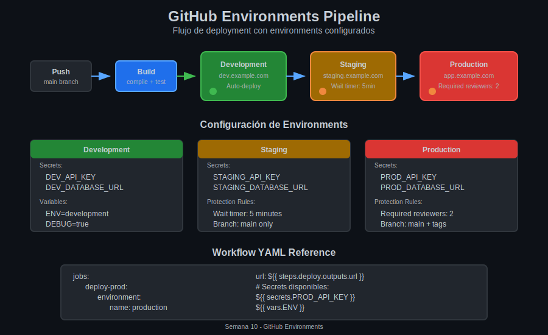

# 🌍 Lección 02: GitHub Environments

## 📋 Información de la Lección

| Campo | Detalle |
|-------|---------|
| **Duración** | 20 minutos |
| **Nivel** | Intermedio |
| **Prerrequisitos** | Lección 01 - Deployment Strategies |
| **Objetivos** | Configurar y usar environments en GitHub Actions |

---

## 🎯 Objetivos de Aprendizaje

Al finalizar esta lección, serás capaz de:

- [ ] Crear y configurar environments en GitHub
- [ ] Definir secrets y variables específicos por environment
- [ ] Referenciar environments desde workflows
- [ ] Entender el flujo de deployment con environments

---

## 📚 Contenido

### 1. ¿Qué son los GitHub Environments?

Los **environments** son configuraciones de deployment que representan destinos como `development`, `staging` y `production`.

#### Características Principales

| Característica | Descripción |
|----------------|-------------|
| **Secrets específicos** | Variables secretas únicas por environment |
| **Variables** | Configuraciones no secretas por environment |
| **Protection rules** | Controles de seguridad antes del deploy |
| **Deployment history** | Registro de qué se deployó y cuándo |
| **URL de deployment** | URL asociada al environment |

---

### 2. Creando un Environment

#### Vía Web UI

1. Ve a **Settings** → **Environments**
2. Click en **New environment**
3. Ingresa el nombre (ej: `production`)
4. Configura protection rules (opcional)
5. Agrega secrets y variables

#### Convención de Nombres

| Environment | Uso |
|-------------|-----|
| `development` | Testing local, feature branches |
| `staging` | Pre-producción, QA |
| `production` | Producción real |
| `preview` | Previews de PR |

---

### 3. Secrets por Environment

Los secrets de environment tienen **mayor prioridad** que los secrets del repository.

#### Jerarquía de Secrets

```
┌─────────────────────────────────────────┐
│          Environment Secrets            │  ← Mayor prioridad
│    (solo disponibles en ese env)        │
├─────────────────────────────────────────┤
│          Repository Secrets             │
│    (disponibles en todo el repo)        │
├─────────────────────────────────────────┤
│        Organization Secrets             │  ← Menor prioridad
│    (compartidos entre repos)            │
└─────────────────────────────────────────┘
```

#### Ejemplo de Uso

```yaml
# ¿QUÉ HACE?: Accede a secrets específicos del environment production
# ¿POR QUÉ?: Cada environment tiene credenciales diferentes
# ¿PARA QUÉ SIRVE?: Separar credenciales de dev, staging y prod

jobs:
  deploy:
    runs-on: ubuntu-latest
    environment: production    # ← Activa secrets de production
    
    steps:
      - name: Deploy to production
        env:
          # Este secret es específico del environment production
          API_KEY: ${{ secrets.API_KEY }}
          DB_URL: ${{ secrets.DATABASE_URL }}
        run: |
          echo "Deploying with production credentials"
          ./deploy.sh
```

#### Configuración de Secrets

| Secret | Development | Staging | Production |
|--------|-------------|---------|------------|
| `API_KEY` | `dev_key_xxx` | `stg_key_xxx` | `prod_key_xxx` |
| `DATABASE_URL` | `postgres://dev...` | `postgres://stg...` | `postgres://prod...` |
| `AWS_ROLE_ARN` | `arn:aws:iam::dev` | `arn:aws:iam::stg` | `arn:aws:iam::prod` |

---

### 4. Variables de Environment

A diferencia de secrets, las **variables** no están encriptadas y son visibles en logs.

#### Cuándo Usar Variables vs Secrets

| Tipo | Uso | Ejemplo |
|------|-----|---------|
| **Secrets** | Datos sensibles | API keys, passwords, tokens |
| **Variables** | Configuración pública | URLs, feature flags, env names |

#### Ejemplo de Variables

```yaml
# ¿QUÉ HACE?: Usa variables del environment para configuración
# ¿POR QUÉ?: Las variables no sensibles no necesitan ser secrets
# ¿PARA QUÉ SIRVE?: Configuración visible y fácil de debuggear

jobs:
  deploy:
    runs-on: ubuntu-latest
    environment: staging
    
    steps:
      - name: Show configuration
        env:
          # Variables (no encriptadas)
          APP_ENV: ${{ vars.APP_ENV }}           # "staging"
          LOG_LEVEL: ${{ vars.LOG_LEVEL }}       # "debug"
          FEATURE_FLAGS: ${{ vars.FEATURE_FLAGS }} # "new-ui,beta"
        run: |
          echo "Environment: $APP_ENV"
          echo "Log level: $LOG_LEVEL"
```

---

### 5. Referenciando Environments en Workflows

#### Sintaxis Básica

```yaml
jobs:
  deploy:
    runs-on: ubuntu-latest
    environment: production    # Nombre del environment
```

#### Con URL de Deployment

```yaml
# ¿QUÉ HACE?: Asocia una URL al deployment
# ¿POR QUÉ?: GitHub muestra el link en la UI de deployments
# ¿PARA QUÉ SIRVE?: Fácil acceso al environment deployado

jobs:
  deploy:
    runs-on: ubuntu-latest
    environment:
      name: production
      url: https://app.example.com    # URL fija
```

#### Con URL Dinámica

```yaml
jobs:
  deploy:
    runs-on: ubuntu-latest
    environment:
      name: preview
      url: ${{ steps.deploy.outputs.url }}    # URL generada
    
    steps:
      - name: Deploy preview
        id: deploy
        run: |
          # El deploy genera una URL única
          PREVIEW_URL="https://pr-${{ github.event.number }}.example.com"
          echo "url=$PREVIEW_URL" >> $GITHUB_OUTPUT
```

---

### 6. Pipeline Multi-Environment



#### Workflow Completo

```yaml
# ¿QUÉ HACE?: Pipeline de deployment a múltiples environments
# ¿POR QUÉ?: Validar en cada etapa antes de llegar a producción
# ¿PARA QUÉ SIRVE?: Reducir riesgo de bugs en producción

name: Deploy Pipeline

on:
  push:
    branches: [main]

jobs:
  # ═══════════════════════════════════════════
  # STAGE 1: BUILD
  # ═══════════════════════════════════════════
  build:
    runs-on: ubuntu-latest
    steps:
      - uses: actions/checkout@v4
      
      - name: Build application
        run: npm run build
      
      - name: Upload artifact
        uses: actions/upload-artifact@v4
        with:
          name: build
          path: dist/

  # ═══════════════════════════════════════════
  # STAGE 2: DEPLOY TO DEVELOPMENT
  # ═══════════════════════════════════════════
  deploy-dev:
    needs: build
    runs-on: ubuntu-latest
    environment:
      name: development
      url: https://dev.example.com
    
    steps:
      - uses: actions/download-artifact@v4
        with:
          name: build
      
      - name: Deploy to Development
        env:
          API_KEY: ${{ secrets.API_KEY }}
        run: ./deploy.sh --env development

  # ═══════════════════════════════════════════
  # STAGE 3: DEPLOY TO STAGING
  # ═══════════════════════════════════════════
  deploy-staging:
    needs: deploy-dev
    runs-on: ubuntu-latest
    environment:
      name: staging
      url: https://staging.example.com
    
    steps:
      - uses: actions/download-artifact@v4
        with:
          name: build
      
      - name: Deploy to Staging
        env:
          API_KEY: ${{ secrets.API_KEY }}
        run: ./deploy.sh --env staging
      
      - name: Run E2E tests
        run: npm run test:e2e

  # ═══════════════════════════════════════════
  # STAGE 4: DEPLOY TO PRODUCTION
  # ═══════════════════════════════════════════
  deploy-prod:
    needs: deploy-staging
    runs-on: ubuntu-latest
    environment:
      name: production
      url: https://app.example.com
    
    steps:
      - uses: actions/download-artifact@v4
        with:
          name: build
      
      - name: Deploy to Production
        env:
          API_KEY: ${{ secrets.API_KEY }}
        run: ./deploy.sh --env production
```

---

### 7. Deployment History

GitHub mantiene un **historial de deployments** por environment:

#### Información Registrada

| Campo | Descripción |
|-------|-------------|
| **Estado** | Success, Failure, In Progress |
| **Commit** | SHA del commit deployado |
| **Actor** | Quien triggereó el deploy |
| **Timestamp** | Cuándo se deployó |
| **URL** | Link al environment |
| **Workflow run** | Link al workflow que deployó |

#### Ver Deployment History

1. Ve a **Code** → **Deployments** (en el sidebar)
2. O ve a **Settings** → **Environments** → [environment] → **Deployment history**

---

### 8. Environment en Pull Requests

Puedes crear environments de **preview** para cada PR:

```yaml
# ¿QUÉ HACE?: Crea un environment de preview para cada PR
# ¿POR QUÉ?: Permite revisar cambios en un entorno aislado
# ¿PARA QUÉ SIRVE?: QA puede probar antes de merge

name: PR Preview

on:
  pull_request:
    types: [opened, synchronize]

jobs:
  preview:
    runs-on: ubuntu-latest
    environment:
      name: preview-pr-${{ github.event.number }}
      url: https://pr-${{ github.event.number }}.preview.example.com
    
    steps:
      - uses: actions/checkout@v4
      
      - name: Deploy preview
        run: |
          ./deploy-preview.sh \
            --pr ${{ github.event.number }} \
            --sha ${{ github.sha }}
```

---

### 9. Cleanup de Environments

Los environments de preview deben limpiarse cuando el PR se cierra:

```yaml
# ¿QUÉ HACE?: Elimina el preview environment cuando el PR se cierra
# ¿POR QUÉ?: Evitar acumulación de recursos no utilizados
# ¿PARA QUÉ SIRVE?: Mantener limpia la infraestructura

name: Cleanup Preview

on:
  pull_request:
    types: [closed]

jobs:
  cleanup:
    runs-on: ubuntu-latest
    steps:
      - name: Delete preview environment
        run: |
          ./delete-preview.sh --pr ${{ github.event.number }}
      
      - name: Deactivate GitHub environment
        uses: strumwolf/delete-deployment-environment@v2
        with:
          token: ${{ secrets.GITHUB_TOKEN }}
          environment: preview-pr-${{ github.event.number }}
```

---

## 💡 Tips y Mejores Prácticas

### Nomenclatura Consistente

```
✅ Bueno:
- development
- staging  
- production

❌ Evitar:
- dev, DEV, Development (inconsistente)
- prod-1, prod-2 (confuso)
```

### Secrets Management

- Nunca hardcodear credenciales en workflows
- Rotar secrets regularmente
- Usar OIDC para cloud providers cuando sea posible

### URLs de Environment

- Siempre configurar URLs para fácil navegación
- Usar URLs dinámicas para previews
- Incluir la URL en notificaciones

---

## 🔗 Recursos Adicionales

- [GitHub Docs: Using environments](https://docs.github.com/en/actions/deployment/targeting-different-environments/using-environments-for-deployment)
- [GitHub Docs: Environment secrets](https://docs.github.com/en/actions/security-guides/encrypted-secrets#creating-encrypted-secrets-for-an-environment)
- [GitHub Docs: Environment variables](https://docs.github.com/en/actions/learn-github-actions/variables#creating-configuration-variables-for-an-environment)

---

## ✅ Checklist de Comprensión

Antes de continuar, asegúrate de poder responder:

- [ ] ¿Cuál es la jerarquía de prioridad de secrets?
- [ ] ¿Cuándo usar variables vs secrets?
- [ ] ¿Cómo referenciar un environment con URL dinámica?
- [ ] ¿Qué información guarda el deployment history?

---

**Siguiente lección**: [03 - Protection Rules](03-protection-rules.md)
