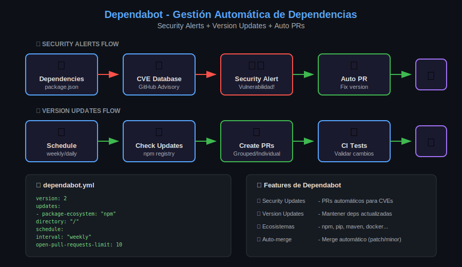

# 🤖 Lección 03: Dependabot

> **Duración**: 25 minutos
> 
> **Objetivos**: Configurar Dependabot alerts, security updates y version updates.

---

## 📋 Tabla de Contenidos

1. [¿Qué es Dependabot?](#-qué-es-dependabot)
2. [Dependabot Alerts](#-dependabot-alerts)
3. [Security Updates](#-security-updates)
4. [Version Updates](#-version-updates)
5. [Configuración Avanzada](#-configuración-avanzada)
6. [Auto-merge Seguro](#-auto-merge-seguro)

---

## 🎯 ¿Qué es Dependabot?

**Dependabot** es el sistema automatizado de GitHub para mantener tus dependencias seguras y actualizadas.



### Tres Funcionalidades

```
┌─────────────────────────────────────────────────────────┐
│                    DEPENDABOT                            │
├──────────────────┬──────────────────┬───────────────────┤
│  🔔 ALERTS       │  🔧 SECURITY     │  📦 VERSION       │
│                  │     UPDATES      │     UPDATES       │
├──────────────────┼──────────────────┼───────────────────┤
│ Notifica CVEs    │ PRs automáticos  │ PRs para nuevas   │
│ en dependencias  │ para CVEs        │ versiones         │
├──────────────────┼──────────────────┼───────────────────┤
│ Automático       │ Automático       │ Requiere config   │
│ (habilitado)     │ (habilitado)     │ (dependabot.yml)  │
└──────────────────┴──────────────────┴───────────────────┘
```

---

## 🔔 Dependabot Alerts

### ¿Cómo Funciona?

1. GitHub escanea tu `package.json`, `requirements.txt`, etc.
2. Compara con **GitHub Advisory Database**
3. Crea alertas cuando encuentra CVEs

### Habilitar Alerts

```
Settings → Security → Code security and analysis
→ Dependabot alerts: Enable
```

### Anatomía de una Alerta

```
┌─────────────────────────────────────────────────────────┐
│  ⚠️ lodash < 4.17.21                                    │
│     High severity vulnerability                         │
├─────────────────────────────────────────────────────────┤
│                                                         │
│  CVE: CVE-2021-23337                                   │
│  GHSA: GHSA-35jh-r3h4-6jhm                             │
│  CVSS: 7.2 (High)                                      │
│                                                         │
│  Vulnerability: Command Injection                       │
│                                                         │
│  Affected: < 4.17.21                                   │
│  Patched:  >= 4.17.21                                  │
│                                                         │
│  Manifest: package-lock.json                           │
│  Path: lodash                                          │
│                                                         │
│  [Dismiss] [Create PR]                                 │
│                                                         │
└─────────────────────────────────────────────────────────┘
```

### Severidades

| Nivel | CVSS | Descripción |
|-------|------|-------------|
| 🔴 Critical | 9.0+ | Explotable remotamente, sin autenticación |
| 🟠 High | 7.0-8.9 | Alto impacto, posible RCE |
| 🟡 Medium | 4.0-6.9 | Requiere condiciones específicas |
| ⚪ Low | 0.1-3.9 | Bajo impacto o difícil de explotar |

### Gestionar Alertas

| Acción | Cuándo Usar |
|--------|-------------|
| **Fix** | Actualizar a versión parcheada |
| **Dismiss: False positive** | No aplica a tu uso |
| **Dismiss: Won't fix** | Aceptas el riesgo |
| **Dismiss: No bandwidth** | Lo harás después |
| **Dismiss: Inaccurate** | La alerta es incorrecta |

---

## 🔧 Security Updates

Los **Security Updates** crean PRs automáticos para corregir vulnerabilidades.

### Habilitar

```
Settings → Security → Code security and analysis
→ Dependabot security updates: Enable
```

### Ejemplo de PR Automático

```
┌─────────────────────────────────────────────────────────┐
│  🤖 Bump lodash from 4.17.20 to 4.17.21                │
│     dependabot[bot] wants to merge 1 commit            │
├─────────────────────────────────────────────────────────┤
│                                                         │
│  Bumps lodash from 4.17.20 to 4.17.21.                 │
│                                                         │
│  Release notes:                                        │
│  - Fixed command injection vulnerability               │
│                                                         │
│  Commits:                                              │
│  - abc1234 Update to 4.17.21                          │
│                                                         │
│  ─────────────────────────────────────                 │
│  Dependabot compatibility score: 100%                  │
│                                                         │
│  [Merge] [Squash] [Rebase]                             │
│                                                         │
└─────────────────────────────────────────────────────────┘
```

### Características

- ✅ Solo para vulnerabilidades (no actualizaciones regulares)
- ✅ Incluye release notes y changelog
- ✅ Muestra compatibility score
- ✅ Ejecuta tus CI tests automáticamente

---

## 📦 Version Updates

Los **Version Updates** mantienen tus dependencias actualizadas regularmente (no solo por seguridad).

### Configuración Básica

Crea `.github/dependabot.yml`:

```yaml
# ¿Qué hace?: Configura actualizaciones automáticas de dependencias
# ¿Por qué?: Mantener dependencias actualizadas reduce deuda técnica
# ¿Para qué sirve?: PRs automáticos semanales con updates

version: 2
updates:
  # npm (Node.js)
  - package-ecosystem: "npm"
    directory: "/"
    schedule:
      interval: "weekly"
      day: "monday"
      time: "09:00"
      timezone: "America/Mexico_City"
    
  # pip (Python)
  - package-ecosystem: "pip"
    directory: "/"
    schedule:
      interval: "weekly"
    
  # GitHub Actions
  - package-ecosystem: "github-actions"
    directory: "/"
    schedule:
      interval: "weekly"
```

### Ecosistemas Soportados

| Ecosystem | Archivos |
|-----------|----------|
| `npm` | package.json, package-lock.json |
| `pip` | requirements.txt, Pipfile, pyproject.toml |
| `maven` | pom.xml |
| `gradle` | build.gradle |
| `docker` | Dockerfile |
| `github-actions` | .github/workflows/*.yml |
| `composer` | composer.json |
| `cargo` | Cargo.toml |
| `gomod` | go.mod |
| `nuget` | *.csproj |

### Intervalos de Schedule

```yaml
schedule:
  interval: "daily"      # Todos los días
  interval: "weekly"     # Una vez por semana
  interval: "monthly"    # Una vez al mes
```

---

## ⚙️ Configuración Avanzada

### Limitar PRs Abiertos

```yaml
# ¿Qué hace?: Limita a 5 PRs abiertos de Dependabot
# ¿Por qué?: Evitar overwhelm de PRs
open-pull-requests-limit: 5
```

### Labels y Reviewers

```yaml
updates:
  - package-ecosystem: "npm"
    directory: "/"
    schedule:
      interval: "weekly"
    # ¿Qué hace?: Agrega labels automáticos
    labels:
      - "dependencies"
      - "npm"
    # ¿Qué hace?: Asigna reviewers
    reviewers:
      - "security-team"
    # ¿Qué hace?: Asigna assignees
    assignees:
      - "octocat"
```

### Ignorar Dependencias Específicas

```yaml
updates:
  - package-ecosystem: "npm"
    directory: "/"
    schedule:
      interval: "weekly"
    ignore:
      # ¿Qué hace?: Ignora major updates de lodash
      - dependency-name: "lodash"
        update-types: ["version-update:semver-major"]
      # ¿Qué hace?: Ignora todas las updates de express
      - dependency-name: "express"
```

### Agrupar Updates

```yaml
updates:
  - package-ecosystem: "npm"
    directory: "/"
    schedule:
      interval: "weekly"
    groups:
      # ¿Qué hace?: Agrupa todas las dev dependencies
      development-dependencies:
        dependency-type: "development"
        update-types:
          - "minor"
          - "patch"
      # ¿Qué hace?: Agrupa dependencias de testing
      testing:
        patterns:
          - "jest*"
          - "@testing-library/*"
```

### Target Branch

```yaml
updates:
  - package-ecosystem: "npm"
    directory: "/"
    schedule:
      interval: "weekly"
    # ¿Qué hace?: Abre PRs contra develop en vez de main
    target-branch: "develop"
```

### Commit Message Customization

```yaml
updates:
  - package-ecosystem: "npm"
    directory: "/"
    schedule:
      interval: "weekly"
    commit-message:
      # ¿Qué hace?: Prefijo para conventional commits
      prefix: "deps"
      # Resultado: "deps: bump lodash from 4.17.20 to 4.17.21"
```

---

## 🔀 Auto-merge Seguro

### Estrategia Recomendada

```yaml
# ¿Qué hace?: Auto-merge solo para patches seguros
# ¿Por qué?: Patches tienen bajo riesgo de breaking changes
# ¿Para qué sirve?: Reducir trabajo manual manteniendo seguridad

version: 2
updates:
  - package-ecosystem: "npm"
    directory: "/"
    schedule:
      interval: "weekly"
    groups:
      # Solo patches - auto-merge seguro
      patch-updates:
        update-types:
          - "patch"
```

### Workflow de Auto-merge

```yaml
# .github/workflows/dependabot-auto-merge.yml
name: Dependabot Auto-merge

on: pull_request

permissions:
  contents: write
  pull-requests: write

jobs:
  auto-merge:
    runs-on: ubuntu-latest
    if: github.actor == 'dependabot[bot]'
    
    steps:
      - name: Dependabot metadata
        id: metadata
        uses: dependabot/fetch-metadata@v2
        with:
          github-token: "${{ secrets.GITHUB_TOKEN }}"
      
      - name: Auto-merge patch updates
        # ¿Qué hace?: Aprueba y mergea solo patches
        if: steps.metadata.outputs.update-type == 'version-update:semver-patch'
        run: gh pr merge --auto --squash "$PR_URL"
        env:
          PR_URL: ${{ github.event.pull_request.html_url }}
          GH_TOKEN: ${{ secrets.GITHUB_TOKEN }}
```

### Metadata Disponible

```yaml
# outputs del fetch-metadata action
steps.metadata.outputs.dependency-names    # "lodash, express"
steps.metadata.outputs.update-type         # "version-update:semver-patch"
steps.metadata.outputs.updated-dependencies-json
steps.metadata.outputs.directory
steps.metadata.outputs.package-ecosystem
```

---

## 📊 Configuración Completa de Ejemplo

```yaml
# .github/dependabot.yml
version: 2

registries:
  npm-github:
    type: npm-registry
    url: https://npm.pkg.github.com
    token: ${{ secrets.NPM_TOKEN }}

updates:
  # === Production Dependencies ===
  - package-ecosystem: "npm"
    directory: "/"
    schedule:
      interval: "daily"
    registries:
      - npm-github
    open-pull-requests-limit: 10
    labels:
      - "dependencies"
      - "security"
    reviewers:
      - "security-team"
    commit-message:
      prefix: "deps"
    groups:
      production:
        dependency-type: "production"
        update-types:
          - "patch"
          - "minor"
    ignore:
      - dependency-name: "aws-sdk"
        update-types: ["version-update:semver-major"]

  # === GitHub Actions ===
  - package-ecosystem: "github-actions"
    directory: "/"
    schedule:
      interval: "weekly"
    labels:
      - "ci"
      - "github-actions"
    commit-message:
      prefix: "ci"

  # === Docker ===
  - package-ecosystem: "docker"
    directory: "/"
    schedule:
      interval: "weekly"
    labels:
      - "docker"
```

---

## 📝 Resumen

| Feature | Propósito | Configuración |
|---------|-----------|---------------|
| **Alerts** | Notificar CVEs | Settings (automático) |
| **Security Updates** | PRs para CVEs | Settings (automático) |
| **Version Updates** | PRs regulares | dependabot.yml |
| **Auto-merge** | Merge automático | workflow + dependabot.yml |

### Checklist de Configuración

- [ ] Dependabot alerts habilitado
- [ ] Security updates habilitado
- [ ] dependabot.yml creado
- [ ] Ecosistemas configurados
- [ ] Schedule definido
- [ ] Groups para patches
- [ ] Auto-merge workflow (opcional)

---

## 🔗 Recursos

- [Dependabot Docs](https://docs.github.com/en/code-security/dependabot)
- [dependabot.yml Options](https://docs.github.com/en/code-security/dependabot/dependabot-version-updates/configuration-options-for-the-dependabot.yml-file)
- [GitHub Advisory Database](https://github.com/advisories)

---

## ⏭️ Siguiente Lección

[04 - Secret Scanning →](04-secret-scanning.md)

---

[⬅️ Volver a Week 11](../README.md)
