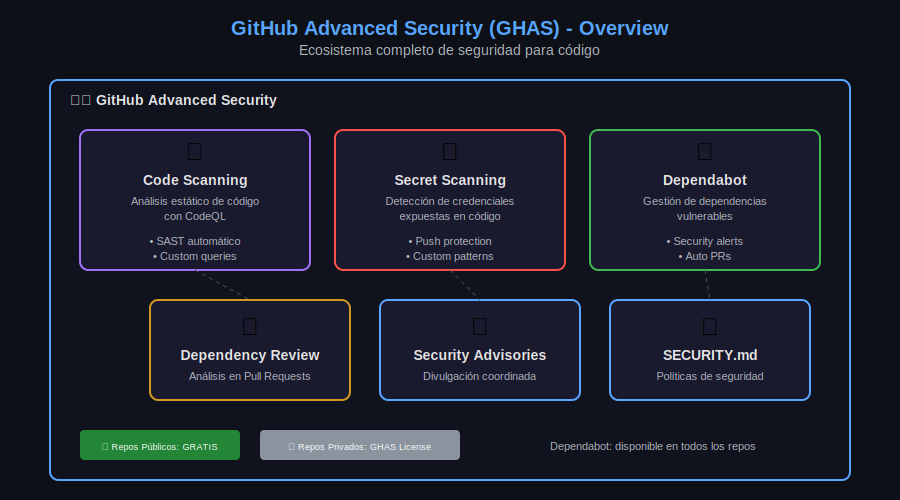

# 🛡️ Lección 01: GitHub Advanced Security (GHAS)

> **Duración**: 20 minutos
> 
> **Objetivos**: Comprender el ecosistema GHAS, sus componentes y modelo de disponibilidad.

---

## 📋 Tabla de Contenidos

1. [¿Qué es GHAS?](#-qué-es-ghas)
2. [Componentes de GHAS](#-componentes-de-ghas)
3. [Disponibilidad por Plan](#-disponibilidad-por-plan)
4. [Habilitación de Features](#-habilitación-de-features)
5. [Security Overview](#-security-overview)

---

## 🎯 ¿Qué es GHAS?

**GitHub Advanced Security (GHAS)** es un conjunto de herramientas de seguridad integradas nativamente en GitHub que ayudan a encontrar y corregir vulnerabilidades en el código antes de que lleguen a producción.

### Filosofía: Shift Left Security

```
Tradicional:          Security al final (costoso)
─────────────────────────────────────────────────►
   Code → Build → Test → Deploy → Security Review ❌

GHAS:                 Security desde el inicio (económico)
─────────────────────────────────────────────────►
   Security → Code → Security → Build → Security → Deploy ✅
```

### Beneficios Clave

| Beneficio | Descripción |
|-----------|-------------|
| 🔄 **Integrado** | No necesitas herramientas externas |
| 🤖 **Automatizado** | Análisis en cada push/PR |
| 📊 **Centralizado** | Todo en Security tab |
| 👥 **Colaborativo** | Developers ven issues en su flujo |

---

## 🧩 Componentes de GHAS



### 1. Code Scanning

**¿Qué hace?**: Análisis estático de seguridad (SAST) usando CodeQL.

```
┌──────────────────────────────────────────┐
│           CODE SCANNING                   │
├──────────────────────────────────────────┤
│ • Detecta vulnerabilidades en el código  │
│ • SQL Injection, XSS, Path Traversal...  │
│ • Análisis semántico profundo            │
│ • Resultados en formato SARIF            │
└──────────────────────────────────────────┘
```

### 2. Secret Scanning

**¿Qué hace?**: Detecta credenciales expuestas en el código.

```
┌──────────────────────────────────────────┐
│          SECRET SCANNING                  │
├──────────────────────────────────────────┤
│ • Detecta 200+ tipos de secrets          │
│ • Push Protection bloquea commits        │
│ • Notifica a proveedores (auto-revoke)   │
│ • Custom patterns para tu org            │
└──────────────────────────────────────────┘
```

### 3. Dependabot

**¿Qué hace?**: Gestiona vulnerabilidades en dependencias.

```
┌──────────────────────────────────────────┐
│            DEPENDABOT                     │
├──────────────────────────────────────────┤
│ • Alerts de dependencias vulnerables     │
│ • PRs automáticos con fixes              │
│ • Version updates programados            │
│ • Compatible con múltiples ecosistemas   │
└──────────────────────────────────────────┘
```

### 4. Dependency Review

**¿Qué hace?**: Analiza dependencias en Pull Requests antes del merge.

```
┌──────────────────────────────────────────┐
│        DEPENDENCY REVIEW                  │
├──────────────────────────────────────────┤
│ • Muestra diff de dependencias en PR     │
│ • Bloquea PRs con deps vulnerables       │
│ • Verifica licencias                     │
│ • Action para automatizar                │
└──────────────────────────────────────────┘
```

---

## 📊 Disponibilidad por Plan

### Matriz de Features

| Feature | Free (Public) | Free (Private) | Team | Enterprise |
|---------|---------------|----------------|------|------------|
| **Dependabot Alerts** | ✅ | ✅ | ✅ | ✅ |
| **Dependabot Updates** | ✅ | ✅ | ✅ | ✅ |
| **Dependency Graph** | ✅ | ✅ | ✅ | ✅ |
| **Security Advisories** | ✅ | ✅ | ✅ | ✅ |
| **Code Scanning** | ✅ | ❌ | ❌ | 💰 GHAS |
| **Secret Scanning** | ✅ | ❌ | ❌ | 💰 GHAS |
| **Push Protection** | ✅ | ❌ | ❌ | 💰 GHAS |
| **Custom Patterns** | ❌ | ❌ | ❌ | 💰 GHAS |
| **Security Overview** | ❌ | ❌ | ❌ | 💰 GHAS |

### Resumen

```
┌─────────────────────────────────────────────────────────┐
│                 DISPONIBILIDAD                          │
├─────────────────────────────────────────────────────────┤
│                                                         │
│  REPOS PÚBLICOS → Todo GRATIS 🎉                       │
│                                                         │
│  REPOS PRIVADOS → Dependabot GRATIS                    │
│                   Code/Secret Scanning = GHAS License  │
│                                                         │
└─────────────────────────────────────────────────────────┘
```

### Modelo de Licenciamiento GHAS

- **Precio**: Por committer activo/mes
- **Committer activo**: Alguien que hizo commit a un repo con GHAS habilitado en los últimos 90 días
- **Trial**: 30 días gratis para probar

---

## 🔧 Habilitación de Features

### Para Repositories Individuales

```
Settings → Security → Code security and analysis
```

| Setting | Descripción |
|---------|-------------|
| Dependency graph | Visualiza dependencias |
| Dependabot alerts | Notifica vulnerabilidades |
| Dependabot security updates | PRs automáticos para CVEs |
| Code scanning | Habilita CodeQL |
| Secret scanning | Detecta credenciales |
| Push protection | Bloquea push con secrets |

### Para Organizations (Bulk Enable)

```
Organization Settings → Security → Code security and analysis
→ Enable all / Disable all
```

### Vía API

```bash
# ¿Qué hace?: Habilita secret scanning en un repository
# ¿Por qué?: Automatizar configuración en múltiples repos
# ¿Para qué sirve?: CI/CD de seguridad o scripts de onboarding

curl -X PUT \
  -H "Authorization: token $GITHUB_TOKEN" \
  -H "Accept: application/vnd.github+json" \
  https://api.github.com/repos/OWNER/REPO/secret-scanning
```

---

## 📈 Security Overview

El **Security Overview** es un dashboard a nivel de organización que muestra el estado de seguridad de todos los repositories.

### Vistas Disponibles

```
Organization → Security → Overview

┌─────────────────────────────────────────────────────────┐
│               SECURITY OVERVIEW                          │
├─────────────────────────────────────────────────────────┤
│                                                         │
│  📊 Risk View          - Repos por nivel de riesgo     │
│  📈 Coverage View      - % de repos con features       │
│  ⚠️  Alert Views       - Code/Secret/Dependabot alerts │
│  🔍 Enablement View    - Estado de features            │
│                                                         │
└─────────────────────────────────────────────────────────┘
```

### Métricas Clave

| Métrica | Descripción |
|---------|-------------|
| **Open alerts** | Alertas sin resolver |
| **Mean time to remediate** | Tiempo promedio de corrección |
| **Coverage** | % de repos protegidos |
| **Alert trends** | Tendencia de alertas |

### Filtros Útiles

```
# Repos con alertas críticas sin resolver
is:public severity:critical state:open

# Repos sin code scanning habilitado
code-scanning:disabled

# Alertas de secrets creadas esta semana
secret-scanning:enabled created:>2024-01-01
```

---

## 🔐 Security Policies

### SECURITY.md

Archivo que define cómo reportar vulnerabilidades:

```markdown
# Security Policy

## Supported Versions

| Version | Supported          |
| ------- | ------------------ |
| 5.1.x   | :white_check_mark: |
| 5.0.x   | :x:                |
| 4.0.x   | :white_check_mark: |
| < 4.0   | :x:                |

## Reporting a Vulnerability

1. **No crear issue público**
2. Email: security@example.com
3. Respuesta esperada: 48 horas
4. Divulgación coordinada: 90 días
```

### Security Advisories

- **Privados**: Draft para coordinar fix internamente
- **Públicos**: Después de publicar el fix
- **CVE**: GitHub puede asignar CVE IDs

---

## 📝 Resumen

| Componente | Función | Disponibilidad |
|------------|---------|----------------|
| **Code Scanning** | SAST con CodeQL | Public: Free, Private: GHAS |
| **Secret Scanning** | Detectar credenciales | Public: Free, Private: GHAS |
| **Dependabot** | Deps vulnerables | Todos: Free |
| **Dependency Review** | Análisis en PRs | Todos: Free |
| **Security Overview** | Dashboard org | Enterprise + GHAS |

---

## 🔗 Recursos

- [GitHub Advanced Security Docs](https://docs.github.com/en/get-started/learning-about-github/about-github-advanced-security)
- [GHAS Pricing](https://docs.github.com/en/billing/managing-billing-for-github-advanced-security)
- [Security Best Practices](https://docs.github.com/en/code-security/getting-started/github-security-features)

---

## ⏭️ Siguiente Lección

[02 - Code Scanning con CodeQL →](02-code-scanning.md)

---

[⬅️ Volver a Week 11](../README.md)
