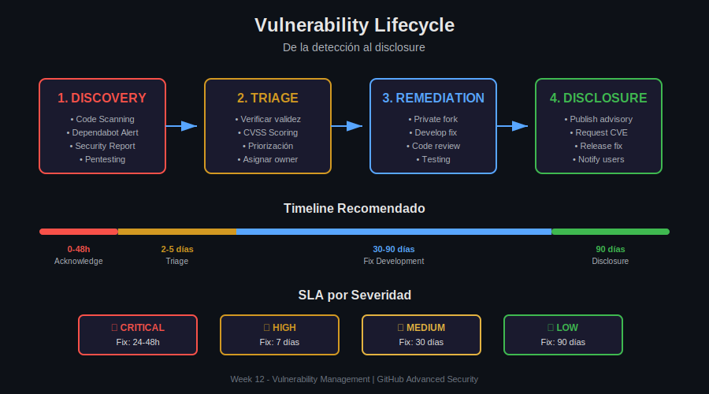

# 📊 Assets - Week 12: Vulnerability Management

Diagramas SVG para la semana de Vulnerability Management.

---

## 📁 Contenido

| Archivo | Descripción | Usado en |
|---------|-------------|----------|
| [01-vulnerability-lifecycle.svg](01-vulnerability-lifecycle.svg) | Ciclo de vida: Discovery → Triage → Remediation → Disclosure | Lección 01 |
| [02-security-advisory-flow.svg](02-security-advisory-flow.svg) | Flujo de Security Advisories en GitHub | Lección 02 |
| [03-cve-process.svg](03-cve-process.svg) | Proceso CVE y CVSS scoring | Lección 03 |
| [04-incident-response.svg](04-incident-response.svg) | NIST Incident Response Framework (6 fases) | Lección 04 |

---

## 🎨 Especificaciones de Diseño

### Paleta de Colores

| Color | Hex | Uso |
|-------|-----|-----|
| Fondo | `#0d1117` | Background principal |
| Texto principal | `#e6e6e6` | Títulos y texto destacado |
| Texto secundario | `#b0b5bd` | Descripciones y subtítulos |
| Rojo (Critical) | `#f85149` | Vulnerabilidades críticas, alertas |
| Naranja (High) | `#d29922` | Severidad alta, warnings |
| Amarillo (Medium) | `#e3b341` | Severidad media |
| Verde (Fixed) | `#3fb950` | Resuelto, patched, success |
| Azul (Process) | `#58a6ff` | Flujos, información |
| Morado (Advisory) | `#a371f7` | Security advisories, draft |
| Bordes | `#30363d` | Líneas y separadores |

### Formato

- **Tipo**: SVG (Scalable Vector Graphics)
- **Tema**: Dark mode
- **Tipografía**: Arial, sans-serif
- **ViewBox**: 900x500 o 900x550

---

## 🔗 Vinculación

Cada asset debe estar vinculado desde los archivos de teoría:

```markdown

```

---

[⬅️ Volver a Week 12](../README.md)

[⬅️ Volver a la semana](../README.md)
