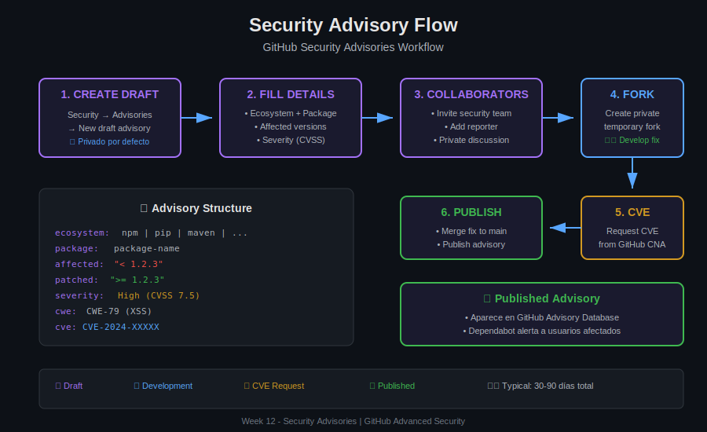

# 📖 Lección 02: Security Advisories

> **Duración**: 25 minutos
>
> **Objetivo**: Dominar la creación y gestión de Security Advisories en GitHub.

---

## 🎯 Objetivos de Aprendizaje

Al finalizar esta lección serás capaz de:

- ✅ Crear **draft security advisories**
- ✅ Completar todos los **campos requeridos**
- ✅ Usar **private forks** para desarrollar fixes
- ✅ **Publicar** advisories y coordinar disclosure

---

## 📊 Diagrama del Flujo



---

## 🔐 ¿Qué es un Security Advisory?

Un **Security Advisory** es un documento estructurado que describe una vulnerabilidad de seguridad en tu software, junto con información sobre versiones afectadas, severidad y remediación.

### Características en GitHub

| Característica | Descripción |
|----------------|-------------|
| **Privado por defecto** | Solo visible para maintainers y colaboradores invitados |
| **Fork temporal privado** | Espacio seguro para desarrollar el fix |
| **Solicitud de CVE** | GitHub actúa como CNA para asignar CVEs |
| **Integración con Dependabot** | Alerta automática a usuarios afectados |

---

## 📝 Crear un Security Advisory

### Paso 1: Acceder a Security Advisories

```
Repository → Security tab → Advisories → New draft security advisory
```

### Paso 2: Completar Información Básica

```yaml
# Campos obligatorios del formulario

Title: SQL Injection vulnerability in search endpoint
# Título claro y descriptivo

CVE ID: Request CVE ID from GitHub
# Puedes solicitarlo ahora o después

Description: |
  The search endpoint in versions < 2.0.0 is vulnerable to SQL injection.
  An attacker can extract arbitrary data from the database by manipulating
  the search query parameter.
```

### Paso 3: Especificar Ecosistema y Paquete

```yaml
# Información del paquete afectado

Ecosystem: npm
# Opciones: npm, pip, maven, nuget, rubygems, composer, go, rust, etc.

Package name: @myorg/search-api
# Nombre exacto del paquete como aparece en el registry

Affected versions: < 2.0.0
# Rango de versiones vulnerables

Patched versions: >= 2.0.0
# Versiones con el fix aplicado
```

### Paso 4: Establecer Severidad

```yaml
Severity: High
# Opciones: Critical, High, Medium, Low

CVSS Score: 7.5
# Calculado con CVSS v3.1

CVSS Vector: CVSS:3.1/AV:N/AC:L/PR:N/UI:N/S:U/C:H/I:N/A:N
# Vector string completo (opcional pero recomendado)
```

### Paso 5: Clasificar con CWE

```yaml
CWE: CWE-89
# Common Weakness Enumeration

# CWEs comunes:
# CWE-79: Cross-site Scripting (XSS)
# CWE-89: SQL Injection
# CWE-22: Path Traversal
# CWE-78: OS Command Injection
# CWE-94: Code Injection
# CWE-200: Information Exposure
# CWE-287: Authentication Issues
# CWE-352: Cross-Site Request Forgery (CSRF)
```

---

## 👥 Gestión de Colaboradores

### Invitar Colaboradores al Advisory

```
Advisory → Collaborators → Add collaborator

Roles:
- Reporter: Quien reportó la vulnerabilidad
- Maintainer: Desarrolladores del fix
- Security team: Revisores de seguridad
```

### Comunicación Privada

```markdown
# El advisory incluye un área de discusión privada

✅ Usar para:
- Coordinar timeline de disclosure
- Discutir severidad y CVSS
- Planificar release
- Agradecer al reporter

❌ NO usar para:
- Compartir exploits públicamente
- Detalles que podrían filtrar el CVE
```

---

## 🔀 Private Fork para Desarrollo

### Crear Fork Temporal

```
Advisory → "Start a temporary private fork"
```

GitHub crea automáticamente:
- Fork privado del repository
- Solo accesible por colaboradores del advisory
- Se elimina después de mergear o cerrar el advisory

### Workflow en el Private Fork

```bash
# 1. Clonar el fork privado (URL proporcionada por GitHub)
git clone https://github.com/owner/repo-ghsa-xxxx-xxxx-xxxx.git
cd repo-ghsa-xxxx-xxxx-xxxx

# 2. Crear branch para el fix
git checkout -b fix/sql-injection

# 3. Desarrollar el fix
# ... editar archivos ...

# 4. Commit con mensaje descriptivo (sin mencionar CVE aún)
git commit -m "fix: sanitize user input in search query

- Add parameterized queries
- Add input validation
- Add regression tests"

# 5. Push al fork privado
git push origin fix/sql-injection

# 6. Crear PR dentro del fork privado para review
```

### Mergear el Fix

```
1. PR revisado y aprobado en el fork privado
2. Merge en el fork privado
3. Cuando esté listo para disclosure:
   - Advisory → "Merge fix into main branch"
   - GitHub crea PR del fork al repo original
4. Merge del PR público (coordinar con disclosure)
```

---

## 📤 Publicar el Advisory

### Checklist Pre-Publicación

```markdown
□ Fix mergeado en main
□ Nueva versión release creada
□ Todos los campos del advisory completos
□ CVSS score verificado
□ CWE asignado
□ Reporter creditado (con permiso)
□ Timeline de disclosure acordado
```

### Proceso de Publicación

```
Advisory → "Publish advisory"

Al publicar:
✅ Advisory se hace público
✅ CVE se publica (si fue asignado)
✅ Aparece en GitHub Advisory Database
✅ Dependabot alerta a usuarios afectados
✅ Notificación a watchers del repo
```

### Ejemplo de Advisory Publicado

```markdown
# GHSA-xxxx-xxxx-xxxx

## SQL Injection in search endpoint

### Summary
The search endpoint is vulnerable to SQL injection attacks.

### Severity
High (CVSS 7.5)

### Affected Versions
- `< 2.0.0`

### Patched Versions
- `>= 2.0.0`

### Workarounds
If unable to upgrade, disable the search endpoint.

### References
- Fix PR: #123
- CVE-2024-12345

### Credits
Thanks to @security-researcher for responsible disclosure.
```

---

## 🔄 Estados del Advisory

```
┌──────────┐     ┌──────────┐     ┌───────────┐
│  DRAFT   │ ──► │ TRIAGE   │ ──► │ PUBLISHED │
└──────────┘     └──────────┘     └───────────┘
     │                                   │
     │                                   │
     ▼                                   ▼
┌──────────┐                      ┌───────────┐
│ CLOSED   │                      │ WITHDRAWN │
│(invalid) │                      │  (error)  │
└──────────┘                      └───────────┘
```

| Estado | Descripción |
|--------|-------------|
| **Draft** | En desarrollo, privado |
| **Published** | Público, CVE asignado |
| **Closed** | Cerrado sin publicar (falso positivo) |
| **Withdrawn** | Retirado después de publicar (error) |

---

## 🤝 Recibir Reportes de Vulnerabilidades

### Habilitar "Private vulnerability reporting"

```
Settings → Security → Enable "Private vulnerability reporting"
```

Esto permite que investigadores externos reporten directamente:
- Crea un draft advisory automáticamente
- Notifica a los maintainers
- Comunicación privada desde el inicio

### Proceso de Recepción

```
1. Investigador reporta via Security tab
   ↓
2. Draft advisory creado automáticamente
   ↓
3. Maintainer recibe notificación
   ↓
4. Acknowledge en 48h (best practice)
   ↓
5. Triage y desarrollo del fix
   ↓
6. Coordinar disclosure con reporter
```

---

## 📊 GitHub Advisory Database

Cuando publicas un advisory, se incluye en la **GitHub Advisory Database**:

```
https://github.com/advisories

Contenido:
- Todos los advisories publicados en GitHub
- CVEs de NVD (National Vulnerability Database)
- Advisories de ecosistemas (npm, PyPI, etc.)
```

### Integración con Dependabot

```yaml
# Cuando publicas un advisory:

1. Aparece en github.com/advisories
2. Dependabot escanea repositories
3. Usuarios con dependencia afectada reciben:
   - Dependabot alert
   - PR automático (si security updates están habilitados)
```

---

## 💡 Mejores Prácticas

### DO ✅

```markdown
- Responder a reportes en 48h
- Mantener comunicación con reporter
- Dar crédito al reporter
- Usar CVSS para severidad consistente
- Coordinar fecha de disclosure
- Incluir workarounds cuando sea posible
```

### DON'T ❌

```markdown
- Ignorar reportes de seguridad
- Publicar sin fix disponible
- Revelar detalles antes del disclosure
- Subestimar severidad por conveniencia
- Publicar sin notificar al reporter
```

---

## 📝 Ejercicio Mental

### Escenario

Recibes este reporte:

```
Vulnerability: Stored XSS in comments

I can inject JavaScript in comments that executes for all users.

Steps:
1. Post comment: <script>alert('xss')</script>
2. Other users see the alert

Affects: all versions
```

### Tareas

1. ¿Qué CWE asignarías?
2. Estima el CVSS score
3. ¿Qué información necesitas del reporter?
4. Draft del advisory title y summary

---

## 🎯 Resumen

| Paso | Acción | Resultado |
|------|--------|-----------|
| 1 | New draft advisory | Advisory privado creado |
| 2 | Complete fields | Ecosystem, versions, severity |
| 3 | Add collaborators | Equipo + reporter |
| 4 | Private fork | Espacio seguro para fix |
| 5 | Develop fix | PR en fork privado |
| 6 | Publish | Advisory público + CVE |

---

## 📚 Recursos Adicionales

- [Creating a security advisory](https://docs.github.com/en/code-security/security-advisories/repository-security-advisories/creating-a-repository-security-advisory)
- [GitHub Advisory Database](https://github.com/advisories)
- [Private vulnerability reporting](https://docs.github.com/en/code-security/security-advisories/guidance-on-reporting-and-writing/privately-reporting-a-security-vulnerability)

---

## ✅ Checklist de Comprensión

- [ ] Puedo crear un draft security advisory
- [ ] Conozco los campos requeridos
- [ ] Sé cómo usar private forks
- [ ] Entiendo el proceso de publicación

---

[⬅️ Anterior: Vulnerability Lifecycle](01-vulnerability-lifecycle.md) | [Siguiente: CVE Process ➡️](03-cve-process.md)
