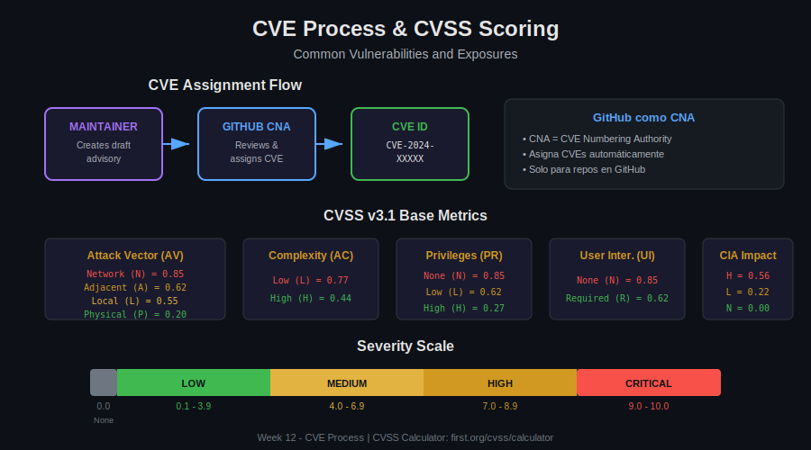

# 📖 Lección 03: CVE Process

> **Duración**: 20 minutos
>
> **Objetivo**: Entender el sistema CVE y cómo solicitar identificadores a través de GitHub.

---

## 🎯 Objetivos de Aprendizaje

Al finalizar esta lección serás capaz de:

- ✅ Entender qué es **CVE** y **CNA**
- ✅ Calcular scores **CVSS** correctamente
- ✅ Solicitar **CVE IDs** a través de GitHub
- ✅ Diferenciar **CVE, GHSA, CWE**

---

## 📊 Diagrama del Proceso



---

## 🔍 ¿Qué es CVE?

**CVE (Common Vulnerabilities and Exposures)** es un sistema de identificación estándar para vulnerabilidades de seguridad.

### Anatomía de un CVE ID

```
CVE-2024-12345
│   │    │
│   │    └── Número secuencial
│   └─────── Año de asignación
└─────────── Prefijo "CVE"
```

### Propósito del CVE

| Beneficio | Descripción |
|-----------|-------------|
| **Identificación única** | Un ID global para cada vulnerabilidad |
| **Comunicación** | Referencia común entre equipos |
| **Tracking** | Seguimiento de remediación |
| **Compliance** | Auditorías y reportes de seguridad |

---

## 🏢 GitHub como CNA

### ¿Qué es un CNA?

**CNA (CVE Numbering Authority)** es una organización autorizada para asignar CVE IDs.

```
MITRE (Root CNA)
    │
    ├── GitHub (CNA)
    │       └── Asigna CVEs para repos de GitHub
    │
    ├── Google (CNA)
    ├── Microsoft (CNA)
    ├── Red Hat (CNA)
    └── ... otros CNAs
```

### Scope de GitHub como CNA

```markdown
GitHub puede asignar CVEs para:
✅ Código hosteado en GitHub (público o privado)
✅ Cualquier lenguaje/ecosistema
✅ A través de Security Advisories

GitHub NO asigna CVEs para:
❌ Software no hosteado en GitHub
❌ Vulnerabilidades en GitHub mismo (usa HackerOne)
```

---

## 📝 Solicitar un CVE

### Desde un Security Advisory

```
1. Crear draft security advisory
2. En el campo "CVE ID":
   - Click "Request CVE ID"
   - O seleccionar "I will get a CVE ID later"
3. GitHub revisa y asigna automáticamente
```

### Información Requerida

```yaml
# GitHub necesita esta información para asignar CVE:

Required:
  - Description: Descripción de la vulnerabilidad
  - Affected product: Nombre del package/repo
  - Affected versions: Versiones vulnerables
  - Vulnerability type: CWE classification

Recommended:
  - CVSS score: Severidad calculada
  - Patched versions: Versiones con fix
  - References: PRs, commits, documentación
```

### Timeline de Asignación

```
Request submitted
    ↓ (minutos a horas)
GitHub reviews
    ↓ (automático si info completa)
CVE ID assigned (CVE-YYYY-NNNNN)
    ↓
CVE published when advisory goes public
```

---

## 📊 CVSS Scoring

### CVSS v3.1 Base Metrics

**CVSS (Common Vulnerability Scoring System)** cuantifica la severidad de 0.0 a 10.0.

#### Exploitability Metrics

| Métrica | Valores | Descripción |
|---------|---------|-------------|
| **Attack Vector (AV)** | N/A/L/P | Desde dónde se puede explotar |
| **Attack Complexity (AC)** | L/H | Condiciones necesarias |
| **Privileges Required (PR)** | N/L/H | Nivel de acceso necesario |
| **User Interaction (UI)** | N/R | ¿Requiere acción del usuario? |

#### Impact Metrics

| Métrica | Valores | Descripción |
|---------|---------|-------------|
| **Confidentiality (C)** | N/L/H | Impacto en confidencialidad |
| **Integrity (I)** | N/L/H | Impacto en integridad |
| **Availability (A)** | N/L/H | Impacto en disponibilidad |

#### Scope

| Métrica | Valores | Descripción |
|---------|---------|-------------|
| **Scope (S)** | U/C | ¿Afecta otros componentes? |

### Ejemplo de Cálculo

```yaml
# SQL Injection que permite leer toda la base de datos

Attack Vector: Network (N) = 0.85
# Explotable remotamente via internet

Attack Complexity: Low (L) = 0.77
# No requiere condiciones especiales

Privileges Required: None (N) = 0.85
# No requiere autenticación

User Interaction: None (N) = 0.85
# No requiere acción del usuario

Scope: Unchanged (U)
# Solo afecta el componente vulnerable

Confidentiality: High (H) = 0.56
# Acceso total a datos

Integrity: None (N) = 0.00
# No puede modificar datos

Availability: None (N) = 0.00
# No afecta disponibilidad
```

### Vector String

```
CVSS:3.1/AV:N/AC:L/PR:N/UI:N/S:U/C:H/I:N/A:N

Score: 7.5 (High)
```

### Calculadora CVSS

```
https://www.first.org/cvss/calculator/3.1

# O usar la calculadora integrada en GitHub:
Security Advisory → Severity → "Calculate CVSS"
```

---

## 🔤 Diferencias: CVE vs GHSA vs CWE

| Sistema | Propósito | Ejemplo |
|---------|-----------|---------|
| **CVE** | ID único de vulnerabilidad específica | CVE-2024-12345 |
| **GHSA** | ID de GitHub Advisory | GHSA-xxxx-xxxx-xxxx |
| **CWE** | Categoría/tipo de debilidad | CWE-89 (SQL Injection) |

### Relación entre ellos

```
CWE-89 (SQL Injection)
    │
    ├── CVE-2024-11111 (en package A)
    │       └── GHSA-aaaa-bbbb-cccc
    │
    ├── CVE-2024-22222 (en package B)
    │       └── GHSA-dddd-eeee-ffff
    │
    └── CVE-2024-33333 (en package C)
            └── GHSA-gggg-hhhh-iiii

Un CWE → Muchos CVEs → Cada CVE tiene su GHSA
```

---

## 📋 CWEs Comunes

### Top 10 CWEs en Software

| CWE ID | Nombre | Descripción |
|--------|--------|-------------|
| CWE-79 | XSS | Cross-site Scripting |
| CWE-89 | SQLi | SQL Injection |
| CWE-22 | Path Traversal | Directory traversal |
| CWE-78 | OS Command Injection | Command injection |
| CWE-94 | Code Injection | Arbitrary code execution |
| CWE-287 | Auth Issues | Authentication bypass |
| CWE-200 | Info Exposure | Information disclosure |
| CWE-352 | CSRF | Cross-Site Request Forgery |
| CWE-434 | File Upload | Unrestricted file upload |
| CWE-502 | Deserialization | Insecure deserialization |

### Buscar CWE Apropiado

```
https://cwe.mitre.org/

Búsqueda por:
- Keyword
- CWE ID
- Vulnerability type
```

---

## 🌐 Bases de Datos de Vulnerabilidades

### NVD (National Vulnerability Database)

```
https://nvd.nist.gov/

Contenido:
- Todos los CVEs publicados
- CVSS scores
- Referencias
- CPE (Common Platform Enumeration)
```

### GitHub Advisory Database

```
https://github.com/advisories

Contenido:
- GHSAs publicados en GitHub
- CVEs importados de NVD
- Advisories de ecosistemas (npm, PyPI, etc.)
- Curado por GitHub Security Lab
```

### Otras Fuentes

| Base de Datos | URL | Especialidad |
|---------------|-----|--------------|
| Snyk Vuln DB | snyk.io/vuln | Múltiples ecosistemas |
| npm Security | npmjs.com/advisories | npm packages |
| RubySec | rubysec.com | Ruby gems |
| Python Advisory | pypi.org/security | PyPI packages |

---

## 🔍 Investigar un CVE

### Información Disponible

```yaml
# Ejemplo: CVE-2021-44228 (Log4Shell)

CVE ID: CVE-2021-44228
Published: 2021-12-10
CVSS: 10.0 (Critical)
CWE: CWE-502 (Deserialization)

Affected:
  - Product: Apache Log4j
  - Versions: 2.0-beta9 to 2.14.1

Description: |
  Apache Log4j2 2.0-beta9 through 2.14.1 JNDI features do not
  protect against attacker controlled LDAP and other JNDI related
  endpoints.

References:
  - https://logging.apache.org/log4j/2.x/security.html
  - https://nvd.nist.gov/vuln/detail/CVE-2021-44228
```

### Buscar CVEs

```bash
# NVD Search
https://nvd.nist.gov/vuln/search?query=log4j

# GitHub Advisory Search
https://github.com/advisories?query=log4j

# Snyk
https://snyk.io/vuln/search?q=log4j
```

---

## 📝 Ejercicio: Calcular CVSS

### Escenario

Una API permite a usuarios autenticados acceder a archivos del servidor usando el parámetro `?file=report.pdf`. Un atacante descubre que puede usar `?file=../../../etc/passwd` para leer archivos del sistema.

### Calcula el CVSS

```yaml
# Completa los valores:

Attack Vector: ___  # ¿Cómo se accede? (Network/Local/etc)
Attack Complexity: ___  # ¿Es fácil explotar?
Privileges Required: ___  # ¿Necesita login?
User Interaction: ___  # ¿Usuario debe hacer algo?
Scope: ___  # ¿Afecta otros sistemas?
Confidentiality: ___  # ¿Accede a datos?
Integrity: ___  # ¿Puede modificar?
Availability: ___  # ¿Afecta disponibilidad?
```

### Respuesta

```yaml
Attack Vector: Network (N)
Attack Complexity: Low (L)
Privileges Required: Low (L)  # Requiere autenticación
User Interaction: None (N)
Scope: Unchanged (U)
Confidentiality: High (H)  # Lee archivos del sistema
Integrity: None (N)
Availability: None (N)

Vector: CVSS:3.1/AV:N/AC:L/PR:L/UI:N/S:U/C:H/I:N/A:N
Score: 6.5 (Medium)
CWE: CWE-22 (Path Traversal)
```

---

## 🎯 Resumen

| Concepto | Descripción |
|----------|-------------|
| **CVE** | ID único para vulnerabilidad |
| **CNA** | Autoridad que asigna CVEs |
| **CVSS** | Score de severidad (0-10) |
| **CWE** | Categoría de debilidad |
| **GHSA** | ID de advisory en GitHub |

---

## 📚 Recursos Adicionales

- [CVSS v3.1 Calculator](https://www.first.org/cvss/calculator/3.1)
- [CWE Database](https://cwe.mitre.org/)
- [NVD](https://nvd.nist.gov/)
- [GitHub as CNA](https://docs.github.com/en/code-security/security-advisories/global-security-advisories/about-the-github-advisory-database)

---

## ✅ Checklist de Comprensión

- [ ] Entiendo qué es CVE y CNA
- [ ] Puedo calcular CVSS score básico
- [ ] Sé cómo solicitar CVE via GitHub
- [ ] Distingo entre CVE, GHSA y CWE

---

[⬅️ Anterior: Security Advisories](02-security-advisories.md) | [Siguiente: Incident Response ➡️](04-incident-response.md)
