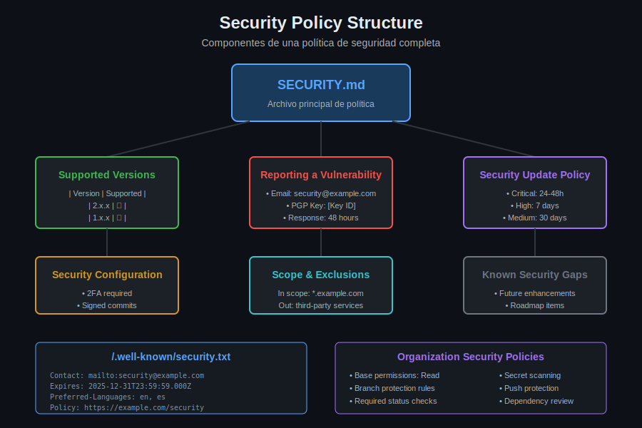

# Lección 01: Security Policies en GitHub

## 🎯 Objetivos de Aprendizaje

Al finalizar esta lección, serás capaz de:

- Crear y mantener un archivo `SECURITY.md` profesional
- Implementar `security.txt` según el estándar RFC 9116
- Configurar políticas de seguridad a nivel de organización
- Establecer canales seguros para reportes de vulnerabilidades

## 📚 Conceptos Teóricos

### ¿Qué es una Security Policy?

Una **Security Policy** es un documento que define cómo una organización o proyecto maneja la seguridad, incluyendo:

- **Versiones soportadas**: Qué versiones reciben parches de seguridad
- **Proceso de reporte**: Cómo reportar vulnerabilidades de forma segura
- **Tiempos de respuesta**: SLAs para acknowledgment y remediación
- **Alcance**: Qué está incluido y excluido del programa

### ¿Por qué es importante?

| Sin Security Policy | Con Security Policy |
|---------------------|---------------------|
| Vulnerabilidades reportadas públicamente | Canal privado y seguro |
| Sin proceso definido | Proceso claro y documentado |
| Tiempos de respuesta indefinidos | SLAs establecidos |
| Riesgo legal para researchers | Safe harbor claro |
| Daño reputacional | Gestión profesional |

---

## 📄 SECURITY.md

### Ubicación y Reconocimiento

GitHub reconoce automáticamente `SECURITY.md` en estas ubicaciones:

```
repo-root/
├── SECURITY.md              # ✅ Raíz del repository
├── docs/SECURITY.md         # ✅ Carpeta docs
├── .github/SECURITY.md      # ✅ Carpeta .github
└── .github/SECURITY.md      # ✅ Repository .github de la org (default)
```

Cuando existe, GitHub muestra un enlace **"Security policy"** en la pestaña Security del repository.

### Estructura Recomendada



```markdown
# Security Policy

## Supported Versions

Use this section to tell people about which versions of your project 
are currently being supported with security updates.

| Version | Supported          |
| ------- | ------------------ |
| 5.1.x   | :white_check_mark: |
| 5.0.x   | :x:                |
| 4.0.x   | :white_check_mark: |
| < 4.0   | :x:                |

## Reporting a Vulnerability

Use this section to tell people how to report a vulnerability.

Tell them where to go, how often they can expect to get an update on a
reported vulnerability, what to expect if the vulnerability is accepted 
or declined, etc.
```

### Plantilla Profesional Completa

```markdown
# Security Policy

## 🛡️ Commitment

We take the security of our software products and services seriously, 
including all source code repositories managed through our GitHub 
organization.

## 📋 Supported Versions

| Version | Supported          | End of Life    |
| ------- | ------------------ | -------------- |
| 3.x.x   | :white_check_mark: | Active         |
| 2.x.x   | :white_check_mark: | December 2025  |
| 1.x.x   | :x:                | June 2024      |
| < 1.0   | :x:                | Not supported  |

## 🔐 Reporting a Vulnerability

### Preferred Method

Please report security vulnerabilities through GitHub's private 
vulnerability reporting feature:

1. Go to the **Security** tab of this repository
2. Click **Report a vulnerability**
3. Fill in the details of your finding

### Alternative Contact

If you prefer email communication:

- **Email**: security@example.com
- **PGP Key**: [Download our PGP key](https://example.com/pgp-key.asc)
- **Key Fingerprint**: `ABCD 1234 EFGH 5678 IJKL 9012 MNOP 3456 QRST 7890`

### What to Include

Please include as much of the following information as possible:

- Type of issue (e.g., buffer overflow, SQL injection, XSS)
- Full paths of source file(s) related to the issue
- Location of the affected source code (tag/branch/commit or URL)
- Step-by-step instructions to reproduce the issue
- Proof-of-concept or exploit code (if possible)
- Impact of the issue, including how an attacker might exploit it

### Response Timeline

| Action | Timeline |
| ------ | -------- |
| Initial acknowledgment | Within 48 hours |
| Preliminary assessment | Within 7 days |
| Status update | Every 14 days |
| Resolution target (Critical) | 7 days |
| Resolution target (High) | 30 days |
| Resolution target (Medium) | 90 days |

## 🛡️ Safe Harbor

We support safe harbor for security researchers who:

- Make a good faith effort to avoid privacy violations, destruction 
  of data, and interruption or degradation of our services
- Only interact with accounts you own or with explicit permission 
  of the account holder
- Do not exploit a security issue for purposes other than verification
- Report vulnerabilities through our designated channels
- Do not publicly disclose the vulnerability before we've had a 
  reasonable time to address it

We will not initiate legal action against researchers who follow 
these guidelines.

## 🏆 Recognition

We maintain a [Security Hall of Fame](./SECURITY_HALL_OF_FAME.md) 
to recognize researchers who have responsibly disclosed vulnerabilities.

## 📚 Security Resources

- [Security Advisories](../../security/advisories)
- [Dependency Graph](../../network/dependencies)
- [Code Scanning Alerts](../../security/code-scanning)

## 📞 Contact

For non-security related issues, please use our regular 
[issue tracker](../../issues).
```

---

## 🌐 security.txt (RFC 9116)

### ¿Qué es security.txt?

Es un estándar web (RFC 9116) que define un archivo en una ubicación conocida para que los security researchers encuentren información de contacto.

### Ubicación

```
https://example.com/.well-known/security.txt
```

O alternativamente:

```
https://example.com/security.txt
```

### Campos del Estándar

| Campo | Requerido | Descripción |
|-------|-----------|-------------|
| `Contact` | ✅ Sí | URI para reportar vulnerabilidades |
| `Expires` | ✅ Sí | Fecha de expiración del archivo |
| `Preferred-Languages` | No | Idiomas preferidos |
| `Canonical` | No | URL canónica del archivo |
| `Policy` | No | URL de la política completa |
| `Hiring` | No | URL de ofertas de trabajo en seguridad |
| `Encryption` | No | Clave PGP para comunicación cifrada |
| `Acknowledgments` | No | URL del hall of fame |

### Ejemplo Completo

```text
# Our security policy
Contact: mailto:security@example.com
Contact: https://example.com/security/report
Expires: 2026-01-01T00:00:00.000Z
Encryption: https://example.com/.well-known/pgp-key.txt
Acknowledgments: https://example.com/security/thanks
Policy: https://example.com/security-policy
Preferred-Languages: en, es
Canonical: https://example.com/.well-known/security.txt
Hiring: https://example.com/careers/security
```

### Firmar con PGP (Recomendado)

```bash
# ¿Qué hace?: Firma el archivo security.txt con tu clave PGP
# ¿Por qué?: Permite verificar la autenticidad del archivo
# ¿Para qué sirve?: Previene modificaciones maliciosas

gpg --clearsign security.txt
# Genera security.txt.asc con firma incluida
```

Resultado:

```text
-----BEGIN PGP SIGNED MESSAGE-----
Hash: SHA256

Contact: mailto:security@example.com
Expires: 2026-01-01T00:00:00.000Z
...

-----BEGIN PGP SIGNATURE-----
[firma]
-----END PGP SIGNATURE-----
```

---

## 🏢 Políticas a Nivel de Organización

### Default Security Policy

Puedes crear una política de seguridad que aplique a todos los repositories de tu organización:

```bash
# Estructura del repository .github de la organización
org-name/.github/
├── SECURITY.md           # Policy por defecto para todos los repos
├── CONTRIBUTING.md       # Guía de contribución por defecto
├── CODE_OF_CONDUCT.md    # Código de conducta por defecto
└── profile/
    └── README.md         # Profile de la organización
```

### Configuración en Organization Settings

```
Organization Settings
└── Code security and analysis
    ├── Dependency graph: ✅ Enabled
    ├── Dependabot alerts: ✅ Enabled
    ├── Dependabot security updates: ✅ Enabled
    ├── Secret scanning: ✅ Enabled
    ├── Push protection: ✅ Enabled
    └── Code scanning: ✅ Enable by default
```

### Security Managers Role

GitHub permite asignar un rol especial de **Security Manager** a nivel de organización:

```yaml
Permisos del Security Manager:
  - Ver alertas de seguridad en todos los repos
  - Descartar alertas de seguridad
  - Ver Security Overview
  - NO puede: modificar código, configurar repos
```

Para asignar:

```
Organization Settings → Roles → Security managers → Add team
```

---

## 🔧 GitHub Private Vulnerability Reporting

### Habilitar en un Repository

```
Repository Settings
└── Security
    └── Private vulnerability reporting: ✅ Enable
```

### Habilitar para toda la Organización

```
Organization Settings
└── Code security and analysis
    └── Private vulnerability reporting
        └── Automatically enable for new repositories: ✅
```

### Workflow de Reporte Privado

```
1. Researcher → Security tab → "Report a vulnerability"
2. Fill form with details
3. Maintainer receives notification
4. Discussion in private draft advisory
5. Collaborate on fix
6. Request CVE (optional)
7. Publish advisory + fix
```

### Plantilla de Reporte

Cuando habilitas private vulnerability reporting, puedes configurar una plantilla:

```yaml
# .github/SECURITY_ISSUE_TEMPLATE.yml
name: Security Vulnerability Report
description: Report a security vulnerability
body:
  - type: markdown
    attributes:
      value: |
        Thanks for taking the time to report this security issue!
        Please fill out this form as completely as possible.
        
  - type: dropdown
    id: severity
    attributes:
      label: Severity
      options:
        - Critical
        - High
        - Medium
        - Low
    validations:
      required: true
      
  - type: textarea
    id: description
    attributes:
      label: Vulnerability Description
      description: Describe the vulnerability in detail
    validations:
      required: true
      
  - type: textarea
    id: reproduction
    attributes:
      label: Steps to Reproduce
      description: Step-by-step instructions to reproduce
    validations:
      required: true
      
  - type: textarea
    id: impact
    attributes:
      label: Impact
      description: What is the potential impact of this vulnerability?
    validations:
      required: true
```

---

## 📊 Security Overview (Organization)

El **Security Overview** proporciona una vista centralizada de la postura de seguridad:

### Métricas Disponibles

| Métrica | Descripción |
|---------|-------------|
| **Coverage** | % de repos con features habilitados |
| **Risk** | Repos con alertas críticas/high |
| **Alerts** | Total de alertas por tipo |
| **MTTR** | Tiempo medio de remediación |

### Filtros Útiles

```
# Ver repos sin SECURITY.md
has:security-policy:false

# Ver repos con alertas críticas
severity:critical

# Ver repos sin code scanning
code-scanning:not-enabled

# Combinar filtros
archived:false is:public has:security-policy:false
```

---

## ✅ Checklist de Security Policy

```markdown
## Repository Level
- [ ] SECURITY.md creado y actualizado
- [ ] Private vulnerability reporting habilitado
- [ ] Versiones soportadas documentadas
- [ ] Contacto de seguridad definido
- [ ] SLAs de respuesta documentados
- [ ] Safe harbor statement incluido

## Organization Level
- [ ] Default SECURITY.md en repo .github
- [ ] Security managers asignados
- [ ] GHAS features habilitados
- [ ] Security Overview configurado

## Web Presence
- [ ] security.txt publicado
- [ ] security.txt firmado con PGP
- [ ] security.txt no expirado
```

---

## 🔗 Recursos Adicionales

- [GitHub Security Policy Documentation](https://docs.github.com/en/code-security/getting-started/adding-a-security-policy-to-your-repository)
- [RFC 9116 - security.txt](https://www.rfc-editor.org/rfc/rfc9116)
- [securitytxt.org - Generator](https://securitytxt.org/)
- [GitHub Private Vulnerability Reporting](https://docs.github.com/en/code-security/security-advisories/guidance-on-reporting-and-writing/privately-reporting-a-security-vulnerability)

---

## 📝 Resumen

| Concepto | Descripción |
|----------|-------------|
| **SECURITY.md** | Documento principal de política en el repository |
| **security.txt** | Estándar web RFC 9116 para contacto de seguridad |
| **Private Reporting** | Feature de GitHub para reportes confidenciales |
| **Security Overview** | Dashboard centralizado a nivel de organización |
| **Safe Harbor** | Protección legal para researchers responsables |

---

**Próxima lección**: [Compliance Frameworks](./02-compliance-frameworks.md) - SOC 2, GDPR, HIPAA, PCI-DSS y su integración con GitHub
