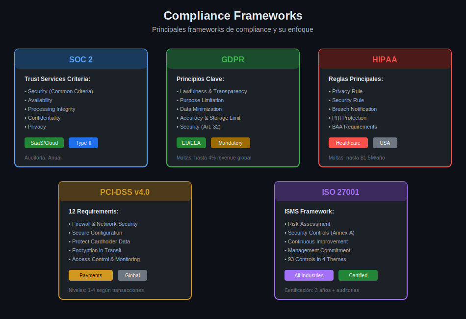

# Lección 02: Compliance Frameworks

## 🎯 Objetivos de Aprendizaje

Al finalizar esta lección, serás capaz de:

- Entender los principales frameworks de compliance (SOC 2, GDPR, HIPAA, PCI-DSS, ISO 27001)
- Mapear controles de GitHub a requisitos de compliance
- Implementar evidencias auditables en workflows de desarrollo
- Configurar GitHub para facilitar auditorías de cumplimiento

## 📚 Conceptos Teóricos

### ¿Qué es Compliance?

**Compliance** (cumplimiento normativo) es el conjunto de prácticas y controles que una organización implementa para cumplir con regulaciones, estándares y leyes aplicables.

### ¿Por qué GitHub es Relevante para Compliance?

```
┌─────────────────────────────────────────────────────────────────┐
│                    Software Development Lifecycle                │
├─────────────────────────────────────────────────────────────────┤
│  Code → Review → Build → Test → Deploy → Monitor                │
│    ↓       ↓       ↓       ↓       ↓        ↓                   │
│  GitHub  GitHub  GitHub  GitHub  GitHub   GitHub                │
│  Repos   PRs     Actions Actions Actions  Insights              │
└─────────────────────────────────────────────────────────────────┘
                              ↓
              Evidence for Compliance Audits
```

GitHub genera **evidencia auditable** de:
- Quién cambió qué código y cuándo
- Quién aprobó los cambios
- Qué pruebas se ejecutaron
- Qué vulnerabilidades se detectaron
- Cómo se manejaron los secretos

---

## 📊 Principales Frameworks de Compliance



### Comparativa Rápida

| Framework | Industria | Alcance Geográfico | Obligatorio | Certificación |
|-----------|-----------|-------------------|-------------|---------------|
| **SOC 2** | SaaS/Cloud | Global | No | Auditoría externa |
| **GDPR** | Todas | EU/EEA + datos de ciudadanos EU | Sí | Auto-certificación |
| **HIPAA** | Healthcare | USA | Sí | Auto-certificación |
| **PCI-DSS** | Pagos | Global | Sí* | Auditoría/SAQ |
| **ISO 27001** | Todas | Global | No | Certificación formal |

*PCI-DSS es obligatorio para quienes procesan pagos con tarjeta.

---

## 🔵 SOC 2 (Service Organization Control 2)

### Trust Services Criteria

SOC 2 evalúa cinco criterios de confianza:

| Criterio | Descripción | Controles GitHub |
|----------|-------------|------------------|
| **Security** | Protección contra acceso no autorizado | 2FA, SAML SSO, Branch protection |
| **Availability** | Sistema disponible según SLA | Status page, redundancy |
| **Processing Integrity** | Procesamiento completo y preciso | CI/CD, automated testing |
| **Confidentiality** | Datos confidenciales protegidos | Secret scanning, encryption |
| **Privacy** | Datos personales manejados apropiadamente | Access controls, audit logs |

### Controles de GitHub para SOC 2

```yaml
# Mapeo de controles SOC 2 a features de GitHub

CC6.1 - Logical Access Controls:
  - SAML/SSO integration
  - 2FA enforcement
  - Team-based permissions
  - Repository access levels

CC6.2 - Access Authentication:
  - Personal Access Tokens (with expiry)
  - SSH Keys management
  - Deploy keys
  - GitHub Apps (fine-grained)

CC6.3 - Access Authorization:
  - Branch protection rules
  - CODEOWNERS
  - Required reviewers
  - Status checks

CC7.1 - Vulnerability Management:
  - Dependabot alerts
  - Code scanning (CodeQL)
  - Secret scanning
  - Security advisories

CC7.2 - Monitoring:
  - Audit log
  - Security overview
  - Alert notifications
  - Webhooks
```

### Evidencia para Auditoría SOC 2

```bash
# Exportar audit log para evidencia
# ¿Qué hace?: Descarga eventos de auditoría de la organización
# ¿Por qué?: Los auditores necesitan evidencia de controles
# ¿Para qué sirve?: Demostrar cumplimiento de CC7.2 (Monitoring)

gh api \
  -H "Accept: application/vnd.github+json" \
  /orgs/{org}/audit-log \
  --paginate > audit-log-export.json
```

---

## 🟢 GDPR (General Data Protection Regulation)

### Principios Clave y GitHub

| Principio GDPR | Artículo | Implementación en GitHub |
|----------------|----------|--------------------------|
| Lawfulness | Art. 6 | Términos de servicio, consentimiento |
| Purpose limitation | Art. 5(1)(b) | Repositories privados, access control |
| Data minimization | Art. 5(1)(c) | Eliminar datos innecesarios |
| Accuracy | Art. 5(1)(d) | Git history, audit trail |
| Storage limitation | Art. 5(1)(e) | Retention policies, archival |
| Security | Art. 32 | Encryption, access controls, GHAS |

### Derechos del Interesado

```yaml
GDPR Data Subject Rights:
  
  Right to Access (Art. 15):
    GitHub: User can export their data
    Action: Settings → Account → Export account data
    
  Right to Rectification (Art. 16):
    GitHub: User can update profile
    Action: Edit profile, update commits (rebase)
    
  Right to Erasure (Art. 17):
    GitHub: Account deletion
    Action: Settings → Account → Delete account
    Caveat: Git history may retain references
    
  Right to Data Portability (Art. 20):
    GitHub: Export repositories, issues, PRs
    Action: gh repo clone, API export
```

### Git y GDPR: Consideraciones Especiales

```bash
# Problema: PII en commits históricos
# Un desarrollador commiteó datos personales por error

# Solución 1: BFG Repo-Cleaner (recomendado)
# ¿Qué hace?: Elimina datos sensibles del historial
# ¿Por qué?: GDPR requiere eliminación de PII cuando se solicita
# ¿Para qué sirve?: Cumplir con Right to Erasure

java -jar bfg.jar --replace-text passwords.txt repo.git
git reflog expire --expire=now --all
git gc --prune=now --aggressive

# Solución 2: git filter-repo
pip install git-filter-repo
git filter-repo --invert-paths --path file-with-pii.txt
```

### GitHub Data Processing Agreement

Para cumplir con GDPR como procesador de datos:

1. Firmar el **GitHub Data Protection Agreement (DPA)**
2. Configurar **Data residency** (EU data center si aplica)
3. Implementar **Security measures** apropiadas

---

## 🔴 HIPAA (Health Insurance Portability and Accountability Act)

### PHI en Desarrollo de Software

**PHI** (Protected Health Information) puede aparecer en:

- Logs de aplicación
- Datos de prueba
- Issues y comentarios
- Commits accidentales

### Controles Técnicos (Technical Safeguards)

```yaml
HIPAA Technical Safeguards → GitHub Controls:

§164.312(a)(1) - Access Control:
  - Unique user identification: GitHub usernames
  - Emergency access: Organization owners
  - Automatic logoff: Session timeout
  - Encryption: HTTPS, SSH

§164.312(b) - Audit Controls:
  - Audit log streaming
  - Activity tracking
  - Security events

§164.312(c)(1) - Integrity:
  - Signed commits
  - Branch protection
  - Required reviews

§164.312(d) - Authentication:
  - 2FA/MFA required
  - SAML/SSO
  - Hardware keys (WebAuthn)

§164.312(e)(1) - Transmission Security:
  - TLS encryption
  - SSH for git operations
```

### GitHub Enterprise + HIPAA

```markdown
## Business Associate Agreement (BAA)

GitHub Enterprise Cloud puede firmar un BAA para clientes HIPAA.

Requisitos:
1. GitHub Enterprise Cloud license
2. Solicitar BAA a GitHub Sales
3. Implementar controles adicionales:
   - [ ] SAML SSO obligatorio
   - [ ] 2FA enforcement
   - [ ] IP allow lists
   - [ ] Audit log streaming
   - [ ] NO PHI en código (usar tokenización)
```

### Secret Scanning para PHI

```yaml
# Custom pattern para detectar formatos de PHI
# .github/secret_scanning.yml

patterns:
  - name: SSN Pattern
    regex: '\b\d{3}-\d{2}-\d{4}\b'
    
  - name: Medical Record Number
    regex: 'MRN[:\s]*\d{6,10}'
    
  - name: Health Insurance ID
    regex: '[A-Z]{3}\d{9}'
```

---

## 🟡 PCI-DSS (Payment Card Industry Data Security Standard)

### Los 12 Requisitos y GitHub

| Requisito PCI-DSS | Descripción | GitHub Controls |
|-------------------|-------------|-----------------|
| **1** | Firewall configuration | N/A (infrastructure) |
| **2** | Secure configurations | Hardened images, secrets management |
| **3** | Protect cardholder data | Never store in code, secret scanning |
| **4** | Encrypt transmission | HTTPS/SSH only |
| **5** | Anti-malware | Code scanning, dependency review |
| **6** | Secure development | SSDLC, code review, testing |
| **7** | Restrict access | RBAC, least privilege |
| **8** | Identify users | Unique IDs, 2FA |
| **9** | Physical access | N/A (GitHub responsibility) |
| **10** | Track access | Audit logging |
| **11** | Test security | Vulnerability scanning |
| **12** | Security policy | SECURITY.md, documented policies |

### Requirement 6: Secure Development

```yaml
# PCI-DSS 6.3 - Secure Development
# Workflow para cumplimiento

name: PCI-DSS Secure Development

on:
  pull_request:
    branches: [main]

jobs:
  security-checks:
    runs-on: ubuntu-latest
    steps:
      # 6.3.1 - Development based on secure coding guidelines
      - name: SAST Scan
        uses: github/codeql-action/analyze@v3
        
      # 6.3.2 - Review code for vulnerabilities
      - name: Dependency Review
        uses: actions/dependency-review-action@v4
        with:
          fail-on-severity: high
          
      # 6.5 - Address common vulnerabilities
      - name: OWASP Check
        run: |
          # Check for OWASP Top 10 vulnerabilities

  # 6.4 - Change control procedures
  require-approval:
    needs: security-checks
    runs-on: ubuntu-latest
    environment: production  # Requires approval
    steps:
      - run: echo "Approved for merge"
```

### Secret Scanning para PCI

```yaml
# Patterns críticos para PCI-DSS
# Detectar datos de tarjetas en código

Custom Secret Patterns:
  - name: Credit Card (Visa)
    pattern: '4[0-9]{12}(?:[0-9]{3})?'
    
  - name: Credit Card (Mastercard)
    pattern: '5[1-5][0-9]{14}'
    
  - name: Credit Card (Amex)
    pattern: '3[47][0-9]{13}'
    
  - name: CVV Code
    pattern: '\bCVV[:\s]*\d{3,4}\b'
```

---

## 🟣 ISO 27001

### Estructura del ISMS

ISO 27001 requiere un **Information Security Management System (ISMS)**:

```
Plan → Do → Check → Act (PDCA Cycle)
  │      │      │       │
  │      │      │       └─ Continuous improvement
  │      │      └─ Monitor and review
  │      └─ Implement controls
  └─ Risk assessment, objectives
```

### Annex A Controls y GitHub

ISO 27001:2022 tiene 93 controles en 4 temas:

```yaml
A.5 Organizational Controls (37):
  A.5.1 Policies: SECURITY.md, documented procedures
  A.5.15 Access control: Branch protection, RBAC
  A.5.23 Cloud services: GitHub security settings

A.6 People Controls (8):
  A.6.3 Awareness: Security training, CODEOWNERS
  A.6.5 Termination: Remove access, revoke tokens

A.7 Physical Controls (14):
  # Mostly N/A - GitHub's responsibility

A.8 Technological Controls (34):
  A.8.4 Access to source code: Repository permissions
  A.8.8 Vulnerability management: Dependabot, code scanning
  A.8.9 Configuration management: IaC, version control
  A.8.16 Monitoring: Audit log, alerts
  A.8.25 Secure development: SSDLC, CI/CD
  A.8.28 Secure coding: Code review, static analysis
```

### Evidencia para Auditoría ISO 27001

```yaml
# Checklist de evidencias desde GitHub

Documentation (A.5.1):
  - [ ] SECURITY.md
  - [ ] CONTRIBUTING.md
  - [ ] Branch protection documentation
  - [ ] Access control matrix

Access Control (A.5.15, A.8.4):
  - [ ] Team membership export
  - [ ] Repository permissions
  - [ ] 2FA status report
  - [ ] PAT audit

Change Management (A.8.9):
  - [ ] Commit history
  - [ ] Pull request records
  - [ ] Approval workflows
  - [ ] Deployment history

Vulnerability Management (A.8.8):
  - [ ] Dependabot alerts history
  - [ ] Code scanning results
  - [ ] Secret scanning findings
  - [ ] MTTR metrics
```

---

## 🛠️ Implementación Práctica

### GitHub Actions para Compliance

```yaml
# .github/workflows/compliance-checks.yml
name: Compliance Validation

on:
  push:
    branches: [main]
  schedule:
    - cron: '0 0 * * 0'  # Weekly

jobs:
  compliance-audit:
    runs-on: ubuntu-latest
    steps:
      - uses: actions/checkout@v4
      
      - name: Check SECURITY.md exists
        run: |
          if [ ! -f "SECURITY.md" ]; then
            echo "::error::SECURITY.md is required for compliance"
            exit 1
          fi
          
      - name: Validate branch protection
        env:
          GH_TOKEN: ${{ secrets.GITHUB_TOKEN }}
        run: |
          protection=$(gh api repos/${{ github.repository }}/branches/main/protection 2>/dev/null || echo "none")
          if [ "$protection" = "none" ]; then
            echo "::warning::Branch protection not configured"
          fi
          
      - name: Check 2FA enforcement
        env:
          GH_TOKEN: ${{ secrets.ORG_TOKEN }}
        run: |
          # Requires org admin token
          gh api /orgs/${{ github.repository_owner }}/members \
            --jq '.[] | select(.two_factor_enabled == false) | .login'
            
      - name: Generate compliance report
        run: |
          echo "# Compliance Report" > compliance-report.md
          echo "Generated: $(date -u)" >> compliance-report.md
          echo "" >> compliance-report.md
          echo "## Checks" >> compliance-report.md
          echo "- [x] SECURITY.md present" >> compliance-report.md
          
      - name: Upload report
        uses: actions/upload-artifact@v4
        with:
          name: compliance-report
          path: compliance-report.md
```

### Audit Log Streaming

Para compliance enterprise, configura streaming de audit logs:

```yaml
# Destinos soportados:
Audit Log Streaming:
  - Amazon S3
  - Azure Blob Storage
  - Azure Event Hubs
  - Google Cloud Storage
  - Splunk
  - Datadog

# Eventos capturados:
Events:
  - repo.* (create, delete, visibility change)
  - org.* (membership, settings)
  - team.* (create, add/remove members)
  - protected_branch.* (policy changes)
  - secret_scanning.* (alerts, dismissals)
  - code_scanning.* (alerts, fixes)
```

---

## 📋 Matriz de Controles Unificada

| Control | SOC 2 | GDPR | HIPAA | PCI-DSS | ISO 27001 |
|---------|-------|------|-------|---------|-----------|
| 2FA/MFA | CC6.1 | Art.32 | §164.312(d) | 8.3 | A.8.5 |
| Access Control | CC6.1-3 | Art.32 | §164.312(a) | 7.1 | A.5.15 |
| Audit Logging | CC7.2 | Art.30 | §164.312(b) | 10.1 | A.8.16 |
| Encryption | CC6.7 | Art.32 | §164.312(e) | 4.1 | A.8.24 |
| Vulnerability Mgmt | CC7.1 | Art.32 | §164.308(a)(1) | 6.1 | A.8.8 |
| Code Review | CC8.1 | - | - | 6.3.2 | A.8.28 |
| Incident Response | CC7.3 | Art.33 | §164.308(a)(6) | 12.10 | A.5.24 |

---

## ✅ Checklist de Compliance

```markdown
## Controles Universales
- [ ] 2FA/MFA habilitado para todos
- [ ] SAML/SSO configurado (Enterprise)
- [ ] Branch protection en main/master
- [ ] Code review obligatorio
- [ ] SECURITY.md actualizado
- [ ] Audit logging activo
- [ ] Secret scanning habilitado
- [ ] Dependabot alerts habilitado

## Evidencia Documentada
- [ ] Políticas de acceso documentadas
- [ ] Procedimientos de cambio documentados
- [ ] Plan de respuesta a incidentes
- [ ] Registro de capacitación
- [ ] Inventario de assets

## Monitoreo Continuo
- [ ] Alertas configuradas
- [ ] Dashboards de métricas
- [ ] Revisión periódica de accesos
- [ ] Pruebas de seguridad regulares
```

---

## 🔗 Recursos Adicionales

- [GitHub Security Documentation](https://docs.github.com/en/enterprise-cloud@latest/admin/overview/about-enterprise-accounts)
- [SOC 2 Compliance Guide](https://www.aicpa.org/interestareas/frc/assuranceadvisoryservices/sorhome)
- [GDPR Official Text](https://gdpr-info.eu/)
- [HIPAA Security Rule](https://www.hhs.gov/hipaa/for-professionals/security/index.html)
- [PCI Security Standards](https://www.pcisecuritystandards.org/)
- [ISO 27001:2022](https://www.iso.org/standard/27001)

---

## 📝 Resumen

| Framework | Enfoque Principal | Control Clave en GitHub |
|-----------|-------------------|------------------------|
| **SOC 2** | Trust services | Audit log, access controls |
| **GDPR** | Privacidad de datos | Data minimization, encryption |
| **HIPAA** | PHI protection | Secret scanning, BAA |
| **PCI-DSS** | Datos de pago | Never store cards, SAST |
| **ISO 27001** | ISMS completo | Controles documentados |

---

**Próxima lección**: [VDP Implementation](./03-vdp-implementation.md) - Diseño e implementación de un Vulnerability Disclosure Program
