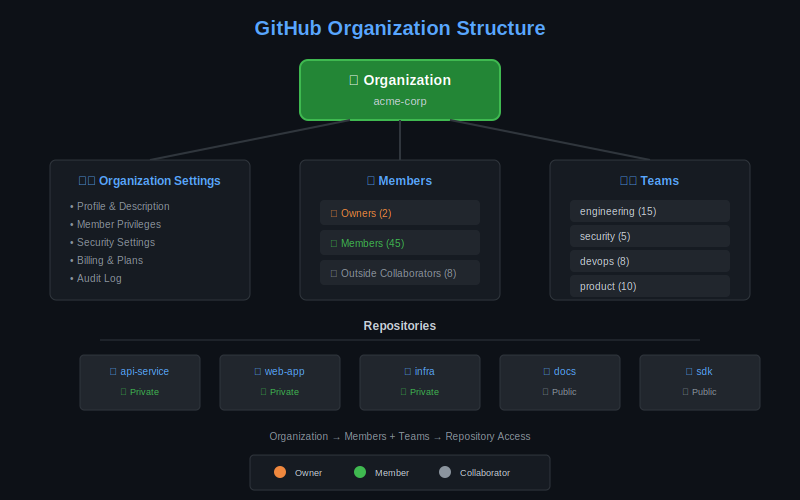

# Lección 01: Organizations

## 🎯 Objetivos de Aprendizaje

Al finalizar esta lección, serás capaz de:

- Crear y configurar GitHub Organizations
- Gestionar settings organizacionales
- Administrar members y roles
- Implementar default permissions

---

## 📚 Conceptos Teóricos

### ¿Qué es una Organization?

Una **Organization** en GitHub es una cuenta compartida que permite:

- Centralizar repositories de un equipo/empresa
- Gestionar accesos de forma granular
- Aplicar políticas de seguridad uniformes
- Facilitar colaboración entre equipos



### Organization vs User Account

| Aspecto | User Account | Organization |
|---------|--------------|--------------|
| **Propósito** | Individual | Equipos/Empresas |
| **Repositories** | Personales | Compartidos |
| **Billing** | Individual | Centralizado |
| **Teams** | No disponible | ✅ Soportado |
| **Permissions** | Collaborators | Granular por team |
| **SSO** | No | ✅ Enterprise |

---

## 🏗️ Crear una Organization

### Via GitHub UI

```yaml
Pasos:
  1. Click en avatar (esquina superior derecha)
  2. Settings → Organizations
  3. "New organization"
  4. Seleccionar plan:
     - Free: Unlimited public/private repos
     - Team: Advanced features ($4/user/month)
     - Enterprise: Full features + support
  5. Configurar nombre y email
  6. Invitar miembros iniciales
```

### Via GitHub CLI

```bash
# No hay comando directo para crear org
# Pero puedes gestionar orgs existentes:

# Listar organizations donde eres miembro
gh api user/orgs --jq '.[].login'

# Ver detalles de una org
gh api orgs/NOMBRE-ORG

# Ver miembros
gh api orgs/NOMBRE-ORG/members --jq '.[].login'
```

---

## ⚙️ Organization Settings

### Profile Settings

```yaml
Organization Profile:
  Name: "Acme Corporation"
  Description: "Building awesome products"
  URL: "https://acme.io"
  Location: "San Francisco, CA"
  Email: "engineering@acme.io"
  Twitter: "@acme_eng"
  
  Avatar: [logo de la empresa]
  
  Verified Domains:
    - acme.io ✅
    - acme.com ✅
```

### Member Privileges

```yaml
# Settings → Member privileges

Base Permissions:
  # Permiso default para TODOS los miembros en TODOS los repos
  Options:
    - No permission    # Recomendado para empresas grandes
    - Read             # Más común
    - Write            # Solo para equipos pequeños
    - Admin            # ⚠️ Nunca usar como default

Repository Creation:
  Allow members to create repositories: 
    - All (public & private)
    - Private only        # Recomendado
    - Disabled            # Más restrictivo

Repository Forking:
  Allow forking of private repos: false  # Recomendado

Repository Visibility Change:
  Allow members to change visibility: false

Repository Deletion:
  Allow members to delete repos: false  # Recomendado

Issue Deletion:
  Allow members to delete issues: false
```

### Security Settings

```yaml
# Settings → Security

Two-Factor Authentication:
  Require 2FA for all members: true  # ✅ CRÍTICO
  
  # Consecuencia: miembros sin 2FA serán removidos

Authentication Security:
  # Solo Enterprise Cloud
  SAML Single Sign-On: Configured
  SCIM Provisioning: Enabled

IP Allow List:
  # Solo Enterprise
  Enable IP allow list: true
  Allowed IPs:
    - 192.168.1.0/24  # Office
    - 10.0.0.0/8      # VPN
```

---

## 👥 Member Management

### Roles en Organization

```yaml
Owner:
  - Control total de la org
  - Billing y settings
  - Puede eliminar org
  - Agregar/remover owners
  - Límite recomendado: 2-3 personas

Member:
  - Acceso a teams asignados
  - Permisos según team membership
  - No puede ver billing
  - No puede cambiar org settings

Billing Manager:
  - Solo acceso a billing
  - No acceso a repos ni teams
  - Para departamento de finanzas

Outside Collaborator:
  - No es miembro de org
  - Acceso a repos específicos
  - Sin acceso a teams
  - Para contractors externos
```

### Invitar Members

```bash
# Via UI: Settings → People → Invite member

# Via API
gh api \
  --method POST \
  -H "Accept: application/vnd.github+json" \
  /orgs/NOMBRE-ORG/invitations \
  -f email='nuevo@usuario.com' \
  -f role='direct_member'

# Roles disponibles:
# - admin (owner)
# - direct_member (member)
# - billing_manager
```

### Gestionar Members

```bash
# Listar todos los miembros
gh api orgs/NOMBRE-ORG/members --jq '.[].login'

# Listar owners
gh api orgs/NOMBRE-ORG/members?role=admin --jq '.[].login'

# Ver estado de 2FA (requiere owner)
gh api orgs/NOMBRE-ORG/members?filter=2fa_disabled

# Remover miembro
gh api \
  --method DELETE \
  /orgs/NOMBRE-ORG/members/USERNAME
```

---

## 🔐 Organization Security

### Two-Factor Authentication

```yaml
Por qué es crítico:
  - Previene acceso no autorizado
  - Requerido para compliance (SOC 2, etc.)
  - Protege secrets y código

Enforcement:
  Settings → Security → Require 2FA
  
  Consecuencias de habilitar:
    - Miembros sin 2FA tienen 1 mes para activar
    - Después serán removidos automáticamente
    - Outside collaborators también aplica
```

### Audit Log

```yaml
# Settings → Audit log

Eventos registrados:
  - Member added/removed
  - Repository created/deleted
  - Team changes
  - Permission changes
  - Authentication events
  - Billing changes

Búsqueda:
  # Por actor
  actor:USERNAME
  
  # Por acción
  action:repo.create
  action:org.add_member
  
  # Por fecha
  created:>2024-01-01
  
  # Combinado
  actor:admin action:repo.delete created:>2024-12-01
```

### Verified Domains

```yaml
Propósito:
  - Confirmar propiedad de dominios
  - Badge "Verified" en profile
  - Restringir notificaciones a emails verificados

Proceso:
  1. Settings → Verified & approved domains
  2. Add domain: acme.io
  3. Agregar TXT record en DNS:
     _github-challenge-ORGNAME.acme.io
     TXT: "VERIFICATION_CODE"
  4. Verify en GitHub
```

---

## 📦 Organization Repositories

### Default Repository Settings

```yaml
# Settings → Repository defaults

Repository labels:
  # Labels aplicadas a todos los nuevos repos
  - bug
  - enhancement
  - documentation
  - help wanted

Branch protection:
  # Rules aplicadas automáticamente
  Default branch: main
  
Repository topics:
  # Topics sugeridos
  - internal
  - production
```

### Repository Visibility

```yaml
Tipos:
  Public:
    - Visible para todos
    - Open source projects
    - Documentación pública
  
  Private:
    - Solo miembros de org
    - Código propietario
    - Proyectos internos
  
  Internal: # Solo Enterprise
    - Visible para todos en enterprise
    - Compartir entre orgs
    - Inner source
```

---

## 💰 Billing & Plans

### GitHub Plans

```yaml
Free:
  - Unlimited public repos
  - Unlimited private repos
  - 2,000 Actions minutes/month
  - 500 MB Packages storage
  - Community support

Team ($4/user/month):
  - Todo de Free +
  - Protected branches
  - Code owners
  - Required reviewers
  - 3,000 Actions minutes/month
  - 2 GB Packages storage

Enterprise ($21/user/month):
  - Todo de Team +
  - SAML SSO
  - SCIM provisioning
  - GitHub Connect
  - Advanced audit log
  - 50,000 Actions minutes/month
  - 50 GB Packages storage
```

### Billing Management

```yaml
# Settings → Billing

Manage:
  - View current plan
  - Upgrade/downgrade
  - Add/remove seats
  - Payment methods
  - Invoices & receipts
  - Usage reports

Spending Limits:
  Actions:
    - Set monthly limit
    - Alerts before limit
  
  Packages:
    - Storage limit
    - Bandwidth limit
```

---

## ✅ Best Practices

### Organization Setup Checklist

```markdown
## New Organization Checklist

### Basics
- [ ] Nombre descriptivo y profesional
- [ ] Description clara
- [ ] URL y email de contacto
- [ ] Avatar/logo corporativo

### Security
- [ ] 2FA required para todos
- [ ] Verified domains configurados
- [ ] Base permissions = Read o None
- [ ] Repository deletion = Members cannot

### Access
- [ ] Owners limitados (2-3)
- [ ] Teams estructurados
- [ ] Outside collaborators policy

### Compliance
- [ ] Audit log monitoring
- [ ] IP allow list (si enterprise)
- [ ] SSO configurado (si enterprise)
```

### Naming Conventions

```yaml
Organization Names:
  Formato: company-name o companyname
  Ejemplos:
    ✅ acme-corp
    ✅ acmecorp
    ❌ ACME_Corp (evitar mayúsculas/guiones bajos)

Repository Names:
  Formato: lowercase-with-dashes
  Ejemplos:
    ✅ api-service
    ✅ web-frontend
    ❌ ApiService (evitar camelCase)
```

---

## 🔗 Recursos Adicionales

- [Creating an Organization](https://docs.github.com/en/organizations/collaborating-with-groups-in-organizations/creating-a-new-organization-from-scratch)
- [Organization Settings](https://docs.github.com/en/organizations/managing-organization-settings)
- [Managing Membership](https://docs.github.com/en/organizations/managing-membership-in-your-organization)
- [Audit Log Events](https://docs.github.com/en/organizations/keeping-your-organization-secure/managing-security-settings-for-your-organization/audit-log-events-for-your-organization)

---

## 📝 Resumen

| Concepto | Descripción |
|----------|-------------|
| **Organization** | Cuenta compartida para equipos |
| **Owners** | Control total (limitar a 2-3) |
| **Members** | Acceso según teams |
| **2FA** | SIEMPRE requerir |
| **Base Permissions** | Read o None recomendado |

---

**Siguiente**: [Lección 02 - Teams & Permissions](02-teams-permissions.md)
