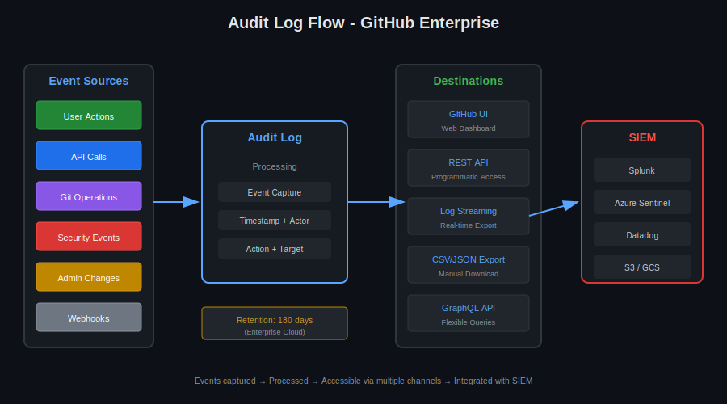

# Lección 01: Audit Log & Compliance

## 🎯 Objetivos de Aprendizaje

Al finalizar esta lección, serás capaz de:

- Entender la estructura del Audit Log de GitHub
- Ejecutar queries para análisis de seguridad
- Configurar streaming a sistemas SIEM
- Generar reportes de compliance

---

## 📚 Conceptos Teóricos

### ¿Qué es el Audit Log?

```yaml
Definición:
  - Registro cronológico de todas las acciones administrativas
  - Incluye quién, qué, cuándo, dónde
  - Inmutable (no se puede modificar ni eliminar)
  - Crítico para compliance y forensics

Cobertura:
  - Acciones de usuarios
  - Cambios de configuración
  - Eventos de seguridad
  - Accesos a recursos
  - Cambios de permisos
```



---

## 📋 Estructura de Eventos

### Anatomía de un Evento

```json
{
  "@timestamp": 1703808000000,
  "action": "repo.create",
  "actor": "admin-user",
  "actor_id": 12345,
  "actor_location": {
    "country_code": "US"
  },
  "org": "acme-corp",
  "org_id": 67890,
  "repo": "acme-corp/new-project",
  "created_at": 1703808000000,
  "operation_type": "create",
  "user_agent": "GitHub CLI 2.40.0"
}
```

### Campos Principales

| Campo | Descripción | Ejemplo |
|-------|-------------|---------|
| `action` | Tipo de evento | `repo.create`, `team.add_member` |
| `actor` | Usuario que realizó la acción | `admin-user` |
| `org` | Organización afectada | `acme-corp` |
| `repo` | Repositorio (si aplica) | `acme-corp/webapp` |
| `created_at` | Timestamp Unix | `1703808000000` |
| `actor_location` | Ubicación geográfica | `{"country_code": "US"}` |

---

## 🔍 Categorías de Eventos

### Eventos de Organización

```yaml
org.add_member:           # Nuevo miembro agregado
org.remove_member:        # Miembro removido
org.update_member:        # Rol de miembro actualizado
org.invite_member:        # Invitación enviada
org.cancel_invitation:    # Invitación cancelada

org.update_default_repository_permission:  # Permisos base cambiados
org.enable_two_factor_requirement:         # 2FA habilitado
org.disable_two_factor_requirement:        # 2FA deshabilitado
```

### Eventos de Repositorio

```yaml
repo.create:              # Repo creado
repo.destroy:             # Repo eliminado
repo.rename:              # Repo renombrado
repo.transfer:            # Repo transferido
repo.archived:            # Repo archivado
repo.unarchived:          # Repo desarchivado

repo.access:              # Acceso a repo privado
repo.add_member:          # Colaborador agregado
repo.remove_member:       # Colaborador removido
```

### Eventos de Equipos

```yaml
team.create:              # Team creado
team.destroy:             # Team eliminado
team.add_member:          # Miembro agregado a team
team.remove_member:       # Miembro removido de team
team.add_repository:      # Repo asignado a team
team.remove_repository:   # Repo removido de team
team.change_parent_team:  # Team padre cambiado
```

### Eventos de Seguridad

```yaml
protected_branch.create:              # Branch protection creada
protected_branch.destroy:             # Branch protection eliminada
protected_branch.policy_override:     # Bypass de protección

secret_scanning_alert.create:         # Secret detectado
secret_scanning_alert.resolve:        # Secret resuelto

dependabot_alerts.enable:             # Dependabot habilitado
dependabot_alerts.disable:            # Dependabot deshabilitado
```

---

## 🔎 Queries del Audit Log

### Via Web UI

```yaml
# Organization → Settings → Logs → Audit log

Filtros disponibles:
  action:repo.create          # Por tipo de acción
  actor:username              # Por usuario
  created:>2024-01-01         # Después de fecha
  created:<2024-12-31         # Antes de fecha
  repo:org/repo-name          # Por repositorio
  country:US                  # Por país

Operadores:
  AND                         # Combinar condiciones
  OR                          # Alternativas
  -                           # Excluir (ej: -actor:bot)
```

### Ejemplos de Queries

```bash
# Eventos de seguridad últimos 7 días
action:protected_branch created:>=2024-01-01

# Cambios de membresía por un admin
actor:admin-user action:org

# Repos eliminados
action:repo.destroy

# Bypasses de branch protection
action:protected_branch.policy_override

# Accesos desde país específico
country:CN

# Excluir bots
action:repo -actor:dependabot -actor:github-actions
```

---

## 🔌 API de Audit Log

### REST API

```bash
# ¿QUÉ VAMOS A HACER?: Consultar audit log via API
# ¿POR QUÉ?: Automatizar análisis y alertas
# ¿PARA QUÉ SIRVE?: Integración con sistemas externos

# Consulta básica (Enterprise Cloud)
gh api \
  "orgs/NOMBRE-ORG/audit-log" \
  --paginate \
  --jq '.[] | "\(.created_at) | \(.action) | \(.actor)"'

# Con filtros
gh api \
  "orgs/NOMBRE-ORG/audit-log?phrase=action:repo.create" \
  --jq '.[] | {action, actor, repo, created_at}'

# Últimas 24 horas
gh api \
  "orgs/NOMBRE-ORG/audit-log?phrase=created:>=$(date -d '24 hours ago' +%Y-%m-%d)" \
  --paginate
```

### GraphQL API

```graphql
# Query de audit log via GraphQL
query AuditLog($org: String!, $first: Int!) {
  organization(login: $org) {
    auditLog(first: $first) {
      nodes {
        ... on AuditEntry {
          action
          actorLogin
          createdAt
          operationType
        }
        ... on RepositoryAuditEntryData {
          repository {
            name
          }
        }
      }
      pageInfo {
        hasNextPage
        endCursor
      }
    }
  }
}
```

```bash
# Ejecutar query GraphQL
gh api graphql -f query='
  query {
    organization(login: "NOMBRE-ORG") {
      auditLog(first: 100) {
        nodes {
          ... on AuditEntry {
            action
            actorLogin
            createdAt
          }
        }
      }
    }
  }
'
```

---

## 📤 Exportación de Audit Log

### Exportación Manual

```yaml
# Via UI: Audit log → Export

Formatos disponibles:
  - JSON: Para procesamiento programático
  - CSV: Para análisis en spreadsheets

Contenido exportado:
  - Todos los eventos visibles con filtros actuales
  - Máximo eventos según plan
  - Incluye todos los campos disponibles
```

### Exportación Automatizada

```bash
#!/bin/bash
# Script de exportación diaria

ORG="nombre-org"
DATE=$(date +%Y-%m-%d)
OUTPUT_DIR="/backup/audit-logs"

# Exportar eventos del día anterior
YESTERDAY=$(date -d 'yesterday' +%Y-%m-%d)

gh api \
  "orgs/${ORG}/audit-log?phrase=created:${YESTERDAY}" \
  --paginate \
  > "${OUTPUT_DIR}/audit-log-${DATE}.json"

# Comprimir
gzip "${OUTPUT_DIR}/audit-log-${DATE}.json"

echo "Exported audit log for ${YESTERDAY}"
```

---

## 🔄 Log Streaming

### ¿Qué es Log Streaming?

```yaml
Definición:
  - Envío en tiempo real de audit events
  - A sistemas externos (SIEM, storage)
  - Configuración enterprise

Beneficios:
  - Retención ilimitada (vs 180 días en GitHub)
  - Correlación con otros logs
  - Alertas en tiempo real
  - Compliance requirements
```

### Destinos Soportados

```yaml
Amazon S3:
  - Formato: JSON lines
  - Configuración: Bucket + credentials
  
Azure Blob Storage:
  - Formato: JSON lines
  - Configuración: Container + SAS token

Azure Event Hubs:
  - Streaming real-time
  - Para Azure Sentinel

Google Cloud Storage:
  - Formato: JSON lines
  - Configuración: Bucket + service account

Splunk:
  - HTTP Event Collector (HEC)
  - Indexación automática

Datadog:
  - API key configuration
  - Dashboard predefinido
```

### Configuración de Streaming

```yaml
# Enterprise → Settings → Audit log → Log streaming

Configuración S3:
  Bucket: my-audit-logs-bucket
  Region: us-east-1
  Access Key ID: AKIA...
  Secret Access Key: [encrypted]
  
  # IAM Policy requerida:
  {
    "Version": "2012-10-17",
    "Statement": [{
      "Effect": "Allow",
      "Action": ["s3:PutObject"],
      "Resource": "arn:aws:s3:::my-audit-logs-bucket/*"
    }]
  }
```

---

## 📊 Compliance & Reporting

### SOC 2 Requirements

```yaml
Control: CC6.1 - Logical Access Controls
Evidence needed:
  - User access logs
  - Permission changes
  - Authentication events

Query:
  action:org.add_member OR action:org.remove_member OR
  action:team.add_member OR action:repo.add_member
```

### GDPR Requirements

```yaml
Data Subject Requests:
  - Identificar todos los datos de un usuario
  - Audit de accesos a datos personales

Query para usuario específico:
  actor:username OR user:username
```

### Reporte de Seguridad Mensual

```bash
#!/bin/bash
# Generar reporte de seguridad mensual

ORG="nombre-org"
MONTH=$(date -d 'last month' +%Y-%m)

echo "=== Security Report ${MONTH} ==="

echo -e "\n## Failed Logins / Suspicious Activity"
gh api "orgs/${ORG}/audit-log?phrase=action:account created:${MONTH}" \
  --jq 'length'

echo -e "\n## Branch Protection Changes"
gh api "orgs/${ORG}/audit-log?phrase=action:protected_branch created:${MONTH}" \
  --jq '.[] | "\(.created_at): \(.actor) - \(.action)"'

echo -e "\n## New Members Added"
gh api "orgs/${ORG}/audit-log?phrase=action:org.add_member created:${MONTH}" \
  --jq '.[] | "\(.created_at): \(.actor) added \(.user)"'

echo -e "\n## Repos Deleted"
gh api "orgs/${ORG}/audit-log?phrase=action:repo.destroy created:${MONTH}" \
  --jq '.[] | "\(.created_at): \(.actor) deleted \(.repo)"'
```

---

## 🚨 Alertas de Seguridad

### Eventos Críticos a Monitorear

```yaml
High Priority:
  - protected_branch.policy_override  # Bypass de protección
  - org.disable_two_factor_requirement  # 2FA deshabilitado
  - repo.destroy  # Repo eliminado
  - secret_scanning_alert.create  # Secret expuesto

Medium Priority:
  - org.remove_member  # Miembro removido
  - team.destroy  # Team eliminado
  - repo.transfer  # Repo transferido
  - protected_branch.destroy  # Protección removida

Monitor:
  - org.add_member  # Nuevos miembros
  - repo.create  # Nuevos repos
  - actor_location changes  # Accesos desde nuevas ubicaciones
```

### Script de Alertas

```bash
#!/bin/bash
# Verificar eventos críticos

ORG="nombre-org"
CRITICAL_ACTIONS=(
  "protected_branch.policy_override"
  "org.disable_two_factor_requirement"
  "repo.destroy"
)

for action in "${CRITICAL_ACTIONS[@]}"; do
  EVENTS=$(gh api \
    "orgs/${ORG}/audit-log?phrase=action:${action} created:>=today" \
    --jq 'length')
  
  if [ "$EVENTS" -gt 0 ]; then
    echo "⚠️ ALERT: ${EVENTS} ${action} events detected!"
    # Enviar notificación (Slack, email, etc.)
  fi
done
```

---

## 🔗 Recursos Adicionales

- [Audit Log Documentation](https://docs.github.com/en/organizations/keeping-your-organization-secure/managing-security-settings-for-your-organization/reviewing-the-audit-log-for-your-organization)
- [Audit Log Events](https://docs.github.com/en/organizations/keeping-your-organization-secure/managing-security-settings-for-your-organization/audit-log-events-for-your-organization)
- [Log Streaming](https://docs.github.com/en/enterprise-cloud@latest/admin/monitoring-activity-in-your-enterprise/reviewing-audit-logs-for-your-enterprise/streaming-the-audit-log-for-your-enterprise)

---

## 📝 Resumen

| Concepto | Descripción |
|----------|-------------|
| **Audit Log** | Registro inmutable de todas las acciones |
| **Retention** | 180 días (Enterprise Cloud) |
| **Streaming** | Export real-time a SIEM/storage |
| **Compliance** | SOC 2, GDPR, ISO 27001 |
| **Alertas** | Monitorear eventos críticos |

---

**Siguiente**: [Lección 02 - GitHub API & GraphQL](02-api-graphql.md)
