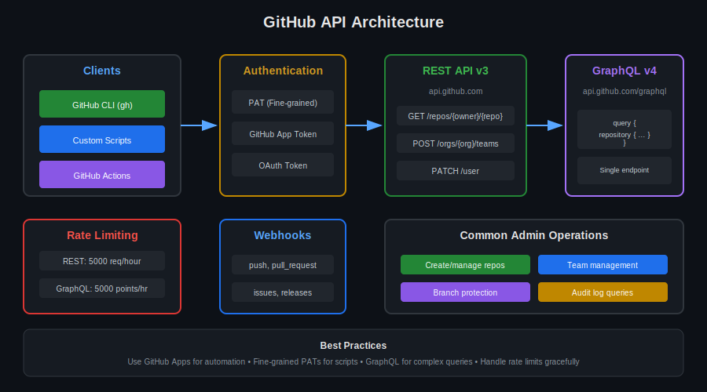

# Lección 02: GitHub API & GraphQL

## 🎯 Objetivos de Aprendizaje

Al finalizar esta lección, serás capaz de:

- Usar la REST API de GitHub para automatización
- Ejecutar queries GraphQL para datos complejos
- Implementar autenticación correcta para APIs
- Manejar rate limiting y paginación

---

## 📚 Conceptos Teóricos

### APIs de GitHub

```yaml
REST API v3:
  - Endpoints predefinidos
  - Recursos como URLs
  - Respuestas JSON
  - Fácil de usar
  
GraphQL API v4:
  - Un solo endpoint
  - Queries flexibles
  - Pide solo lo que necesitas
  - Menos requests
```



---

## 🔐 Autenticación

### Tipos de Tokens

```yaml
Personal Access Token (Classic):
  Uso: Scripts personales, testing
  Scopes: Amplios (repo, admin:org, etc.)
  Límite: 5000 req/hora

Fine-grained PAT:
  Uso: Producción, específico
  Scopes: Por repositorio
  Límite: 5000 req/hora
  Recomendado: ✅

GitHub App Token:
  Uso: Integraciones, bots
  Scopes: Definidos en app
  Límite: 15000 req/hora (con installation)
  Recomendado para producción: ✅

OAuth Token:
  Uso: Aplicaciones web
  Scopes: Autorizados por usuario
  Límite: 5000 req/hora
```

### Crear Fine-grained PAT

```yaml
# Settings → Developer settings → Personal access tokens → Fine-grained tokens

Configuración:
  Token name: admin-automation-2024
  Expiration: 90 days
  
  Resource owner: mi-organizacion
  
  Repository access: All repositories
  # O seleccionar repos específicos
  
  Permissions:
    Repository:
      - Contents: Read and write
      - Metadata: Read
      - Pull requests: Read and write
    
    Organization:
      - Members: Read
      - Administration: Read
```

### Usar Token con gh CLI

```bash
# ¿QUÉ VAMOS A HACER?: Autenticarse con token
# ¿POR QUÉ?: Necesario para llamadas API
# ¿PARA QUÉ SIRVE?: Acceso programático a GitHub

# Opción 1: Variable de entorno
export GH_TOKEN="ghp_xxxxxxxxxxxx"

# Opción 2: Login interactivo
gh auth login

# Opción 3: En la llamada
gh api repos/owner/repo --header "Authorization: Bearer ghp_xxx"

# Verificar autenticación
gh auth status
```

---

## 🌐 REST API v3

### Estructura de Endpoints

```yaml
Base URL: https://api.github.com

Estructura: /{recurso}/{identificador}/{sub-recurso}

Ejemplos:
  GET /repos/owner/repo           # Info de repo
  GET /orgs/org-name/members      # Miembros de org
  POST /repos/owner/repo/issues   # Crear issue
  PATCH /user                     # Actualizar perfil
  DELETE /repos/owner/repo        # Eliminar repo
```

### Operaciones CRUD

```bash
# CREATE - Crear nuevo recurso
gh api --method POST repos/OWNER/REPO/issues \
  -f title="Bug report" \
  -f body="Description here"

# READ - Obtener recurso
gh api repos/OWNER/REPO

# UPDATE - Modificar recurso
gh api --method PATCH repos/OWNER/REPO \
  -f description="Updated description"

# DELETE - Eliminar recurso
gh api --method DELETE repos/OWNER/REPO
```

### Ejemplos Prácticos

```bash
# ¿QUÉ VAMOS A HACER?: Listar repos de una org
gh api orgs/NOMBRE-ORG/repos \
  --jq '.[] | "\(.name): \(.private)"'

# ¿QUÉ VAMOS A HACER?: Obtener miembros de un team
gh api orgs/NOMBRE-ORG/teams/TEAM-SLUG/members \
  --jq '.[].login'

# ¿QUÉ VAMOS A HACER?: Crear branch protection
gh api --method PUT \
  repos/OWNER/REPO/branches/main/protection \
  -f required_status_checks='{"strict":true,"contexts":["ci"]}' \
  -f enforce_admins=true \
  -f required_pull_request_reviews='{"required_approving_review_count":2}'

# ¿QUÉ VAMOS A HACER?: Agregar colaborador a repo
gh api --method PUT \
  repos/OWNER/REPO/collaborators/USERNAME \
  -f permission='push'
```

---

## 📊 GraphQL API v4

### ¿Por qué GraphQL?

```yaml
Ventajas:
  - Un solo request para datos relacionados
  - Pides exactamente lo que necesitas
  - Menos over-fetching
  - Introspección del schema

Cuándo usar:
  - Datos complejos y relacionados
  - Optimización de requests
  - Cuando necesitas nested data
```

### Estructura de Query

```graphql
# Query básica
query {
  viewer {
    login
    name
    email
  }
}

# Query con variables
query GetRepo($owner: String!, $name: String!) {
  repository(owner: $owner, name: $name) {
    name
    description
    stargazerCount
    forkCount
    issues(first: 5, states: OPEN) {
      totalCount
      nodes {
        title
        createdAt
      }
    }
  }
}
```

### Ejecutar GraphQL con gh CLI

```bash
# ¿QUÉ VAMOS A HACER?: Query básica de usuario
gh api graphql -f query='
  query {
    viewer {
      login
      name
      organizations(first: 10) {
        nodes {
          login
        }
      }
    }
  }
'

# ¿QUÉ VAMOS A HACER?: Query con variables
gh api graphql \
  -f query='
    query($owner: String!, $name: String!) {
      repository(owner: $owner, name: $name) {
        name
        defaultBranchRef {
          name
        }
        pullRequests(first: 5, states: OPEN) {
          nodes {
            title
            author { login }
          }
        }
      }
    }
  ' \
  -f owner='OWNER' \
  -f name='REPO'
```

### Mutations

```graphql
# Crear issue via GraphQL
mutation CreateIssue($repoId: ID!, $title: String!, $body: String) {
  createIssue(input: {
    repositoryId: $repoId
    title: $title
    body: $body
  }) {
    issue {
      number
      url
    }
  }
}
```

```bash
# Ejecutar mutation
gh api graphql -f query='
  mutation {
    createIssue(input: {
      repositoryId: "R_xxxxx"
      title: "New Issue"
      body: "Issue body"
    }) {
      issue {
        number
        url
      }
    }
  }
'
```

---

## 📄 Paginación

### REST API Pagination

```bash
# ¿QUÉ VAMOS A HACER?: Paginar resultados REST
# Por defecto: 30 items por página

# Especificar items por página (max 100)
gh api "orgs/NOMBRE-ORG/repos?per_page=100"

# Usar --paginate para obtener todo
gh api orgs/NOMBRE-ORG/repos --paginate \
  --jq '.[].name'

# Manual con headers Link
gh api orgs/NOMBRE-ORG/repos -i | grep "^Link:"
# Link: <https://api.github.com/...?page=2>; rel="next"
```

### GraphQL Pagination

```graphql
# Cursor-based pagination
query($cursor: String) {
  organization(login: "NOMBRE-ORG") {
    repositories(first: 100, after: $cursor) {
      pageInfo {
        hasNextPage
        endCursor
      }
      nodes {
        name
      }
    }
  }
}
```

```bash
# Script de paginación GraphQL
#!/bin/bash
CURSOR=""
while true; do
  RESULT=$(gh api graphql -f query='
    query($cursor: String) {
      organization(login: "NOMBRE-ORG") {
        repositories(first: 100, after: $cursor) {
          pageInfo { hasNextPage endCursor }
          nodes { name }
        }
      }
    }
  ' -f cursor="$CURSOR")
  
  echo "$RESULT" | jq '.data.organization.repositories.nodes[].name'
  
  HAS_NEXT=$(echo "$RESULT" | jq -r '.data.organization.repositories.pageInfo.hasNextPage')
  if [ "$HAS_NEXT" != "true" ]; then break; fi
  
  CURSOR=$(echo "$RESULT" | jq -r '.data.organization.repositories.pageInfo.endCursor')
done
```

---

## ⏱️ Rate Limiting

### Límites

```yaml
REST API:
  Authenticated: 5000 requests/hora
  Unauthenticated: 60 requests/hora
  Search API: 30 requests/minuto

GraphQL API:
  Points: 5000 puntos/hora
  Cálculo: Complejidad de query
  Max nodes: 500,000 por query

GitHub Apps:
  Installation: 15,000 requests/hora
  User-to-server: 5,000 requests/hora
```

### Verificar Rate Limit

```bash
# ¿QUÉ VAMOS A HACER?: Ver rate limit actual
gh api rate_limit --jq '{
  core: .resources.core,
  search: .resources.search,
  graphql: .resources.graphql
}'

# Output:
# {
#   "core": { "limit": 5000, "remaining": 4990, "reset": 1703808000 },
#   "search": { "limit": 30, "remaining": 30, "reset": 1703808000 },
#   "graphql": { "limit": 5000, "remaining": 4998, "reset": 1703808000 }
# }
```

### Manejar Rate Limits

```bash
#!/bin/bash
# Script con manejo de rate limit

call_api() {
  local response
  response=$(gh api "$1" 2>&1)
  
  if echo "$response" | grep -q "rate limit exceeded"; then
    echo "Rate limit hit, waiting..."
    sleep 60
    response=$(gh api "$1")
  fi
  
  echo "$response"
}

# Uso
call_api "repos/OWNER/REPO"
```

---

## 🤖 Scripts de Automatización

### Listar Todos los Repos sin Activity

```bash
#!/bin/bash
# Encontrar repos sin commits en 6 meses

ORG="nombre-org"
CUTOFF_DATE=$(date -d '6 months ago' +%Y-%m-%dT%H:%M:%SZ)

echo "Repos sin actividad desde ${CUTOFF_DATE}:"

gh api "orgs/${ORG}/repos" --paginate --jq '.[].full_name' | while read repo; do
  LAST_COMMIT=$(gh api "repos/${repo}/commits?per_page=1" --jq '.[0].commit.committer.date' 2>/dev/null)
  
  if [[ "$LAST_COMMIT" < "$CUTOFF_DATE" ]]; then
    echo "  - ${repo}: last commit ${LAST_COMMIT}"
  fi
done
```

### Bulk Update Branch Protection

```bash
#!/bin/bash
# Aplicar branch protection a todos los repos

ORG="nombre-org"
PROTECTION='{
  "required_status_checks": {"strict": true, "contexts": ["ci"]},
  "enforce_admins": true,
  "required_pull_request_reviews": {
    "required_approving_review_count": 1,
    "dismiss_stale_reviews": true
  },
  "restrictions": null
}'

gh api "orgs/${ORG}/repos" --paginate --jq '.[].name' | while read repo; do
  echo "Protecting ${ORG}/${repo}/main..."
  gh api --method PUT \
    "repos/${ORG}/${repo}/branches/main/protection" \
    --input - <<< "$PROTECTION" 2>/dev/null || echo "  Failed (may not have main branch)"
done
```

### Generar Reporte de Permisos

```bash
#!/bin/bash
# Reporte de permisos de repos

ORG="nombre-org"

echo "# Permission Report for ${ORG}"
echo ""

gh api "orgs/${ORG}/repos" --paginate --jq '.[].name' | while read repo; do
  echo "## ${repo}"
  
  echo "### Teams:"
  gh api "repos/${ORG}/${repo}/teams" --jq '.[] | "  - \(.name): \(.permission)"' 2>/dev/null
  
  echo "### Collaborators:"
  gh api "repos/${ORG}/${repo}/collaborators" --jq '.[] | "  - \(.login): \(.permissions | to_entries | map(select(.value==true)) | .[0].key)"' 2>/dev/null
  
  echo ""
done
```

---

## 🔗 Webhooks

### Configurar Webhook

```bash
# ¿QUÉ VAMOS A HACER?: Crear webhook para repo
gh api --method POST repos/OWNER/REPO/hooks \
  -f name='web' \
  -f active=true \
  -f events='["push","pull_request"]' \
  -f config='{"url":"https://example.com/webhook","content_type":"json","secret":"webhook-secret"}'

# Para organización
gh api --method POST orgs/NOMBRE-ORG/hooks \
  -f name='web' \
  -f active=true \
  -f events='["repository","member"]' \
  -f config='{"url":"https://example.com/org-webhook","content_type":"json"}'
```

### Eventos Comunes

```yaml
Repository events:
  - push              # Commits pushed
  - pull_request      # PR opened/closed/merged
  - issues            # Issue created/updated
  - release           # Release published

Organization events:
  - repository        # Repo created/deleted
  - member            # Member added/removed
  - team              # Team changes

Security events:
  - secret_scanning_alert
  - code_scanning_alert
  - dependabot_alert
```

---

## 🔗 Recursos Adicionales

- [REST API Reference](https://docs.github.com/en/rest)
- [GraphQL API Reference](https://docs.github.com/en/graphql)
- [GraphQL Explorer](https://docs.github.com/en/graphql/overview/explorer)
- [Webhooks Documentation](https://docs.github.com/en/webhooks)

---

## 📝 Resumen

| Concepto | REST API | GraphQL |
|----------|----------|---------|
| **Endpoint** | Múltiples | Único |
| **Datos** | Fijos por endpoint | Flexibles |
| **Rate Limit** | 5000 req/hr | 5000 points/hr |
| **Uso ideal** | CRUD simple | Datos complejos |
| **Paginación** | page/per_page | Cursor-based |

---

**Siguiente**: [Lección 03 - Migration Tools](03-migration.md)
