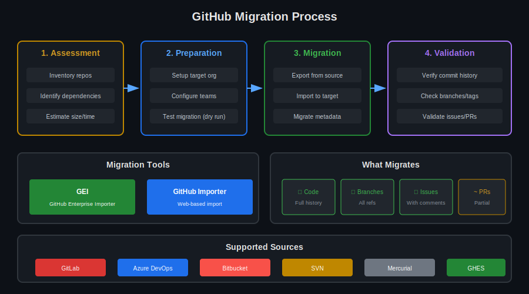

# Lección 03: Migration Tools

## 🎯 Objetivos de Aprendizaje

Al finalizar esta lección, serás capaz de:

- Planificar migraciones a GitHub
- Usar GitHub Enterprise Importer (GEI)
- Migrar desde diferentes plataformas
- Validar migraciones exitosas

---

## 📚 Conceptos Teóricos

### ¿Cuándo Migrar?

```yaml
Escenarios comunes:
  - Consolidación de plataformas
  - Migración a GitHub Enterprise
  - Cambio de proveedor (GitLab → GitHub)
  - Reorganización de empresas
  - Compliance requirements

Consideraciones:
  - Tamaño total de repos
  - Historia de commits
  - Issues, PRs, wikis
  - CI/CD pipelines
  - Integraciones existentes
```



---

## 📦 Herramientas de Migración

### Comparativa

| Herramienta | Origen | Qué migra | Complejidad |
|-------------|--------|-----------|-------------|
| GitHub Importer | Git URL | Código, branches, tags | Baja |
| GEI | GitHub, ADO, GitLab | Todo + metadata | Media |
| ghe-migrator | GHES | Enterprise completo | Alta |
| git clone --mirror | Cualquier Git | Solo código | Baja |

### GitHub Importer (Web)

```yaml
# github.com/new/import

Soporta:
  - Git (cualquier URL)
  - SVN
  - Mercurial
  - TFS

Migra:
  ✅ Código fuente
  ✅ Branches
  ✅ Tags
  ✅ Commit history
  ❌ Issues
  ❌ Pull requests
  ❌ Wikis

Uso:
  1. Ir a github.com/new/import
  2. Pegar URL del repo origen
  3. Seleccionar owner y nombre
  4. Esperar importación
```

---

## 🔄 GitHub Enterprise Importer (GEI)

### Instalación

```bash
# ¿QUÉ VAMOS A HACER?: Instalar GEI CLI extension
# ¿POR QUÉ?: Herramienta oficial para migraciones enterprise
# ¿PARA QUÉ SIRVE?: Migración completa con metadata

# Instalar extension
gh extension install github/gh-gei

# Verificar instalación
gh gei --version
```

### Migración desde GitHub

```bash
# ¿QUÉ VAMOS A HACER?: Migrar repo entre orgs de GitHub

# Paso 1: Autenticarse en ambos (origen y destino)
export GH_SOURCE_PAT="ghp_source_token"
export GH_TARGET_PAT="ghp_target_token"

# Paso 2: Generar script de migración
gh gei generate-script \
  --github-source-org SOURCE_ORG \
  --github-target-org TARGET_ORG \
  --output migrate.ps1

# Paso 3: Ejecutar migración
gh gei migrate-repo \
  --github-source-org SOURCE_ORG \
  --source-repo REPO_NAME \
  --github-target-org TARGET_ORG \
  --target-repo REPO_NAME \
  --github-source-pat $GH_SOURCE_PAT \
  --github-target-pat $GH_TARGET_PAT
```

### Lo que GEI Migra

```yaml
Código:
  ✅ Commits completos
  ✅ Branches
  ✅ Tags
  ✅ Releases (con assets)

Metadata:
  ✅ Issues (con comentarios)
  ✅ Pull requests (estado, reviews)
  ✅ Labels
  ✅ Milestones
  ✅ Projects (classic)
  ✅ Wikis

Configuración:
  ✅ Branch protection rules
  ✅ Repository settings
  ⚠️ Secrets (manual)
  ⚠️ Actions workflows (necesitan ajuste)
  ⚠️ Webhooks (manual)

Usuarios:
  - Mantiene atribución
  - Requiere mannequin mapping
```

---

## 🔀 Migración desde Azure DevOps

### Preparación

```bash
# ¿QUÉ VAMOS A HACER?: Migrar desde Azure DevOps
# ¿POR QUÉ?: Consolidar en GitHub
# ¿PARA QUÉ SIRVE?: Transición a GitHub Enterprise

# Configurar tokens
export ADO_PAT="azure_devops_pat"
export GH_PAT="github_pat"

# Listar repos disponibles
gh gei inventory-report \
  --ado-source-org ADO_ORG \
  --ado-pat $ADO_PAT
```

### Ejecutar Migración

```bash
# Migrar repo individual
gh gei migrate-repo \
  --ado-source-org ADO_ORG \
  --ado-team-project PROJECT_NAME \
  --source-repo REPO_NAME \
  --github-target-org GITHUB_ORG \
  --target-repo REPO_NAME \
  --ado-pat $ADO_PAT \
  --github-target-pat $GH_PAT

# Migrar con queue (para múltiples repos)
gh gei migrate-repo \
  --ado-source-org ADO_ORG \
  --ado-team-project PROJECT_NAME \
  --source-repo REPO_NAME \
  --github-target-org GITHUB_ORG \
  --queue-only

# Verificar estado
gh gei wait-for-migration --migration-id MIGRATION_ID
```

---

## 🦊 Migración desde GitLab

### Usando GEI

```bash
# Configurar tokens
export GITLAB_TOKEN="glpat-xxxxx"
export GH_PAT="ghp_xxxxx"

# Migrar repo
gh gei migrate-repo \
  --gitlab-source-org GITLAB_GROUP \
  --source-repo REPO_NAME \
  --github-target-org GITHUB_ORG \
  --target-repo REPO_NAME \
  --gitlab-pat $GITLAB_TOKEN \
  --github-target-pat $GH_PAT
```

### Migración Manual (Sin GEI)

```bash
# ¿QUÉ VAMOS A HACER?: Migrar manualmente desde GitLab
# Método alternativo para casos especiales

# Paso 1: Clonar mirror desde GitLab
git clone --mirror https://gitlab.com/group/repo.git

# Paso 2: Crear repo vacío en GitHub
gh repo create GITHUB_ORG/REPO_NAME --private

# Paso 3: Push mirror a GitHub
cd repo.git
git remote add github https://github.com/GITHUB_ORG/REPO_NAME.git
git push github --mirror

# Paso 4: Migrar issues (script personalizado)
# Ver sección de scripts abajo
```

---

## 📋 Planificación de Migración

### Checklist Pre-Migración

```markdown
## Pre-Migration Checklist

### Assessment
- [ ] Inventario completo de repos
- [ ] Tamaño total (GB)
- [ ] Número de commits/branches
- [ ] Issues y PRs abiertos
- [ ] Integraciones activas

### Preparation
- [ ] Crear org destino en GitHub
- [ ] Configurar teams
- [ ] Preparar tokens con permisos
- [ ] Comunicar a equipos
- [ ] Definir ventana de migración

### Testing
- [ ] Dry run en repos de prueba
- [ ] Validar que todo migra
- [ ] Documentar problemas encontrados

### Execution
- [ ] Freeze en repo origen
- [ ] Ejecutar migración
- [ ] Validar destino
- [ ] Actualizar CI/CD
- [ ] Actualizar integraciones

### Post-Migration
- [ ] Verificar accesos
- [ ] Testear workflows
- [ ] Comunicar nuevo repo
- [ ] Archivar repo origen
```

### Inventory Script

```bash
#!/bin/bash
# Generar inventario de repos para migración

ORG="nombre-org"

echo "# Migration Inventory for ${ORG}"
echo ""
echo "| Repo | Size (KB) | Branches | Issues | PRs |"
echo "|------|-----------|----------|--------|-----|"

gh api "orgs/${ORG}/repos" --paginate --jq '.[].name' | while read repo; do
  SIZE=$(gh api "repos/${ORG}/${repo}" --jq '.size')
  BRANCHES=$(gh api "repos/${ORG}/${repo}/branches" --jq 'length')
  ISSUES=$(gh api "repos/${ORG}/${repo}/issues?state=all" --jq 'length')
  PRS=$(gh api "repos/${ORG}/${repo}/pulls?state=all" --jq 'length')
  
  echo "| ${repo} | ${SIZE} | ${BRANCHES} | ${ISSUES} | ${PRS} |"
done
```

---

## ✅ Validación Post-Migración

### Script de Validación

```bash
#!/bin/bash
# Validar migración completa

SOURCE_ORG="origen"
TARGET_ORG="destino"
REPO="nombre-repo"

echo "=== Validating Migration ==="

# Comparar commits
echo -e "\n## Commits"
SOURCE_COMMITS=$(gh api "repos/${SOURCE_ORG}/${REPO}/commits" --paginate --jq 'length')
TARGET_COMMITS=$(gh api "repos/${TARGET_ORG}/${REPO}/commits" --paginate --jq 'length')
echo "Source: ${SOURCE_COMMITS} | Target: ${TARGET_COMMITS}"
[ "$SOURCE_COMMITS" -eq "$TARGET_COMMITS" ] && echo "✅ Match" || echo "❌ Mismatch"

# Comparar branches
echo -e "\n## Branches"
SOURCE_BRANCHES=$(gh api "repos/${SOURCE_ORG}/${REPO}/branches" --jq '.[].name' | sort)
TARGET_BRANCHES=$(gh api "repos/${TARGET_ORG}/${REPO}/branches" --jq '.[].name' | sort)
diff <(echo "$SOURCE_BRANCHES") <(echo "$TARGET_BRANCHES") && echo "✅ Match" || echo "❌ Mismatch"

# Comparar tags
echo -e "\n## Tags"
SOURCE_TAGS=$(gh api "repos/${SOURCE_ORG}/${REPO}/tags" --jq 'length')
TARGET_TAGS=$(gh api "repos/${TARGET_ORG}/${REPO}/tags" --jq 'length')
echo "Source: ${SOURCE_TAGS} | Target: ${TARGET_TAGS}"
[ "$SOURCE_TAGS" -eq "$TARGET_TAGS" ] && echo "✅ Match" || echo "❌ Mismatch"

# Comparar issues
echo -e "\n## Issues"
SOURCE_ISSUES=$(gh api "repos/${SOURCE_ORG}/${REPO}/issues?state=all" --jq 'length')
TARGET_ISSUES=$(gh api "repos/${TARGET_ORG}/${REPO}/issues?state=all" --jq 'length')
echo "Source: ${SOURCE_ISSUES} | Target: ${TARGET_ISSUES}"
```

### Validación de Git

```bash
# Validar integridad de commits
cd target-repo
git fsck --full

# Verificar que HEAD apunta correctamente
git rev-parse HEAD

# Comparar hash del último commit
# En origen y destino debe ser igual
git log -1 --format="%H"
```

---

## 🗺️ Mannequin Mapping

### ¿Qué son Mannequins?

```yaml
Problema:
  - Usuarios de origen no existen en destino
  - Commits aparecen como "mannequin" placeholder

Solución:
  - Reclamar mannequins
  - Mapear a usuarios existentes

Proceso:
  1. GEI crea mannequins durante migración
  2. Admin revisa mannequins
  3. Usuarios reclaman su identidad
  4. Atribución se actualiza
```

### Reclamar Mannequins

```yaml
# Organization → Settings → Mannequins

Opciones:
  1. Invite user to reclaim
     - Usuario recibe invitación
     - Acepta y se vincula
  
  2. Map to existing member
     - Admin mapea manualmente
     - Para usuarios ya en la org
  
  3. Leave as mannequin
     - Mantener como placeholder
     - Para usuarios que no migran
```

---

## ⚠️ Problemas Comunes

### Large File Handling

```bash
# Problema: Archivos grandes bloquean migración
# Solución: Usar Git LFS

# Antes de migrar, en origen:
git lfs install
git lfs migrate import --include="*.zip,*.tar.gz,*.bin"
git push --force

# O excluir archivos grandes:
git filter-branch --tree-filter 'rm -f large-file.zip' HEAD
```

### Repos Demasiado Grandes

```bash
# Problema: Repo > 10GB
# Solución: Dividir o limpiar historia

# Opción 1: Shallow clone
git clone --depth 1 URL
# Migrar solo HEAD, sin historia

# Opción 2: Limpiar historia
git filter-repo --strip-blobs-bigger-than 100M

# Opción 3: Dividir en múltiples repos
git subtree split -P src/module1 -b module1-branch
```

---

## 🔗 Recursos Adicionales

- [GitHub Enterprise Importer](https://docs.github.com/en/migrations/using-github-enterprise-importer)
- [Importing a Repository](https://docs.github.com/en/migrations/importing-source-code/using-the-command-line-to-import-source-code/importing-a-git-repository-using-the-command-line)
- [Migration Best Practices](https://docs.github.com/en/migrations/overview/planning-your-migration-to-github)

---

## 📝 Resumen

| Herramienta | Mejor para | Complejidad |
|-------------|------------|-------------|
| **GitHub Importer** | Repos simples, solo código | Baja |
| **GEI** | Migraciones enterprise completas | Media |
| **git mirror** | Control total, custom | Baja |
| **ghe-migrator** | GHES a GHES/Cloud | Alta |

---

**Siguiente**: [Lección 04 - Backup & Recovery](04-backup-recovery.md)
