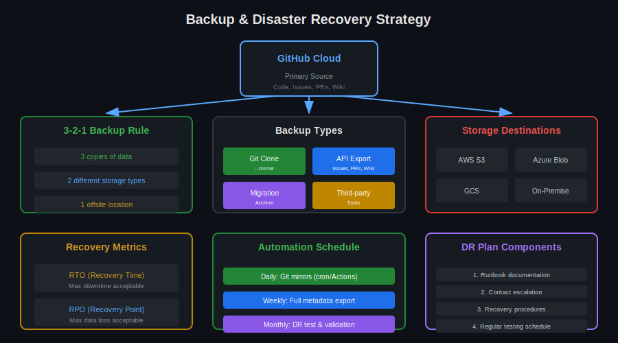

# Lección 04: Backup & Recovery

## 🎯 Objetivos de Aprendizaje

Al finalizar esta lección, serás capaz de:

- Implementar estrategias de backup para GitHub
- Crear scripts de backup automatizados
- Diseñar planes de disaster recovery
- Restaurar repositorios desde backups

---

## 📚 Conceptos Teóricos

### ¿Por qué Backup?

```yaml
GitHub Cloud tiene:
  - Alta disponibilidad (99.9%+)
  - Redundancia geográfica
  - Backups internos

Pero necesitas backup propio para:
  - Cumplimiento regulatorio
  - Retención más allá de políticas GitHub
  - Independencia de proveedor
  - Recuperación de errores humanos
  - Auditorías y forensics
```



---

## 📋 Regla 3-2-1 de Backup

### Principio

```yaml
3: Tres copias de datos
   - Original (GitHub)
   - Backup primario (S3/Azure)
   - Backup secundario (offline/otra región)

2: Dos tipos de almacenamiento diferentes
   - Cloud storage (S3)
   - On-premise o diferente provider (GCS)

1: Una copia offsite
   - Diferente región geográfica
   - Diferente cuenta cloud
   - Medio físico (casos críticos)
```

---

## 💾 Tipos de Backup

### 1. Git Mirror

```bash
# ¿QUÉ VAMOS A HACER?: Crear mirror completo del repo
# ¿POR QUÉ?: Captura código, branches, tags, historia
# ¿PARA QUÉ SIRVE?: Backup de código fuente

# Clone mirror
git clone --mirror https://github.com/ORG/REPO.git

# El mirror incluye:
# - Todos los commits
# - Todas las branches
# - Todos los tags
# - Refs internos

# Actualizar mirror existente
cd REPO.git
git fetch --all
```

### 2. API Export (Metadata)

```bash
# ¿QUÉ VAMOS A HACER?: Exportar metadata via API
# ¿POR QUÉ?: Git mirror no incluye issues, PRs, etc.
# ¿PARA QUÉ SIRVE?: Backup completo de proyecto

# Exportar issues
gh api "repos/ORG/REPO/issues?state=all" --paginate > issues.json

# Exportar PRs
gh api "repos/ORG/REPO/pulls?state=all" --paginate > pulls.json

# Exportar releases
gh api "repos/ORG/REPO/releases" --paginate > releases.json

# Exportar wiki (si existe)
git clone https://github.com/ORG/REPO.wiki.git
```

### 3. Migration Archive

```bash
# ¿QUÉ VAMOS A HACER?: Crear archive de migración
# ¿POR QUÉ?: Formato oficial para backup completo
# ¿PARA QUÉ SIRVE?: Restauración completa

# Usando GEI para crear archive
gh gei migrate-repo \
  --github-source-org ORG \
  --source-repo REPO \
  --github-target-org BACKUP_ORG \
  --target-repo REPO-backup-$(date +%Y%m%d)
```

---

## 🔄 Script de Backup Completo

### backup-github.sh

```bash
#!/bin/bash
# =============================================================================
# GitHub Organization Backup Script
# =============================================================================

set -e

# Configuration
ORG="nombre-org"
BACKUP_DIR="/backup/github/$(date +%Y-%m-%d)"
S3_BUCKET="s3://my-github-backups"

# Create backup directory
mkdir -p "$BACKUP_DIR"/{repos,metadata}

echo "=== GitHub Backup Started: $(date) ==="

# -----------------------------------------------------------------------------
# Phase 1: Git Mirrors
# -----------------------------------------------------------------------------
echo -e "\n[Phase 1] Backing up repositories..."

gh api "orgs/${ORG}/repos" --paginate --jq '.[].clone_url' | while read url; do
  REPO_NAME=$(basename "$url" .git)
  echo "  Cloning ${REPO_NAME}..."
  
  if [ -d "${BACKUP_DIR}/repos/${REPO_NAME}.git" ]; then
    cd "${BACKUP_DIR}/repos/${REPO_NAME}.git"
    git fetch --all --prune
  else
    git clone --mirror "$url" "${BACKUP_DIR}/repos/${REPO_NAME}.git"
  fi
done

# -----------------------------------------------------------------------------
# Phase 2: Organization Metadata
# -----------------------------------------------------------------------------
echo -e "\n[Phase 2] Backing up organization metadata..."

# Members
gh api "orgs/${ORG}/members" --paginate > "${BACKUP_DIR}/metadata/members.json"

# Teams
gh api "orgs/${ORG}/teams" --paginate > "${BACKUP_DIR}/metadata/teams.json"

# Team memberships
gh api "orgs/${ORG}/teams" --paginate --jq '.[].slug' | while read team; do
  gh api "orgs/${ORG}/teams/${team}/members" --paginate > "${BACKUP_DIR}/metadata/team-${team}-members.json"
done

# -----------------------------------------------------------------------------
# Phase 3: Repository Metadata
# -----------------------------------------------------------------------------
echo -e "\n[Phase 3] Backing up repository metadata..."

gh api "orgs/${ORG}/repos" --paginate --jq '.[].name' | while read repo; do
  REPO_DIR="${BACKUP_DIR}/metadata/${repo}"
  mkdir -p "$REPO_DIR"
  
  echo "  Exporting metadata for ${repo}..."
  
  # Issues
  gh api "repos/${ORG}/${repo}/issues?state=all" --paginate > "${REPO_DIR}/issues.json" 2>/dev/null || true
  
  # Pull requests
  gh api "repos/${ORG}/${repo}/pulls?state=all" --paginate > "${REPO_DIR}/pulls.json" 2>/dev/null || true
  
  # Releases
  gh api "repos/${ORG}/${repo}/releases" --paginate > "${REPO_DIR}/releases.json" 2>/dev/null || true
  
  # Branch protection
  gh api "repos/${ORG}/${repo}/branches/main/protection" > "${REPO_DIR}/branch-protection.json" 2>/dev/null || true
  
  # Repository settings
  gh api "repos/${ORG}/${repo}" > "${REPO_DIR}/settings.json" 2>/dev/null || true
done

# -----------------------------------------------------------------------------
# Phase 4: Compress and Upload
# -----------------------------------------------------------------------------
echo -e "\n[Phase 4] Compressing backup..."

cd /backup/github
tar -czf "backup-${ORG}-$(date +%Y%m%d).tar.gz" "$(date +%Y-%m-%d)"

echo -e "\n[Phase 5] Uploading to S3..."
aws s3 cp "backup-${ORG}-$(date +%Y%m%d).tar.gz" "${S3_BUCKET}/"

# -----------------------------------------------------------------------------
# Cleanup old local backups (keep 7 days)
# -----------------------------------------------------------------------------
echo -e "\n[Cleanup] Removing old local backups..."
find /backup/github -maxdepth 1 -type d -mtime +7 -exec rm -rf {} \;

echo -e "\n=== Backup Complete: $(date) ==="
```

---

## ⏰ Automatización con Cron/Actions

### Cron Job

```bash
# Editar crontab
crontab -e

# Backup diario a las 2 AM
0 2 * * * /scripts/backup-github.sh >> /var/log/github-backup.log 2>&1

# Backup incremental cada 6 horas
0 */6 * * * /scripts/backup-github-incremental.sh >> /var/log/github-backup-incr.log 2>&1
```

### GitHub Action

```yaml
# .github/workflows/backup.yml
name: GitHub Backup

on:
  schedule:
    - cron: '0 2 * * *'  # Daily at 2 AM UTC
  workflow_dispatch:      # Manual trigger

jobs:
  backup:
    runs-on: ubuntu-latest
    
    steps:
      - name: Setup
        run: |
          mkdir -p backup/{repos,metadata}
      
      - name: Backup Repositories
        env:
          GH_TOKEN: ${{ secrets.BACKUP_PAT }}
        run: |
          gh api "orgs/${{ vars.ORG_NAME }}/repos" --paginate --jq '.[].clone_url' | while read url; do
            REPO=$(basename "$url" .git)
            git clone --mirror "$url" "backup/repos/${REPO}.git"
          done
      
      - name: Backup Metadata
        env:
          GH_TOKEN: ${{ secrets.BACKUP_PAT }}
        run: |
          gh api "orgs/${{ vars.ORG_NAME }}/members" --paginate > backup/metadata/members.json
          gh api "orgs/${{ vars.ORG_NAME }}/teams" --paginate > backup/metadata/teams.json
      
      - name: Compress
        run: |
          tar -czf backup-$(date +%Y%m%d).tar.gz backup/
      
      - name: Upload to S3
        uses: aws-actions/configure-aws-credentials@v4
        with:
          aws-access-key-id: ${{ secrets.AWS_ACCESS_KEY_ID }}
          aws-secret-access-key: ${{ secrets.AWS_SECRET_ACCESS_KEY }}
          aws-region: us-east-1
      
      - run: |
          aws s3 cp backup-$(date +%Y%m%d).tar.gz s3://${{ vars.S3_BUCKET }}/
```

---

## 🔁 Restauración

### Restaurar Git Mirror

```bash
# ¿QUÉ VAMOS A HACER?: Restaurar repo desde mirror
# ¿POR QUÉ?: Recuperar código perdido
# ¿PARA QUÉ SIRVE?: Disaster recovery

# Paso 1: Crear nuevo repo vacío
gh repo create ORG/REPO-restored --private

# Paso 2: Push desde mirror
cd backup/repos/REPO.git
git remote add restore https://github.com/ORG/REPO-restored.git
git push restore --mirror

# Paso 3: Verificar
gh repo view ORG/REPO-restored
```

### Restaurar Issues/PRs

```bash
#!/bin/bash
# Restaurar issues desde backup JSON

REPO="ORG/REPO"
BACKUP_FILE="backup/metadata/REPO/issues.json"

jq -c '.[]' "$BACKUP_FILE" | while read issue; do
  TITLE=$(echo "$issue" | jq -r '.title')
  BODY=$(echo "$issue" | jq -r '.body')
  LABELS=$(echo "$issue" | jq -r '.labels[].name' | tr '\n' ',' | sed 's/,$//')
  
  echo "Restoring issue: $TITLE"
  
  gh issue create \
    --repo "$REPO" \
    --title "$TITLE" \
    --body "$BODY" \
    --label "$LABELS" 2>/dev/null || echo "  Failed"
done
```

---

## 📊 Disaster Recovery Plan

### Componentes del DR Plan

```yaml
1. Inventario:
   - Lista de repos críticos
   - Prioridad de restauración
   - Dependencias entre repos

2. RTO (Recovery Time Objective):
   - Tiempo máximo de downtime aceptable
   - Repos críticos: < 4 horas
   - Repos normales: < 24 horas

3. RPO (Recovery Point Objective):
   - Pérdida de datos máxima aceptable
   - Repos críticos: < 1 hora (backups frecuentes)
   - Repos normales: < 24 horas (backup diario)

4. Procedimientos:
   - Runbook documentado
   - Contactos de emergencia
   - Acceso a backups
   - Pasos de validación

5. Testing:
   - Restauración de prueba mensual
   - Documentar tiempo real de recovery
   - Actualizar runbook según hallazgos
```

### Runbook Template

```markdown
# Disaster Recovery Runbook

## Incident Classification
- **Severity 1**: Org completa no disponible
- **Severity 2**: Repos críticos afectados
- **Severity 3**: Repos no críticos afectados

## Contacts
| Role | Name | Phone | Email |
|------|------|-------|-------|
| Primary | John Doe | +1-xxx | john@... |
| Backup | Jane Smith | +1-xxx | jane@... |
| GitHub Support | - | - | enterprise@github.com |

## Recovery Procedures

### Scenario A: Repo Accidentally Deleted
1. Check GitHub Trash (90 days retention)
2. Restore from GitHub UI if available
3. If not, restore from latest mirror backup
4. Restore metadata from JSON backups
5. Notify affected teams

### Scenario B: Organization Compromised
1. Contact GitHub Support immediately
2. Revoke all tokens
3. Reset all 2FA
4. Review audit log
5. Restore from isolated backup
6. Forensic investigation

### Scenario C: Data Corruption
1. Identify affected repos
2. Determine last known good state
3. Restore specific commits from backup
4. Validate data integrity
5. Document incident
```

---

## ✅ Validación de Backups

### Script de Validación

```bash
#!/bin/bash
# Validar integridad de backups

BACKUP_DIR="/backup/github/latest"

echo "=== Backup Validation ==="

# Verificar mirrors
echo -e "\n## Git Mirrors"
for mirror in "$BACKUP_DIR"/repos/*.git; do
  REPO=$(basename "$mirror")
  cd "$mirror"
  
  if git fsck --full >/dev/null 2>&1; then
    echo "✅ $REPO - Valid"
  else
    echo "❌ $REPO - CORRUPTED"
  fi
done

# Verificar JSON
echo -e "\n## Metadata JSON"
for json in "$BACKUP_DIR"/metadata/*/*.json; do
  if jq empty "$json" 2>/dev/null; then
    echo "✅ $(basename $json) - Valid JSON"
  else
    echo "❌ $(basename $json) - INVALID JSON"
  fi
done

# Verificar completeness
echo -e "\n## Completeness Check"
EXPECTED_REPOS=$(gh api "orgs/ORG/repos" --jq 'length')
BACKED_UP=$(ls -1 "$BACKUP_DIR"/repos/*.git 2>/dev/null | wc -l)
echo "Expected: $EXPECTED_REPOS | Backed up: $BACKED_UP"
```

### Test de Restauración

```bash
#!/bin/bash
# Test de restauración mensual

TEST_ORG="restore-test-org"
BACKUP_DIR="/backup/github/latest"
TEST_REPO="test-restore-$(date +%Y%m%d)"

echo "=== Monthly Restore Test ==="

# Seleccionar repo aleatorio
RANDOM_REPO=$(ls -1 "$BACKUP_DIR"/repos/*.git | shuf -n 1)
REPO_NAME=$(basename "$RANDOM_REPO" .git)

echo "Testing restore of: $REPO_NAME"

# Crear repo de prueba
gh repo create "$TEST_ORG/$TEST_REPO" --private

# Restaurar
cd "$RANDOM_REPO"
git push "https://github.com/$TEST_ORG/$TEST_REPO.git" --mirror

# Validar
ORIGINAL_COMMITS=$(git rev-list --count HEAD)
RESTORED_COMMITS=$(gh api "repos/$TEST_ORG/$TEST_REPO/commits" --paginate --jq 'length')

if [ "$ORIGINAL_COMMITS" -eq "$RESTORED_COMMITS" ]; then
  echo "✅ Restore successful: $ORIGINAL_COMMITS commits"
else
  echo "❌ Restore failed: expected $ORIGINAL_COMMITS, got $RESTORED_COMMITS"
fi

# Cleanup
gh repo delete "$TEST_ORG/$TEST_REPO" --yes

echo "=== Test Complete ==="
```

---

## 🔗 Recursos Adicionales

- [GitHub Backup Best Practices](https://docs.github.com/en/repositories/archiving-a-github-repository)
- [git-mirror Documentation](https://git-scm.com/docs/git-clone#Documentation/git-clone.txt---mirror)
- [AWS S3 CLI](https://docs.aws.amazon.com/cli/latest/reference/s3/)

---

## 📝 Resumen

| Componente | Frecuencia | Retención |
|------------|------------|-----------|
| **Git Mirror** | Diario | 30 días |
| **Metadata JSON** | Diario | 90 días |
| **Full Archive** | Semanal | 1 año |
| **Restore Test** | Mensual | N/A |

---

**Siguiente**: [Ejercicio 01 - Audit Log Analysis](../2-practicas/ejercicio-01-audit-analysis/README.md)
