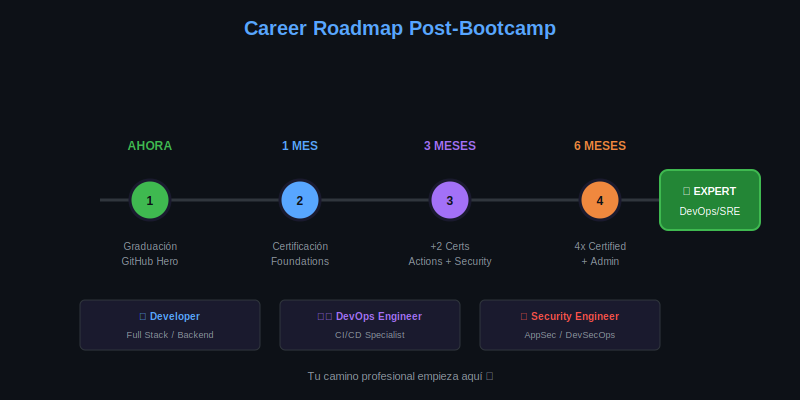

# Lección 03: Career Path

## 🎯 Objetivos de Aprendizaje

Al finalizar esta lección, serás capaz de:

- Identificar oportunidades profesionales con tus nuevas skills
- Crear un plan de desarrollo continuo
- Construir tu marca profesional en GitHub
- Prepararte para entrevistas técnicas

---

## 📚 Tu Roadmap Profesional



### Roles que Puedes Alcanzar

| Rol | Skills del Bootcamp | Salario Promedio* |
|-----|---------------------|-------------------|
| **Software Developer** | Git, GitHub, CI/CD | $60-120k |
| **DevOps Engineer** | Actions, CI/CD, IaC | $80-150k |
| **Site Reliability Engineer** | Automation, monitoring | $100-170k |
| **Security Engineer** | GHAS, scanning, policies | $90-160k |
| **Platform Engineer** | Actions, admin, enterprise | $100-180k |

*USD/año, varía por región y experiencia

---

## 🎯 Plan de Acción Post-Bootcamp

### Primeros 30 Días

```markdown
## Semana 1-2: Certificación
- [ ] Agendar examen GitHub Foundations
- [ ] Repasar study guide
- [ ] Hacer practice tests
- [ ] Tomar el examen

## Semana 3-4: Portfolio
- [ ] Pulir proyecto final
- [ ] Agregar 2-3 proyectos más
- [ ] Actualizar perfil de GitHub
- [ ] Crear/actualizar LinkedIn
```

### 60-90 Días

```markdown
## Mes 2: Especialización
- [ ] Segunda certificación (Actions o Security)
- [ ] Contribuir a open source
- [ ] Networking (meetups, comunidades)
- [ ] Practicar entrevistas

## Mes 3: Búsqueda Activa
- [ ] Tercera/cuarta certificación
- [ ] Aplicar a posiciones
- [ ] Preparar para entrevistas
- [ ] Negociar ofertas
```

---

## 💼 Tu Perfil de GitHub

### Optimización del Perfil

```yaml
Elementos Clave:
  Bio:
    - Rol actual/deseado
    - Skills principales
    - Ubicación
    - Link a portfolio/LinkedIn
  
  Profile README:
    - Introducción personal
    - Skills con badges
    - Estadísticas de GitHub
    - Proyectos destacados
  
  Pinned Repos (6 max):
    - Proyecto final del bootcamp
    - 2-3 proyectos técnicos
    - Contribuciones open source
    - Algo creativo/personal
```

### Ejemplo Profile README

```markdown
# Hi, I'm [Nombre] 👋

🎓 GitHub Certified | 4x Certifications
💼 DevOps Engineer | CI/CD Specialist
🚀 Building automation tools

## 🛠️ Tech Stack


## 📊 GitHub Stats


## 🔗 Connect
[](URL)
```

---

## 🤝 Networking Efectivo

### Comunidades

| Comunidad | Beneficio |
|-----------|-----------|
| **GitHub Community** | Soporte oficial, discussions |
| **Dev.to** | Compartir conocimiento |
| **Twitter/X Tech** | Networking, trending |
| **Discord servers** | Comunidades específicas |
| **Meetups locales** | Conexiones presenciales |

### Contribuir a Open Source

```yaml
Beneficios:
  - Experiencia real
  - Visibilidad
  - Networking
  - Referencias

Cómo Empezar:
  1. Busca repos con "good first issue"
  2. Lee CONTRIBUTING.md
  3. Empieza con docs/typos
  4. Progresa a features pequeñas
  5. Sé constante

Repos Amigables:
  - first-contributions/first-contributions
  - github/docs
  - microsoft/vscode
```

---

## 🎤 Preparación para Entrevistas

### Preguntas Comunes

```yaml
Git/GitHub:
  - "¿Cómo resuelves un merge conflict?"
  - "Explica git rebase vs merge"
  - "¿Qué es un PR y su workflow?"
  
CI/CD:
  - "Diseña un pipeline para X"
  - "¿Cómo manejas secrets en Actions?"
  - "Diferencia entre CI y CD"

Security:
  - "¿Cómo previenes secrets en commits?"
  - "¿Qué es code scanning?"
  - "Explica Dependabot"

Behavioral:
  - "Cuéntame de un bug difícil"
  - "¿Cómo manejas código legacy?"
  - "Describe un proyecto desafiante"
```

### Template de Respuesta (STAR)

```markdown
**S**ituation: Contexto del problema
**T**ask: Tu responsabilidad
**A**ction: Qué hiciste específicamente
**R**esult: Resultado medible

Ejemplo:
"En mi proyecto final (S), necesitaba implementar 
CI/CD (T). Configuré GitHub Actions con tests 
automatizados y deploy a staging (A). Reduje el 
tiempo de deploy de 30 min manual a 5 min 
automático (R)."
```

---

## 📈 Desarrollo Continuo

### Skills para Aprender Después

```yaml
Corto Plazo (3-6 meses):
  - Kubernetes/Docker
  - Terraform/IaC
  - Cloud (AWS/Azure/GCP)
  
Mediano Plazo (6-12 meses):
  - Service mesh
  - Observability (Prometheus, Grafana)
  - Advanced security

Largo Plazo (1+ año):
  - Architecture patterns
  - Leadership/mentoring
  - Speaking/writing
```

### Recursos de Aprendizaje

| Recurso | Tipo | Costo |
|---------|------|-------|
| GitHub Skills | Hands-on | Gratis |
| Microsoft Learn | Cursos | Gratis |
| Pluralsight | Videos | Pago |
| A Cloud Guru | Cloud | Pago |
| YouTube | Variado | Gratis |

---

## 📝 Resumen

| Timeframe | Objetivo |
|-----------|----------|
| **30 días** | 1ra certificación + portfolio |
| **90 días** | 2-3 certificaciones + OSS |
| **6 meses** | 4 certs + posición |
| **1 año** | Especialización + growth |

---

**Siguiente**: [Lección 04 - Bootcamp Wrap-up](04-bootcamp-wrapup.md)
