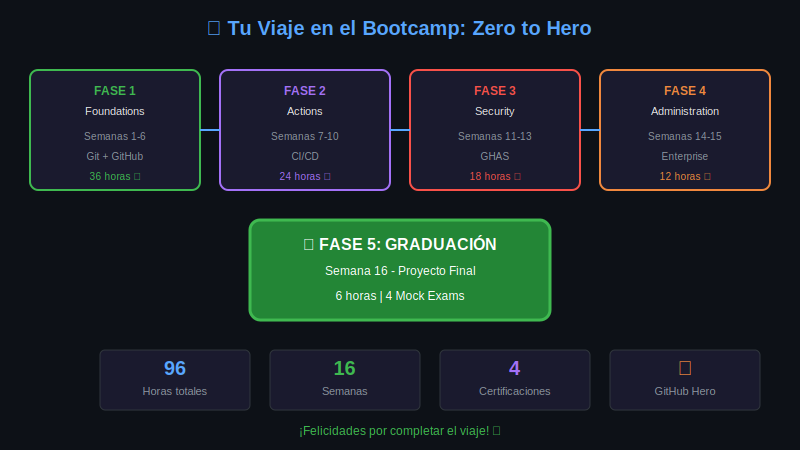

# Lección 04: Bootcamp Wrap-up

## 🎯 Objetivos de Aprendizaje

Al finalizar esta lección, serás capaz de:

- Reflexionar sobre tu aprendizaje
- Reconocer tu transformación
- Celebrar tus logros
- Planificar tus próximos pasos

---

## 🎓 Tu Viaje: Zero to Hero



### Lo que Has Logrado

```yaml
Horas Invertidas: 96
Semanas Completadas: 16
Certificaciones Preparadas: 4
Proyectos Realizados: 16+
Skills Adquiridas: 50+
```

---

## 📊 Resumen por Fase

### Fase 1: Foundations (Semanas 1-6)

| Semana | Tema | Skill Clave |
|--------|------|-------------|
| 1 | Git Basics | `git init, add, commit` |
| 2 | Repositories | `clone, push, pull` |
| 3 | Branching | `branch, checkout, merge` |
| 4 | Conflicts | Resolución de conflictos |
| 5 | Remotes | Colaboración |
| 6 | GitHub | PRs, Issues, Reviews |

**Certificación**: GitHub Foundations ✅

### Fase 2: Actions (Semanas 7-10)

| Semana | Tema | Skill Clave |
|--------|------|-------------|
| 7 | Workflows | YAML, triggers, jobs |
| 8 | CI/CD | Build, test, deploy |
| 9 | Advanced | Custom actions, matrices |
| 10 | Deploy | Environments, approvals |

**Certificación**: GitHub Actions ✅

### Fase 3: Security (Semanas 11-13)

| Semana | Tema | Skill Clave |
|--------|------|-------------|
| 11 | Code Scanning | CodeQL, SARIF |
| 12 | Vulnerabilities | Dependabot, secrets |
| 13 | Policies | SECURITY.md, advisories |

**Certificación**: Advanced Security ✅

### Fase 4: Administration (Semanas 14-15)

| Semana | Tema | Skill Clave |
|--------|------|-------------|
| 14 | Organizations | Teams, permissions, SSO |
| 15 | Advanced Admin | Audit log, API, backup |

**Certificación**: Administration ✅

### Fase 5: Graduación (Semana 16)

```
🎯 Proyecto Final
📝 Mock Exams (4)
🎤 Presentación
🎓 Graduación
```

---

## 🌟 Tu Transformación

### Antes del Bootcamp

```
😰 "¿Qué es Git?"
😵 "¿Por qué hay tantos comandos?"
🤔 "¿Cómo colaboro con otros?"
😟 "CI/CD suena complicado"
```

### Después del Bootcamp

```
😎 "Git es mi herramienta diaria"
🚀 "Automatizo todo con Actions"
🤝 "Lidero code reviews"
🔒 "Implemento security by design"
🏢 "Administro organizations"
```

---

## 🏆 Certificado de Logros

```
╔══════════════════════════════════════════════════╗
║                                                  ║
║     🎓 CERTIFICADO DE COMPLETACIÓN 🎓            ║
║                                                  ║
║     Este certifica que                           ║
║                                                  ║
║           [TU NOMBRE]                            ║
║                                                  ║
║     Ha completado exitosamente el                ║
║                                                  ║
║     BOOTCAMP GIT & GITHUB                        ║
║     Zero to Hero                                 ║
║                                                  ║
║     96 horas | 16 semanas                        ║
║     4 Certificaciones Preparadas                 ║
║                                                  ║
║     Fecha: _______________                       ║
║                                                  ║
║          🦸 GITHUB HERO 🦸                       ║
║                                                  ║
╚══════════════════════════════════════════════════╝
```

---

## 💭 Reflexión Final

### Preguntas para Ti

```markdown
1. ¿Cuál fue tu mayor desafío?
   ________________________________

2. ¿Qué te sorprendió aprender?
   ________________________________

3. ¿Cuál es tu feature favorita de GitHub?
   ________________________________

4. ¿Qué harás diferente en tu trabajo diario?
   ________________________________

5. ¿Cuál es tu próximo objetivo?
   ________________________________
```

---

## 🚀 Próximos Pasos

### Inmediatos (Esta Semana)

- [ ] Completar proyecto final
- [ ] Pasar mock exams
- [ ] Presentar proyecto
- [ ] Celebrar 🎉

### Corto Plazo (30 días)

- [ ] Agendar primera certificación
- [ ] Actualizar LinkedIn/CV
- [ ] Publicar sobre el bootcamp
- [ ] Unirte a comunidades

### Mediano Plazo (90 días)

- [ ] Obtener 2+ certificaciones
- [ ] Contribuir a open source
- [ ] Aplicar skills en trabajo
- [ ] Mentorear a alguien

---

## 🤝 Mantente Conectado

### Comunidad de Egresados

```yaml
Beneficios:
  - Networking continuo
  - Oportunidades laborales
  - Eventos exclusivos
  - Mentoring

Canales:
  - Discord del bootcamp
  - LinkedIn Group
  - GitHub Discussions
  - Meetups periódicos
```

---

## 🙏 Agradecimientos

```
A ti, por tu dedicación y esfuerzo.
A la comunidad, por el apoyo mutuo.
A GitHub, por las herramientas increíbles.
A todos los que hicieron esto posible.
```

---

## 🎉 ¡FELICIDADES!

```
   🌟 🌟 🌟 🌟 🌟 🌟 🌟 🌟 🌟 🌟
   
         HAS COMPLETADO EL
         
      🦸 BOOTCAMP GIT & GITHUB 🦸
      
         ZERO TO HERO
         
   🌟 🌟 🌟 🌟 🌟 🌟 🌟 🌟 🌟 🌟
   
   Ahora eres un GitHub Hero.
   
   El mundo necesita tus skills.
   
   ¡Ve y construye cosas increíbles! 🚀
```

---

**Siguiente**: [Mock Exams](../2-practicas/README.md)
