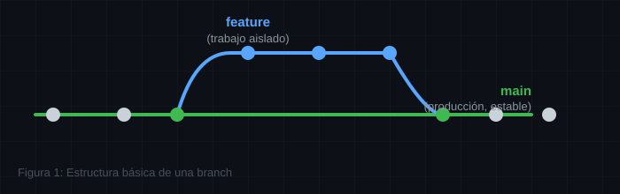
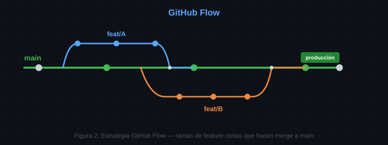
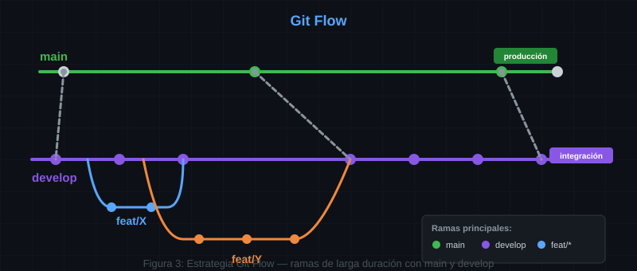
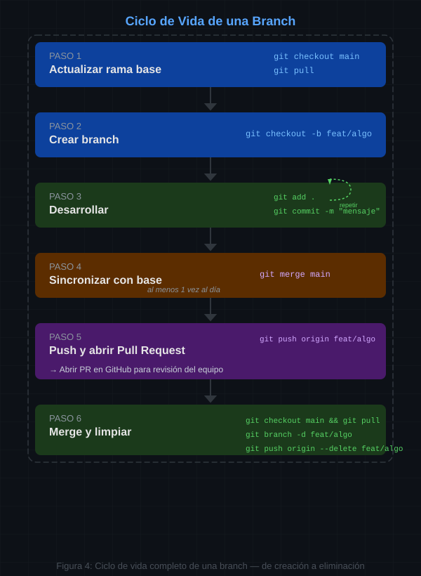

# 🌿 Buenas Prácticas para Gestión de Branches

Guía completa para gestión de ramas en equipos de desarrollo. Orientada a principiantes con instrucciones paso a paso y listas de chequeo.

---

## 📋 Objetivo

Al finalizar esta guía sabrás:

- ✅ Qué es una branch y para qué sirve
- ✅ Nombrar branches correctamente
- ✅ Elegir una estrategia de branching para tu equipo
- ✅ Crear, actualizar y fusionar branches sin errores
- ✅ Aplicar listas de chequeo antes de cada operación
- ✅ Evitar los errores más comunes en trabajo colaborativo

---

## 🌱 ¿Qué es una Branch?

Una **branch** (rama) es una línea independiente de desarrollo dentro de un repositorio. Te permite trabajar en una funcionalidad, corrección o experimento **sin afectar el código principal**.

**Analogía**: Imagina que el código principal (`main`) es el tronco de un árbol. Cada branch es una rama que crece del tronco. Puedes podarla, injertarla o fusionarla de vuelta sin dañar el tronco.



---

## 🏷️ Nombrado de Branches

Un buen nombre de branch debe ser **descriptivo**, **corto** y **consistente**.

### Estructura Recomendada

```
<tipo>/<descripcion-breve>
```

### Tipos de Branch

| Prefijo    | Uso                                      | Ejemplo                              |
| ---------- | ---------------------------------------- | ------------------------------------ |
| `feat/`    | Nueva funcionalidad                      | `feat/login-form`                    |
| `fix/`     | Corrección de bug                        | `fix/email-validation`               |
| `hotfix/`  | Corrección urgente en producción         | `hotfix/critical-payment-bug`        |
| `docs/`    | Cambios en documentación                 | `docs/api-reference`                 |
| `refactor/`| Reestructuración de código sin cambiar funcionalidad | `refactor/user-service`  |
| `test/`    | Añadir o modificar tests                 | `test/login-unit-tests`              |
| `chore/`   | Tareas de mantenimiento                  | `chore/update-dependencies`          |
| `exp/`     | Experimento o prueba de concepto         | `exp/new-algorithm`                  |

### Reglas de Nombrado

**✅ Correcto**:

```
feat/user-authentication
fix/navbar-responsive-bug
docs/setup-instructions
```

**❌ Incorrecto**:

```
mi-rama                     # Demasiado genérico
RamaDePrueba                # Usa mayúsculas y mezcla idiomas
fixing_the_bug_123          # Usa underscores, poco descriptivo
rama-temporaria-para-probar # Demasiado larga
```

### Convenciones Clave

1. Usa **kebab-case** (minúsculas con guiones): `feat/user-profile`
2. Usa **inglés** para los tipos y descripciones (estándar en la industria)
3. Mantén el nombre **corto pero descriptivo** (máx. 3-4 palabras)
4. No uses nombres personales: ❌ `rama-de-juan`, ✅ `feat/payment-gateway`
5. Incluye el **número de issue** si aplica: `feat/42-user-dashboard`

---

## 🗺️ Estrategias de Branching

Elige una según el tamaño de tu equipo y frecuencia de despliegue.

### 🌊 GitHub Flow (Recomendado para Principiantes)

La estrategia más simple. Ideal para equipos pequeños y despliegues continuos.



📌 **Reglas**:

- `main` siempre está lista para producción
- Cada funcionalidad va en su propia branch desde `main`
- Se abre **Pull Request** para revisar código
- Se hace **merge** a `main` tras revisión y tests
- Se despliega inmediatamente después del merge

### 🌳 Git Flow (Equipos con Versiones)

Estrategia más robusta con múltiples ramas de largo plazo. Ideal para proyectos con ciclos de release definidos.



📌 **Ramas principales**:

| Rama        | Propósito                                        |
| ----------- | ------------------------------------------------ |
| `main`      | Código en producción                             |
| `develop`   | Código integrado para próximo release            |
| `feat/*`    | Nuevas funcionalidades                           |
| `release/*` | Preparación de una versión (ej: `release/1.2.0`) |
| `hotfix/*`  | Corrección urgente en producción                 |

📌 **Cuándo usarlo**:

- Proyectos con versiones numeradas (v1.0, v2.1, etc.)
- Equipos de 5+ personas
- Necesidad de mantener múltiples versiones en paralelo

### 🚀 Trunk-Based Development (Equipos Avanzados)

Trabajo directo sobre `main` o branches de vida muy corta (máx. 1 día).

📌 **Usar solo si**:

- El equipo tiene mucha experiencia con Git
- Hay suite de tests automatizada robusta
- Se usan feature flags para código incompleto
- Despliegue continuo ya está implementado

---

## 🛠️ Flujo de Trabajo Paso a Paso

### 1. Antes de Empezar una Nueva Tarea

```bash
# Paso 1: Ve a la rama base (main o develop)
git checkout main

# Paso 2: Asegúrate de tener la última versión
git pull origin main

# Paso 3: Crea tu nueva branch
git checkout -b feat/mi-funcionalidad
```

### 2. Durante el Desarrollo

```bash
# Paso 1: Verifica en qué branch estás
git branch

# Paso 2: Haz commits frecuentes y atómicos
git add archivo_modificado.js
git commit -m "feat: añadir validación de email en formulario"

# Paso 3: Sube tu branch al remoto diariamente
git push -u origin feat/mi-funcionalidad
```

### 3. Mantener tu Branch Actualizada

```bash
# Opción A: Merge (más simple, recomendado para principiantes)
git checkout feat/mi-funcionalidad
git merge main
# Resuelve conflictos si los hay, luego:
git push origin feat/mi-funcionalidad

# Opción B: Rebase (historial más limpio, avanzado)
git checkout feat/mi-funcionalidad
git rebase main
# Resuelve conflictos si los hay, luego:
git push --force-with-lease origin feat/mi-funcionalidad
```

### 4. Finalizar y Fusionar

```bash
# Paso 1: Actualiza tu branch con main
git checkout main
git pull origin main
git checkout feat/mi-funcionalidad
git merge main
git push origin feat/mi-funcionalidad

# Paso 2: Abre un Pull Request en GitHub
# (Usa la interfaz web de GitHub)

# Paso 3: Después de que el PR sea aprobado y mergeado, elimina tu branch local
git checkout main
git pull origin main
git branch -d feat/mi-funcionalidad
```

---

## ✅ Lista de Chequeo: Crear una Branch

Antes de ejecutar `git checkout -b`, verifica:

- [ ] Estoy en la rama base correcta (`main` o `develop`)
- [ ] Hice `git pull` para tener la última versión del remoto
- [ ] Elegí un tipo adecuado (`feat/`, `fix/`, `docs/`, etc.)
- [ ] El nombre es descriptivo y usa kebab-case
- [ ] El nombre no incluye información personal
- [ ] No hay cambios sin commit en la rama actual (`git status` limpio)
- [ ] Entiendo el alcance exacto de la tarea a realizar

---

## ✅ Lista de Chequeo: Antes de un Commit

- [ ] Los cambios corresponden a una sola unidad lógica
- [ ] El código compila sin errores
- [ ] No incluí archivos temporales, logs o dependencias
- [ ] Verifiqué qué archivos se van a incluir (`git status`)
- [ ] Usé `git diff` para revisar los cambios exactos
- [ ] El mensaje de commit sigue el formato: `tipo: descripción breve`

### Formato de Mensaje de Commit

```
tipo: descripción en imperativo, máximo 72 caracteres

Cuerpo opcional con explicación detallada del porqué del cambio.
```

**Ejemplos**:

```
feat: añadir endpoint de registro de usuarios
fix: corregir error 500 en validación de token expirado
docs: actualizar guía de instalación para macOS
refactor: extraer lógica de autenticación a módulo separado
```

---

## ✅ Lista de Chequeo: Antes de un Pull Request

- [ ] Mi branch está actualizada con la rama base (`main` o `develop`)
- [ ] Todos los commits tienen mensajes descriptivos
- [ ] El código sigue las convenciones del proyecto (linting, formato)
- [ ] Escribí o actualicé los tests necesarios
- [ ] Todos los tests pasan localmente
- [ ] Probé la funcionalidad manualmente
- [ ] Eliminé logs de depuración y código comentado
- [ ] Actualicé la documentación si es necesario
- [ ] El PR tiene un título claro y una descripción útil
- [ ] El PR está vinculado al issue correspondiente (ej: `Closes #42`)

---

## ✅ Lista de Chequeo: Después de un Merge

- [ ] Verifiqué que el merge fue exitoso en GitHub
- [ ] Eliminé la branch remota (GitHub ofrece un botón para esto)
- [ ] Eliminé la branch local (`git branch -d feat/mi-funcionalidad`)
- [ ] Actualicé mi `main` local (`git checkout main && git pull`)

---

## ⚠️ Errores Comunes y Cómo Evitarlos

### 1. Trabajar Directamente en `main`

**❌ Error**: Haces commits directamente en `main`.

**✅ Solución**: Siempre crea una branch para cualquier cambio.

```bash
git checkout -b feat/nueva-funcionalidad
```

### 2. No Actualizar la Branch Antes del PR

**❌ Error**: Tu branch lleva 2 semanas sin sincronizarse con `main`. Al abrir el PR hay 15 conflictos.

**✅ Solución**: Haz merge de `main` a tu branch al menos una vez al día.

```bash
git checkout feat/mi-rama
git merge main
```

### 3. Una Branch por Meses

**❌ Error**: Una branch vive tanto tiempo que se vuelve imposible de integrar.

**✅ Solución**: Divide el trabajo en piezas pequeñas. Una branch no debería vivir más de 1-2 días (GitHub Flow) o 1-2 semanas (Git Flow).

### 4. Mezclar Funcionalidades No Relacionadas

**❌ Error**: Una branch llamada `feat/login` también incluye cambios de estilos, corrección de un bug antiguo y refactor del navbar.

**✅ Solución**: Una branch = una responsabilidad. Si hay que cambiar estilos, crea `feat/update-styles`. Si hay un bug, crea `fix/navbar-bug`.

### 5. Hacer Force Push sin Cuidado

**❌ Error**: `git push --force` sobrescribe el historial remoto y puede borrar trabajo de otros.

**✅ Solución**: Usa `--force-with-lease` si necesitas reescribir historial. Solo en branches personales, nunca en `main` o `develop`.

```bash
git push --force-with-lease origin feat/mi-rama
```

### 6. No Eliminar Branches Viejas

**❌ Error**: El repositorio acumula cientos de branches mergeadas. Nadie sabe cuáles están activas.

**✅ Solución**: Elimina la branch local y remota inmediatamente después del merge.

```bash
# Eliminar branch local
git branch -d feat/rama-mergeada

# Eliminar branch remota
git push origin --delete feat/rama-mergeada
```

---

## 🛡️ Protección de Branches (GitHub)

Configura reglas de protección en `main` (y `develop` si usas Git Flow) desde **Settings > Branches > Branch protection rules**:

### Reglas Recomendadas para Equipos

| Regla                                    | Principiante | Intermedio | Avanzado |
| ---------------------------------------- | :----------: | :--------: | :------: |
| Requiere Pull Request antes del merge    |      ✅       |     ✅      |    ✅     |
| Requiere al menos 1 aprobación           |      ✅       |     ✅      |    ✅     |
| Requiere que los checks de CI pasen      |      ⚠️       |     ✅      |    ✅     |
| Requiere que la branch esté actualizada  |      ❌       |     ✅      |    ✅     |
| Requiere conversaciones resueltas        |      ❌       |     ✅      |    ✅     |
| Requiere historial lineal (no merge commits) |   ❌       |     ⚠️      |    ✅     |
| No permite pushes directos               |      ✅       |     ✅      |    ✅     |
| No permite force pushes                  |      ✅       |     ✅      |    ✅     |
| No permite eliminación de la branch      |      ✅       |     ✅      |    ✅     |

---

## 📋 Resumen Visual: Ciclo de Vida de una Branch



---

## 💡 Consejos para Equipos

1. **Acuerden una estrategia y cíñanse a ella**. No todos hacen lo que quieren. Definan `main` + feature branches como mínimo.
2. **Documenten sus convenciones** en un archivo `CONTRIBUTING.md` del repositorio.
3. **Revisen código en equipo**. Los Pull Requests no son un trámite: son la mejor herramienta para compartir conocimiento.
4. **Automaticen lo que puedan**: linting, tests, formateo en CI. Así las revisiones humanas se enfocan en la lógica.
5. **Hagan pair programming ocasionalmente** para transferir conocimiento entre miembros del equipo.
6. **No tengan miedo de preguntar**. Si hay duda sobre cómo resolver un conflicto o hacer un merge, pregunten antes de romper algo.

---

## 🔗 Referencias

- [GitHub Flow - Guía Oficial](https://docs.github.com/en/get-started/using-github/github-flow)
- [Git Flow - Artículo Original de Vincent Driessen](https://nvie.com/posts/a-successful-git-branching-model/)
- [Trunk-Based Development](https://trunkbaseddevelopment.com/)
- [Conventional Commits](https://www.conventionalcommits.org/)
- [Pro Git Book - Branching](https://git-scm.com/book/es/v2/Ramificaciones-en-Git-%C2%BFQu%C3%A9-es-una-rama%3F)

---

💡 **Recuerda**: Las branches son gratuitas. Úsalas. Una buena gestión de ramas es la diferencia entre un equipo que avanza y uno que se tropieza consigo mismo.
